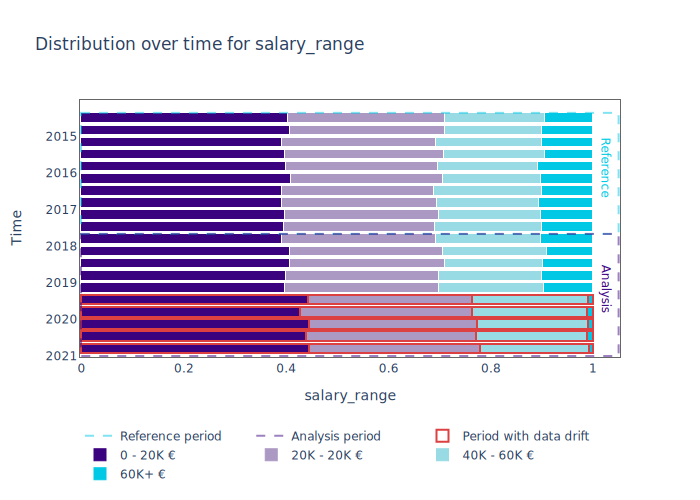

<p align="center">
    
</p>
<p align="center">
    <a href="https://pypi.org/project/nannyml/">
        
    </a>
    <a href="https://anaconda.org/conda-forge/nannyml">
        
    </a>
    <a href="https://pypi.org/project/nannyml/">
        
    </a>
    <a href="https://github.com/nannyml/nannyml/actions/workflows/dev.yml">
        
    </a>
    <a href='https://nannyml.readthedocs.io/en/main/?badge=main'>
        
    </a>
    
    <br />
    <br />
    <a href="https://www.producthunt.com/posts/nannyml?utm_source=badge-top-post-badge&utm_medium=badge&utm_souce=badge-nannyml" target="_blank">
        
    </a>

</p>

<p align="center">
    <strong>
        <a href="https://nannyml.com/">Website</a>
        •
        <a href="https://nannyml.readthedocs.io/en/stable/">Docs</a>
        •
        <a href="https://join.slack.com/t/nannymlbeta/shared_invite/zt-16fvpeddz-HAvTsjNEyC9CE6JXbiM7BQ">Community Slack</a>
    </strong>
</p>

<p align="center">
  
</p>

# 💡 What is NannyML?

NannyML is an open-source python library that allows you to **estimate post-deployment model performance** (without access to targets), detect data drift, and intelligently link data drift alerts back to changes in model performance. Built for data scientists, NannyML has an easy-to-use interface, interactive visualizations, is completely model-agnostic and currently supports all tabular use cases, classification and **regression**.

The core contributors of NannyML have researched and developed multiple novel algorithms for estimating model performance: [confidence-based performance estimation (CBPE)](https://nannyml.readthedocs.io/en/stable/how_it_works/performance_estimation.html#confidence-based-performance-estimation-cbpe) and [direct loss estimation (DLE)](https://nannyml.readthedocs.io/en/stable/how_it_works/performance_estimation.html#direct-loss-estimation-dle).
The nansters also invented a new approach to detect [multivariate data drift](https://nannyml.readthedocs.io/en/stable/how_it_works/multivariate_drift.html#data-reconstruction-with-pca) using PCA-based data reconstruction.

If you like what we are working on, be sure to become a Nanster yourself, join our [community slack](https://join.slack.com/t/nannymlbeta/shared_invite/zt-16fvpeddz-HAvTsjNEyC9CE6JXbiM7BQ)  and support us with a GitHub  star ⭐.

# ☔ Why use NannyML?

NannyML closes the loop with performance monitoring and post deployment data science, empowering data scientist to quickly understand and **automatically detect silent model failure**. By using NannyML, data scientists can finally maintain complete visibility and trust in their deployed machine learning models.
Allowing you to have the following benefits:

-   End sleepless nights caused by not knowing your model performance 😴
-   Analyse data drift and model performance **over time**
-   Discover the **root cause** to why your models are not performing as expected
-   **No alert fatigue!** React only when necessary if model performance is impacted
-   **Painless** setup in any environment

# 🧠 GO DEEP

| NannyML Resources                                                                                               | Description                                                                            |
| --------------------------------------------------------------------------------------------------------------- | -------------------------------------------------------------------------------------- |
| ☎️ **[NannyML 101]**                                                                                            | New to NannyML? Start here!                                                            |
| 🔮 **[Performance estimation]**                                                                                 | How the magic works.                                                                   |
| 🌍 **[Real world example]**                                                                                     | Take a look at a real-world example of NannyML.                                        |
| 🔑 **[Key concepts]**                                                                                           | Glossary of key concepts we use.                                                       |
| 🔬 **[Technical reference]**                                                                                    | Monitor the performance of your ML models.                                             |
| 🔎 **[Blog]**                                                                                                   | Thoughts on post-deployment data science from the NannyML team.                        |
| 📬 **[Newsletter]**                                                                                             | All things post-deployment data science. Subscribe to see the latest papers and blogs. |
| 💎 **[New in v0.13.1]**                                                                                          | New features, bug fixes.                                                               |
| 🧑‍💻 **[Contribute]**                                                                                             | How to contribute to the NannyML project and codebase.                                 |
|  **[Join slack]** | Need help with your specific use case? Say hi on slack!                                |

[nannyml 101]: https://nannyml.readthedocs.io/en/stable/
[performance estimation]: https://nannyml.readthedocs.io/en/stable/how_it_works/performance_estimation.html
[key concepts]: https://nannyml.readthedocs.io/en/stable/glossary.html
[technical reference]: https://nannyml.readthedocs.io/en/stable/nannyml/modules.html
[new in v0.13.1]: https://github.com/NannyML/nannyml/releases/latest/
[real world example]: https://nannyml.readthedocs.io/en/stable/examples/california_housing.html
[blog]: https://www.nannyml.com/blog
[newsletter]: https://mailchi.mp/022c62281d13/postdeploymentnewsletter
[join slack]: https://join.slack.com/t/nannymlbeta/shared_invite/zt-16fvpeddz-HAvTsjNEyC9CE6JXbiM7BQ
[contribute]: https://github.com/NannyML/nannyml/blob/main/CONTRIBUTING.rst

# 🔱 Features

### 1. Performance estimation and monitoring

When the actual outcome of your deployed prediction models is delayed, or even when post-deployment target labels are completely absent, you can use NannyML's [CBPE-algorithm](https://nannyml.readthedocs.io/en/stable/how_it_works/performance_estimation.html#confidence-based-performance-estimation-cbpe) to **estimate model performance** for classification or NannyML's [DLE-algorithm](https://nannyml.readthedocs.io/en/stable/how_it_works/performance_estimation.html#direct-loss-estimation-dle) for regression. These algorithms provide you with any estimated metric you would like, i.e. ROC AUC or RSME. Rather than estimating the performance of future model predictions, CBPE and DLE estimate the expected model performance of the predictions made at inference time.

<p></p>

NannyML can also **track the realised performance** of your machine learning model once targets are available.

### 2. Data drift detection

To detect **multivariate feature drift** NannyML uses [PCA-based data reconstruction](https://nannyml.readthedocs.io/en/stable/how_it_works/multivariate_drift.html#data-reconstruction-with-pca). Changes in the resulting reconstruction error are monitored over time and data drift alerts are logged when the reconstruction error in a certain period exceeds a threshold. This threshold is calculated based on the reconstruction error observed in the reference period.

<p></p>

NannyML utilises statistical tests to detect **univariate feature drift**. We have just added a bunch of new univariate tests including Jensen-Shannon Distance and L-Infinity Distance, check out the [comprehensive list](https://nannyml.readthedocs.io/en/stable/how_it_works/univariate_drift_detection.html#methods-for-continuous-features). The results of these tests are tracked over time, properly corrected to counteract multiplicity and overlayed on the temporal feature distributions. (It is also possible to visualise the test-statistics over time, to get a notion of the drift magnitude.)

<p></p>

NannyML uses the same statistical tests to detected **model output drift**.

<p></p>

**Target distribution drift** can also be monitored using the same statistical tests. Bear in mind that this operation requires the presence of actuals.

<p></p>

### 3. Intelligent alerting

Because NannyML can estimate performance, it is possible to weed out data drift alerts that do not impact expected performance, combatting alert fatigue. Besides linking data drift issues to drops in performance it is also possible to prioritise alerts according to other criteria using NannyML's Ranker.

# 🚀 Getting started

### Install NannyML

NannyML depends on [LightGBM](https://github.com/microsoft/LightGBM). This might require you to set install additional
OS-specific binaries. You can follow the [official installation guide](https://lightgbm.readthedocs.io/en/latest/Installation-Guide.html).

From PyPI:

```bash
pip install nannyml
```

From Conda:

```bash
 conda install -c conda-forge nannyml
```

Running via [Docker](https://hub.docker.com/r/nannyml/nannyml):

```bash
docker -v /local/config/dir/:/config/ run nannyml/nannyml nml run
```

**Here be dragons!** Use the latest development version of NannyML at your own risk:

```bash
python -m pip install git+https://github.com/NannyML/nannyml
```

#### Extras

If you're using database connections to read model inputs/outputs or you're exporting monitoring results to a database,
you'll need to include the optional `db` dependency. For example using `pip`:

```bash
pip install nannyml[db]
```

or using `poetry`

```bash
poetry install nannyml --all-extras
```

### Quick Start

_The following snippet is based on our [latest release](https://github.com/NannyML/nannyml/releases/latest)_.

```python
import nannyml as nml
import pandas as pd
from IPython.display import display

# Load real-world data:
reference_df, analysis_df, _ = nml.load_us_census_ma_employment_data()
display(reference_df.head())
display(analysis_df.head())

# Choose a chunker or set a chunk size:
chunk_size = 5000

# initialize, specify required data columns, fit estimator and estimate:
estimator = nml.CBPE(
    problem_type='classification_binary',
    y_pred_proba='predicted_probability',
    y_pred='prediction',
    y_true='employed',
    metrics=['roc_auc'],
    chunk_size=chunk_size,
)
estimator = estimator.fit(reference_df)
estimated_performance = estimator.estimate(analysis_df)

# Show results:
figure = estimated_performance.plot()
figure.show()

# Define feature columns:
features = ['AGEP', 'SCHL', 'MAR', 'RELP', 'DIS', 'ESP', 'CIT', 'MIG', 'MIL', 'ANC',
       'NATIVITY', 'DEAR', 'DEYE', 'DREM', 'SEX', 'RAC1P']

# Initialize the object that will perform the Univariate Drift calculations:
univariate_calculator = nml.UnivariateDriftCalculator(
    column_names=features,
    chunk_size=chunk_size
)

univariate_calculator.fit(reference_df)
univariate_drift = univariate_calculator.calculate(analysis_df)

# Get features that drift the most with count-based ranker:
alert_count_ranker = nml.AlertCountRanker()
alert_count_ranked_features = alert_count_ranker.rank(univariate_drift)
display(alert_count_ranked_features.head())

# Plot drift results for top 3 features:
figure = univariate_drift.filter(column_names=['RELP','AGEP', 'SCHL']).plot()
figure.show()

# Compare drift of a selected feature with estimated performance
uni_drift_AGEP_analysis = univariate_drift.filter(column_names=['AGEP'], period='analysis')
figure = estimated_performance.compare(uni_drift_AGEP_analysis).plot()
figure.show()

# Plot distribution changes of the selected features:
figure = univariate_drift.filter(period='analysis', column_names=['RELP','AGEP', 'SCHL']).plot(kind='distribution')
figure.show()

# Get target data, calculate, plot and compare realized performance with estimated performance:
_, _, analysis_targets_df = nml.load_us_census_ma_employment_data()

analysis_with_targets_df = pd.concat([analysis_df, analysis_targets_df], axis=1)
display(analysis_with_targets_df.head())

performance_calculator = nml.PerformanceCalculator(
    problem_type='classification_binary',
    y_pred_proba='predicted_probability',
    y_pred='prediction',
    y_true='employed',
    metrics=['roc_auc'],
    chunk_size=chunk_size)

performance_calculator.fit(reference_df)
calculated_performance = performance_calculator.calculate(analysis_with_targets_df)

figure = estimated_performance.filter(period='analysis').compare(calculated_performance).plot()
figure.show()

```

# 📖 Documentation

-   Performance monitoring
    -   [Estimated performance](https://nannyml.readthedocs.io/en/main/tutorials/performance_estimation.html)
    -   [Realized performance](https://nannyml.readthedocs.io/en/main/tutorials/performance_calculation.html)
-   Drift detection
    -   [Multivariate feature drift](https://nannyml.readthedocs.io/en/main/tutorials/detecting_data_drift/multivariate_drift_detection.html)
    *   [Univariate feature drift](https://nannyml.readthedocs.io/en/main/tutorials/detecting_data_drift/univariate_drift_detection.html)

# 🦸 Contributing and Community

We want to build NannyML together with the community! The easiest to contribute at the moment is to propose new features or log bugs under [issues](https://github.com/NannyML/nannyml/issues). For more information, have a look at [how to contribute](CONTRIBUTING.rst).

Thanks to all of our contributors!

[](https://github.com/CoffiDev)[](https://github.com/smetam)[](https://github.com/amrit110)[](https://github.com/bgalvao)[](https://github.com/SoyGema)

[](https://github.com/sebasmos)[](https://github.com/shezadkhan137)[](https://github.com/highstepper)[](https://github.com/WojtekNML)[](https://github.com/YYYasin19)

[](https://github.com/giodavoli)[](https://github.com/mireiar)[](https://github.com/baskervilski)[](https://github.com/rfrenoy)[](https://github.com/jrggementiza)

[](https://github.com/PieDude12)[](https://github.com/hakimelakhrass)[](https://github.com/maciejbalawejder)[](https://github.com/apps/dependabot)[](https://github.com/Dbhasin1)

[](https://github.com/alexnanny)[](https://github.com/santiviquez)[](https://github.com/cartgr)[](https://github.com/BobbuAbadeer)[](https://github.com/jnesfield)

[](https://github.com/NeoKish)[](https://github.com/michael-nml)[](https://github.com/jakubnml)[](https://github.com/nikml)[](https://github.com/nnansters)


# 🙋 Get help

The best place to ask for help is in the [community slack](https://join.slack.com/t/nannymlbeta/shared_invite/zt-16fvpeddz-HAvTsjNEyC9CE6JXbiM7BQ). Feel free to join and ask questions or raise issues. Someone will definitely respond to you.

# 🥷 Stay updated

If you want to stay up to date with recent changes to the NannyML library, you can subscribe to our [release notes](https://nannyml.substack.com). For thoughts on post-deployment data science from the NannyML team, feel free to visit our [blog](https://www.nannyml.com/blog). You can also sing up for our [newsletter](https://mailchi.mp/022c62281d13/postdeploymentnewsletter), which brings together the best papers, articles, news, and open-source libraries highlighting the ML challenges after deployment.

# 📍 Roadmap

Curious what we are working on next? Have a look at our [roadmap](https://bit.ly/nannymlroadmap). If you have any questions or if you would like to see things prioritised in a different way, let us know!

# 📝 Citing NannyML

To cite NannyML in academic papers, please use the following BibTeX entry.

### Version 0.13.1

```
    @misc{nannyml,
        title = {{N}anny{ML} (release 0.13.1)},
        howpublished = {\url{https://github.com/NannyML/nannyml}},
        month = mar,
        year = 2023,
        note = {NannyML, Belgium, OHL.},
        key = {NannyML}
    }
```

# 📄 License

NannyML is distributed under an Apache License Version 2.0. A complete version can be found [here](LICENSE). All contributions will be distributed under this license.
