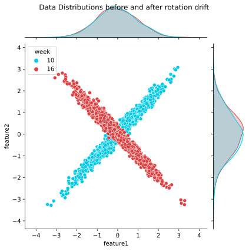
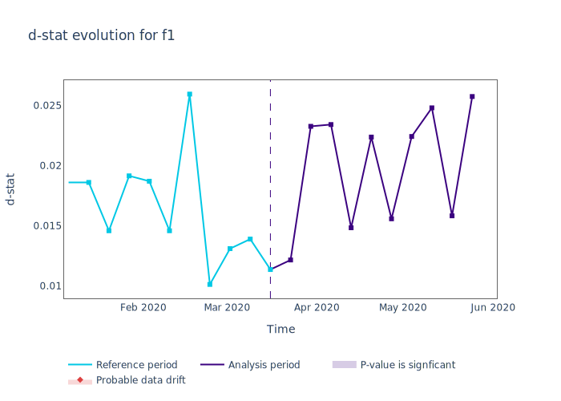
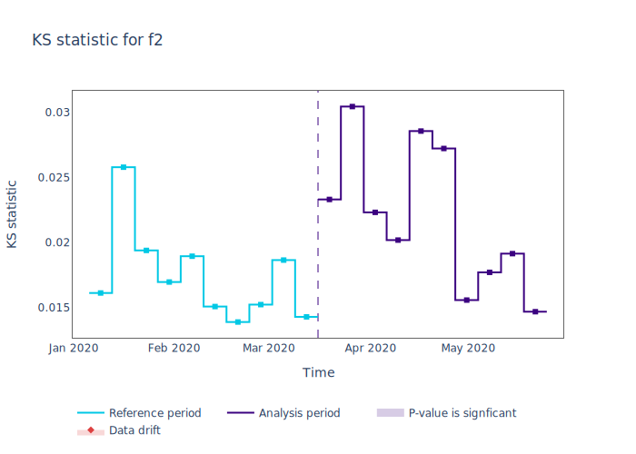
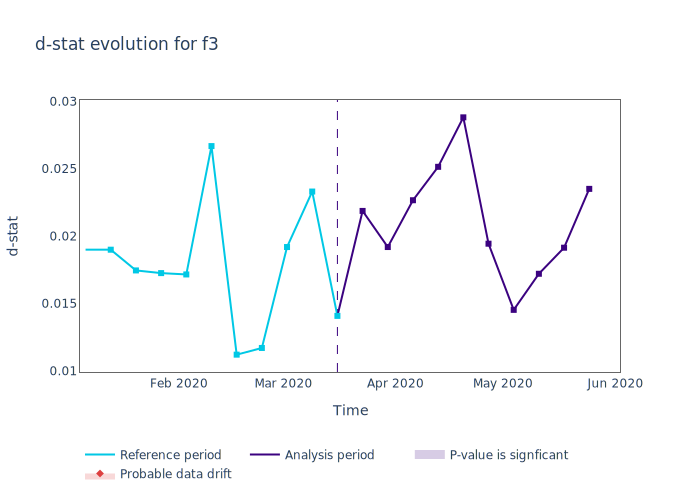
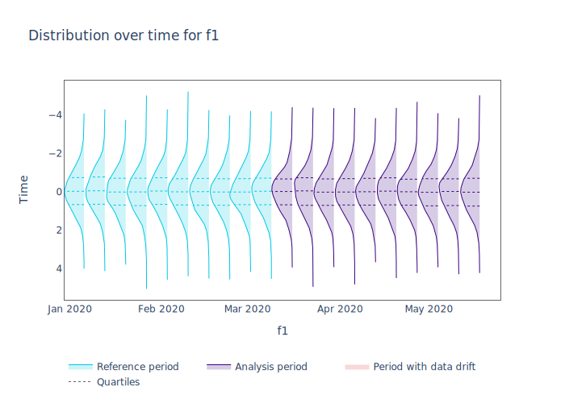
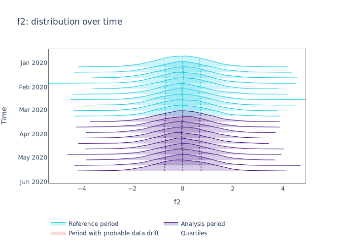
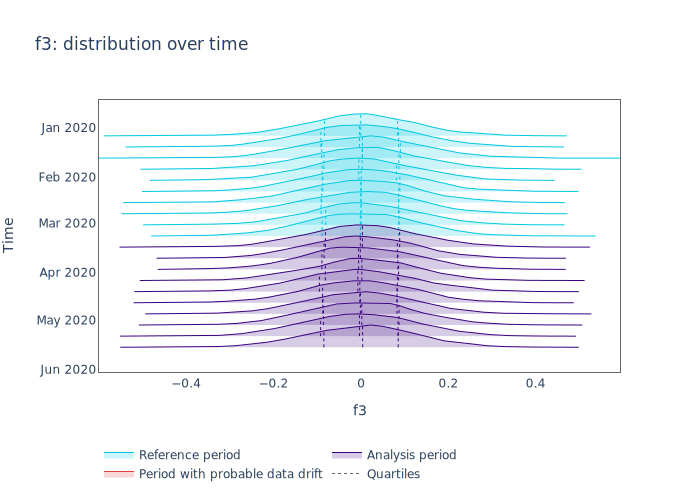
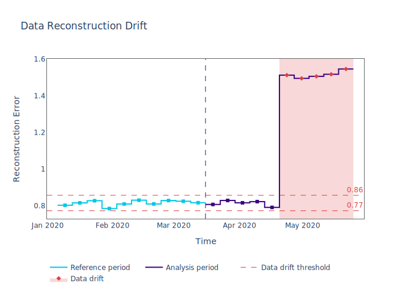

.. _data-reconstruction-pca:

============================
Data Reconstruction with PCA
============================

Data Drift in Multidimensional data
-----------------------------------

Machine Learning models typically have a multidimensional input space. In binary
classification problems, models are trained to find the optimal classification
boundary. This boundary depends on the structure of the data within the model input
space. However the world is not static, and the structure of a model's input data can
change. This change can then cause our existing decision boundary to be suboptimal.

:ref:`Univariate Drift Detection<data-drift-univariate>` describes how NannyML analyzes
each feature individually and
observes whether there are changes in the resulting feature distributions over time. However,
this is not enough to capture all the changes that may affect a machine learning model.
The changes in correlations and more complex changes in relationships between model inputs might have
a significant impact on model performance without changing univariate distributions of features.
The "butterfly" dataset, introduced below, demonstrates this.

"Butterfly" Dataset
~~~~~~~~~~~~~~~~~~~

Let's see first how we can construct an instance of the Butterfly dataset:

.. code-block:: python

    >>> import numpy as np
    >>> import pandas as pd
    >>> import matplotlib.pyplot as plt
    >>> import seaborn as sns
    >>> import nannyml as nml
    >>> from scipy.spatial.transform import Rotation
    >>> from sklearn.datasets import make_classification

    >>> # 10 reference periods
    >>> # 10 analysis periods
    >>> # Days/week * Hours/day * events/hour
    >>> DPP = 7*24*12

    >>> np.random.seed(23)
    >>> s1 = np.random.randn(DPP*20)
    >>> x1 = s1 + np.random.randn(DPP*20)/8
    >>> x2 = s1 + np.random.randn(DPP*20)/8
    >>> x3 = np.random.randn(DPP*20)/8
    >>> xdat = np.array([x1, x2, x3]).T

    >>> rot = Rotation.from_euler('z', 90, degrees=True)

    >>> # following matrix multiplication implementation, we need a 3xN data matrix hence we transpose
    >>> ydat = np.matmul(rot.as_matrix(), xdat.T).T

    >>> # create overall array that has drifted and not drifted subsets.
    >>> # drift is sudden and affects last 5 weeks
    >>> dataar = np.concatenate(
    ...     (xdat[:-5*DPP], ydat[-5*DPP:]),
    ...     axis=0
    >>> )

    >>> # convert data to dataframe
    >>> datadf = pd.DataFrame(dataar, columns=['f1', 'f2', 'f3'])

    >>> # add "timestamp" column
    >>> datadf = datadf.assign(ordered = pd.date_range(start='1/6/2020', freq='5min', periods=20*DPP))

    >>> # Adding helper column - duplicates date range functionality
    >>> datadf['week'] = datadf.ordered.dt.isocalendar().week - 1
    >>> # Adding partition column
    >>> datadf['partition'] = 'reference'
    >>> datadf.loc[datadf.week >= 11, ['partition']] = 'analysis'

    >>> # Assign random predictions and targets (we won't be using them but they are needed for NannyML)
    >>> datadf = datadf.assign(y_pred = np.random.rand(DPP*20))
    >>> datadf = datadf.assign(y_true = np.random.randint(2, size=DPP*20))

The key feature of the butterfly dataset is the data drift on its first two features.
This data drift is introduced by a 90 degree rotation across the z-axis. The following code creates a
plot that clearly shows the resulting data drift:

.. code-block:: python

    >>> # let's construct a dataframe for visuzlization purposes
    >>> dat1 = datadf.loc[datadf.week == 10, ['f1', 'f2']][:1500]
    >>> dat1['week'] = 10
    >>> dat2 = datadf.loc[datadf.week == 16, ['f1', 'f2']][:1500]
    >>> dat2['week'] = 16
    >>> data_sample = pd.concat([dat1, dat2], ignore_index=True)

    >>> # let's plot
    >>> colors = nml.plots.colors.Colors
    >>> figure = sns.jointplot(
    ...     data=data_sample,
    ...     x="f1",
    ...     y="f2",
    ...     hue="week",
    ...     palette=[colors.BLUE_SKY_CRAYOLA.value, colors.RED_IMPERIAL.value]
    >>> )
    >>> figure.fig.suptitle('Data Distributions before and after rotation drift')

The plot shows that the univariate distribution of features `f1` and
`f2` are unchanged. Indeed using NannyML to compute and plot the univariate
drift statistics produces the following results:

.. code-block:: python

    >>> # Let's first create the analysis and reference datasets NannyML needs.
    >>> reference = datadf.loc[datadf['partition'] == 'reference'].reset_index(drop=True)
    >>> reference.drop(['week'], axis=1, inplace=True)
    >>> analysis = datadf.loc[datadf['partition'] == 'analysis'].reset_index(drop=True)
    >>> analysis.drop(['y_true', 'week'], axis=1, inplace=True)
    >>> data = pd.concat([reference, analysis], ignore_index=True)

    >>> # Let's create the model metadata object
    >>> metadata = nml.extract_metadata(data = reference, model_name='3d_rotation')
    >>> metadata.identifier_column_name = 'ordered'
    >>> metadata.timestamp_column_name = 'ordered'
    >>> metadata.target_column_name = 'y_true'

    >>> # Let's compute univariate drift
    >>> univariate_calculator = nml.UnivariateStatisticalDriftCalculator(model_metadata=metadata, chunk_size=DPP)
    >>> univariate_calculator.fit(reference_data=reference)
    >>> # let's compute (and visualize) results across all the dataset.
    >>> univariate_results = univariate_calculator.calculate(data=data)

    >>> # let's create plot with results
    >>> for feature in metadata.features:
    ...     figure = univariate_results.plot(kind='feature_drift', metric='statistic', feature_label=feature.label)
    ...     figure.show()

.. code-block:: python

    >>> for feature in metadata.continuous_features:
    ...     figure = univariate_results.plot(
    ...         kind='feature_distribution',
    ...         feature_label=feature.label
    ...     )
    ...     figure.show()

These results make it clear that the univariate distribution results do not detect any drift.
However there is data drift in the butterfly dataset. It has been explicitly created with it.
A metric that is able to capture this change is needed.

Data Reconstruction with PCA
----------------------------

The solution to the problem posed with univariate drift statistics and the butterfly dataset
is to use the Data Reconstruction with PCA. This method is able to capture
complex changes in our data. The algorithm implementing Data Reconstruction with PCA
works in three steps described below.

The first step is data preparation and includes missing values :term:`Imputation`,
frequency encoding and scaling the data. Missing values need to be imputed because using PCA requires it.
Frequency encoding is used to convert all categorical features into numbers. The next thing to do
is standardize all features to 0 mean and unit variance. This makes sure that all features
contribute to PCA on equal footing.

The second step is the dimensionality reduction part by using the PCA algorithm.
By default it aims to capture 65% of the dataset's variance but this is a parameter that
can be changed. The PCA algorithm is fitted on the reference dataset and
learns a transformation from the pre-processed model input space to a :term:`Latent space`.
NannyML then applies this transformation to the data
being analyzed. It is important that the PCA method captures the internal structure of the
model input data and ignores any random noise that is usually present.

The third step is to transform the data from the latent space back to the preprocessed
model input space, using the inverse PCA transformation.
The euclidean distance between the original data points and their re-cosntructed counterparts
is computed. The resulting distances are then aggregated to get their average. The resulting
number is called :term:`Reconstruction Error`.

Understanding Reconstruction Error with PCA
-------------------------------------------

As PCA learns the internal structure of the data, a significant change in the reconstruction error means
that the learned structure no longer accurately approximates the current data structure. This indicates data drift.
:ref:`Multivariate Drift Detection<data-drift-multivariate>` shows how one can compute
Reconstruction Error with PCA.

Applying PCA as part of the Data Reconstruction with PCA means that we lose some information about our dataset.
This means that the reconstructed data will be slightly different compared to the original and reconstruction
error reflects that. However the change in reconstruction error values over time has valuable insight.
It tells us whether there is data drift or not. This is because, when there is
data drift, the principal compoments of the model input data, that the PCA method has learnt,
are now different. This will result in worse reconstruction of the new data and
therefore increased reconstruction error.

Because of the noise present in real world datasets, there will always be some
variability in reconstruction error results. This variability is used to determine
a significant change in reconstruction error. NannyMl computes the mean
and standard deviation of the reconstruction error with PCA on the reference
dataset based on the different results for each :term:`Data Chunk`. This establishes
a range of expected values of reconstruction error. A threshold for significant change
in NannyML is defined as values that are more than three standard deviations away from the mean
of the reference data.

Reconstruction Error with PCA on the butterfly dataset
~~~~~~~~~~~~~~~~~~~~~~~~~~~~~~~~~~~~~~~~~~~~~~~~~~~~~~

Now that we have a better understanding of what Reconstruction Error with PCA is let's see
what it does on the butterfly dataset.

.. code-block:: python

    # Let's compute univariate drift
    rcerror_calculator = nml.DataReconstructionDriftCalculator(model_metadata=metadata, chunk_size=DPP)
    rcerror_calculator.fit(reference_data=reference)
    # let's compute (and visualize) results across all the dataset.
    rcerror_results = rcerror_calculator.calculate(data=data)

    # let's create plot with results
    figure = rcerror_results.plot()
    figure.show()

The change in the butterfly dataset is now clearly visible through the change in the
reconstruction error.
