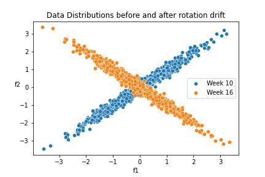

.. _data-reconstruction-pca:

============================
Data Reconstruction with PCA
============================

Data Drift in Multidimensional data
-----------------------------------

Machine Learning models have multidimensional input spaces. In binary
classification problems we train our models in order to find the optimal classification
boundary. This boundary is dependent on the structure of the data within the model input
space. However our world is not static, and the structure of our data can change. This
change can then cause our existing decision boundary to be suboptimal.

From :ref:`Univariate Drift Detection<data-drift-univariate>` section,
we saw how we can project our data to each feature individually and observe
whether there are changes in the resulting distributions over time. However
this is not enough to capture all the changes that may affect our model. We
explore below the "butterfly" dataset which has data drift by rotating some
data.

"Butterfly" Dataset
~~~~~~~~~~~~~~~~~~~

Let's see first how we can construct an instance of the Butterfly dataset:

.. code-block:: python

    import numpy as np
    import pandas as pd
    import matplotlib.pyplot as plt
    import seaborn as sns

    from scipy.spatial.transform import Rotation
    from sklearn.datasets import make_classification

    # 10 reference periods
    # 10 analysis periods
    # Days/week * Hours/day * events/hour
    DPP = 7*24*12

    np.random.seed(13)
    s1 = np.random.randn(DPP*20)
    x1 = s1 + np.random.randn(DPP*20)/8
    x2 = s1 + np.random.randn(DPP*20)/8
    x3 = np.random.randn(DPP*20)/8
    xdat = np.array([x1, x2, x3]).T

    rot = Rotation.from_euler('z', 90, degrees=True)

    # following proper matrix multiplication rules, we need a 3xN data matrix
    ydat = np.matmul(rot.as_matrix(), xdat.T).T

    # create overall array that has drifted and not drifted subsets.
    # drift is sudden and affects last 5 weeks
    dataar = np.concatenate(
        (xdat[:-5*DPP], ydat[-5*DPP:]),
        axis=0
    )

    # convert data to dataframe
    datadf = pd.DataFrame(dataar, columns=['f1', 'f2', 'f3'])

    # add "timestamp" column
    datadf = datadf.assign(ordered = pd.date_range(start='1/6/2020', freq='5min', periods=20*DPP))

    # Adding helper column - duplicates date range functionality
    datadf['week'] = datadf.ordered.dt.isocalendar().week - 1
    # Adding partition column
    datadf['partition'] = 'reference'
    datadf.loc[datadf.week >= 11, ['partition']] = 'analysis'

    # Assign random predictions and targets (we won't be using them but they are needed for NannyML)
    datadf = datadf.assign(y_pred = np.random.rand(DPP*20))
    datadf = datadf.assign(y_true = np.random.randint(2, size=DPP*20))

The key feature of this dataset is the data drift on it's first two features. This data drift
is a 90 degree rotation across the z-axis. We can see the resulting data drift with the code
below:

.. code-block:: python

    sns.scatterplot(
        x=datadf.loc[datadf.week == 10, 'f1'][:1000],
        y=datadf.loc[datadf.week == 10, 'f2'][:1000],
        label='Week 10'
    )
    sns.scatterplot(
        x=datadf.loc[datadf.week == 16, 'f1'][:1000],
        y=datadf.loc[datadf.week == 16, 'f2'][:1000],
        label='Week 16'
    )
    plt.title('Data Distributions before and after rotation drift')
    plt.xlabel('f1')
    plt.ylabel('f2', rotation=0)
    plt.legend()
    plt.savefig('butterfly-scatterplot.jpg')

The resulting drift is:

We can see from the images that the univariate distribution of features `f1` and
`f2` look unchanged. Indeed if we compute and plot the univariate drift statistics
we get:

.. code-block:: python

    # Let's first crete the analysis and reference datasets NannyML needs.
    reference = datadf.loc[datadf['partition'] == 'reference'].reset_index(drop=True)
    reference.drop(['week'], axis=1, inplace=True)
    analysis = datadf.loc[datadf['partition'] == 'analysis'].reset_index(drop=True)
    analysis.drop(['y_true', 'week'], axis=1, inplace=True)

    # Let's create the model metadata object
    md = nml.extract_metadata(data = reference, model_name='wfh_predictor')
    md.identifier_column_name = 'ordered'
    md.timestamp_column_name = 'ordered'
    md.ground_truth_column_name = 'y_true'

    # Let's compute univariate drift
    univariate_calculator = nml.UnivariateStatisticalDriftCalculator(model_metadata=md, chunk_size=DPP)
    univariate_calculator.fit(reference_data=reference)
    # let's compute (and visualize) results across all the dataset.
    univariate_results = univariate_calculator.calculate(data=pd.concat([reference, analysis], ignore_index=True))

    # let's create plot with results
    plots = nml.DriftPlots(md)
    plots.plot_univariate_statistical_drift(univariate_results, metric='statistic', feature_label='f1').show()

.. image:: ../_static/butterfly-univariate-f1.jpg

.. code-block:: python

    # joyplots for f1.

.. image:: ../_static/butterfly-univariate-f1-joyplot.jpg

The results are similar for the other two features of the dataset.
We see that the univariate distribution results do not detect any drift.
However we know that there is data drift in our data. We induced it!
We want a metric that will be able to capture this change.

Reconstruction Error with PCA
-----------------------------

The solution to the problem posed with univariate drift statistics and the butterfly dataset
is to use the Reconstruction Error with PCA metric. This method is able to capture
complex changes in our data. Let's describe this method first.
In general reconstruction error is the error we have when we
re-create a dataset after a dimensionality reduction transformation followed by its
inverse transformation. The error is computed to be the mean of the Euclidean distance
of all the points in our dataset.

Now let's go into more details on how we have implemented this process in NannyML.
The process goes through three steps. The first step is data preparation and includes
frequency encoding and scaling the data. We use frequency encoding
to convert all categorical features into numbers. Compared to one-hot encoding this
approach doesn't increas as much the dataset dimensionality. The next thing we do
is scale all the features to 0 mean and unit variance. This makes sure that all features
contribute to PCA on equal footing.

The second step is the dimensionality reduction part. We use PCA to perform this.
By default we are aiming to capture 65% of the dataset's variance but the user can
change that. The PCA algorithm is fitted on the reference dataset.
It learns a transofrmation from the pre-processed, from the first step,
model input space to a latent space. We then apply this transformtion to the data
we are analyzing. This step is very crucial for our process. It is key here
that our representation learning method captures the internal structure of the dataset
and ignores the random noise that is usually present.

The third step is to transform our data from the latent space back to the preprocessed
model input space that we got at the end of the first step. In our case all we need for that
is to apply the inverse PCA transformation.

Since the second step in our process is about compressing information we cannot expect
to end up precisely with the data we started at the end of step three. Some information will
have been lost and this will mean that our reconstructed data will be slightly different compared
to the original. Reconstruction error is a measure of how different the reconstructed data
are from the original.

Understanding Reconstruction Error with PCA
-------------------------------------------

At :ref:`Multivariate Drift Detection<data-drift-multivariate>` we saw how we can compute PCA
Reconstruction Error. Let's go a bit deeper in what it means.

The key thing we need to know is that reconstruction error on it's own doesn't convey
information. It is the change in reconstruction error values over time that does so.
It tells us whether there is data drift or not. This is because, when there is significant
data drift, the principal compoments of our data, that the PCA method has learnt, are now
slightly different. This will result in worse reconstruction of the new data and therefore
increased reconstruction error.

Because of the noise present in real world datasets, there will always be some
variability in reconstruction error results. We use this variability to determine
what a significant change in reconstruction error is. We compute the mean
and standard deviation of the reconstruction error with PCA on the reference
dataset. And we define as a threshold for a significant change any values that
are more than two standard deviations from the mean.

Reconstruction Error with PCA on the butterfly dataset
~~~~~~~~~~~~~~~~~~~~~~~~~~~~~~~~~~~~~~~~~~~~~~~~~~~~~~

Now that we have a better understanding of what Reconstruction Error with PCA is let's see
what it does on the butterfly dataset.

.. code-block:: python

    # Let's compute univariate drift
    rcerror_calculator = nml.DataReconstructionDriftCalculator(model_metadata=md, chunk_size=DPP)
    rcerror_calculator.fit(reference_data=reference)
    # let's compute (and visualize) results across all the dataset.
    rcerror_results = rcerror_calculator.calculate(data=pd.concat([reference, analysis], ignore_index=True))

    # let's create plot with results
    plots.plot_data_reconstruction_drift(rcerror_results).show()

.. image:: ../_static/butterfly-multivariate-rcerror-lineplot.jpg

We can now clearly see the change in our dataset through the change in the reconstruction error.