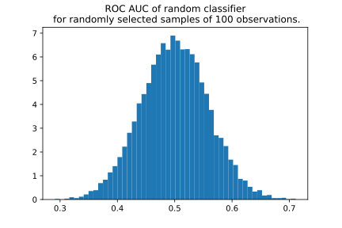
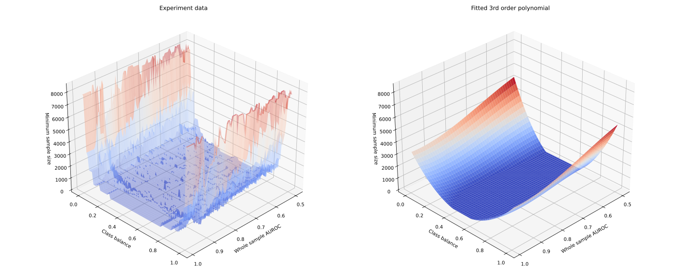

.. _minimum-chunk-size:

==================
Minimum chunk size
==================

.. note::
    Not sure what data chunk is in the first place? Read about :term:`Data Chunk` for a short explanation or go through
    the :ref:`guide<chunk-data>` for practical implementations.

Small sample size strongly affects the reliability of any ML or statistical analysis, including data drift detection
and performance estimation. NannyML allows splitting data in chunks in different ways to let users choose chunks that
are meaningful for them. However, when the chunks are too small, statistical results may become unreliable.
In this case NannyML will issue a warning. The user can then chose to ignore it and continue or use a chunking
method that will result in bigger chunks.

Minimum Chunk for Performance Estimation
========================================

When the chunk size is small
**what looks like a significant drop in performance of the monitored model may be only a sampling effect**.
To better understand that, have a look at the histogram below.
It shows dispersion of ROC AUC for a random model predicting a random binary target (which by definition should be 0.5) for
a sample of 100 observations. It is not uncommon to get ROC AUC of 0.65 for some samples.

.. code-block:: python

    >>> import numpy as np
    >>> import matplotlib.pyplot as plt
    >>> from sklearn.metrics import roc_auc_score
    >>>
    >>> sample_size = 100
    >>> roc_aucs = []
    >>>
    >>> for experiment in range(10_000):
    >>>     y_trues = np.random.binomial(1, 0.5, sample_size) # balanced dataset
    >>>     y_pred_probas = np.random.beta(0.5,0.5, sample_size) # beta distribution of y_pred_proba
    >>>     roc_aucs.append(roc_auc_score(y_trues, y_pred_probas))
    >>>
    >>> plt.hist(roc_aucs, bins=50, density=True)
    >>> plt.title("ROC AUC of random classifier\n for randomly selected samples of 100 observations.");

When there are many chunks, it is easy to spot the noisy nature of fluctuations. However, with only a few chunks, it
is difficult to tell whether the observed changes are meaningful and significant. To minimize this risk, NannyML
estimates a minimum chunk size for the monitored data and raises a warning if the selected chunking method results in
chunks that are smaller. Since NannyML is model-performance-oriented, the minimum chunk size is estimated in order to keep variation of performance of your model *low*. Low is defined as:

- For models with ROC AUC below 0.9 on the reference period, standard deviation of ROC AUC on chunks should be lower than 0.01.
- For Models with ROC AUC above 0.9 on the reference period, standard deviation of ROC AUC on chunks should be below 0.02.

Experiments have shown that variability of ROC AUC with respect to sample size is mostly affected by the quality of
the monitored model (i.e. its performance) and the target distribution (class balance). In order to quantify the
impact, numerous synthetic data sets were created with different target distributions and models of different quality
. For each artificially created vector of targets and predicted probabilities, a sample of constant size was drawn
many times and the standard deviation was calculated. Then, the experiments that met the requirements on standard deviation value were chosen and a model was fitted (see experiment results and fitted surface on the plot below). As a result, a function of two arguments - ROC AUC score and target distribution - was obtained. NannyML uses this function to calculate minimum chunk size based on the characteristics of the monitored data. If any of the created chunks is smaller than the minimum estimated, a warning is raised.

This solution has a few shortcomings. It is easy to imagine two different datasets and models with ROC AUC scores and
class balances that are the same, but dispersions of ROC AUC on samples of the same size that are different. Moreover, the arbitrary limits on standard deviation may not fit all cases. After all, there are situations where the performance actually fluctuates on reference data (due to e.g. seasonality). Finally, there are cases where only one chunk size is justified from business perspective (e.g. quarterly split). For these reasons, minimum chunk size should not be treated as recommended chunk size nor as a hard limit. It is just a chunk size, below which performance - actual or estimated - most likely will be governed by sampling effects rather than actual changes. Finally, be aware that sample size also affects calculations related to data drift.

Minimum Chunk for Data Reconstruction
=====================================

To ensure that there is no significant noise present in data recontruction results NannyML suggests a minimum chunk size
based on the number of features user to perform data reconstruction according to this function:

.. math::

    f(x) = \textrm{Int}( 20 * x ^ {\frac{5}{6}})

The result based on internal testing. It is merely a suggestion because multidimensional data can have difficult to foresee
instabilities. A better suggestion could be derived by inspecting the data used to look for
:ref:`multivariate drift<data-drift-multivariate>` but at the cost of increased computation time.

Minimum Chunk for Univariate Drift
==================================

To ensure that there is no significant noise present in :ref:`Univariate Drift Detection<data-drift-univariate>`
the recommended minimum chunk size is 500. It is a rule of thumb
choice that should cover most common cases. A better suggestion could be derived by inspecting the data used
for Univariate Drift detection but at the cost of increased computation time.
