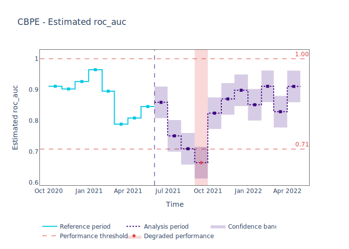
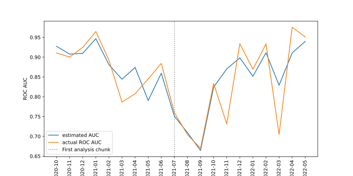
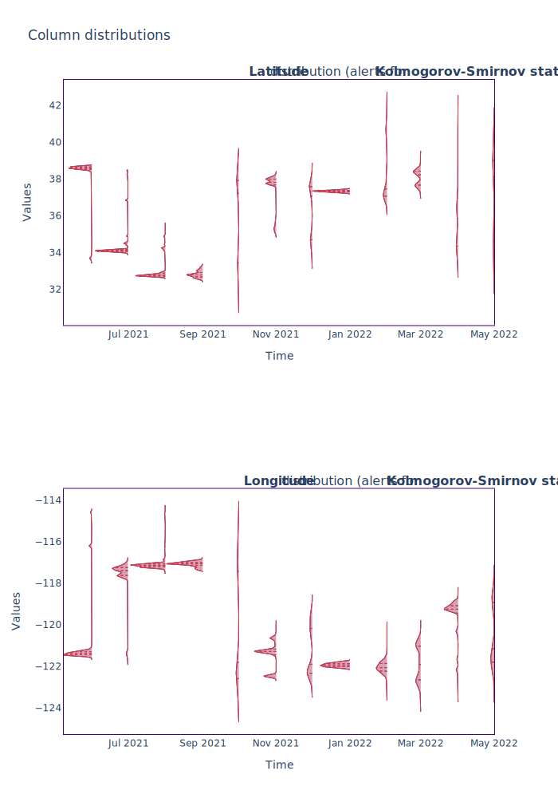
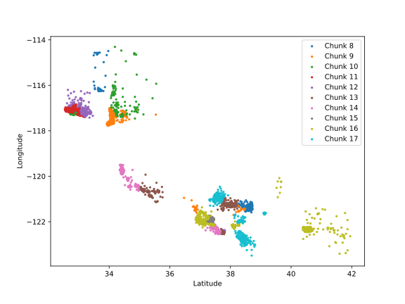

=================================================
Binary Classification: California Housing Dataset
=================================================

This example outlines a typical workflow for estimating performance of a model without access to ground truth,
detecting performance issues and identifying potential root causes for these issues. In this examples, we are
using NannyML on the modified California Housing Prices dataset.

You can see what modifications were made to the data to make it suitable for the
use case in :ref:`California Housing Dataset<dataset-california>`.

Load and prepare data
=====================

Let's load the dataset from NannyML's included datasets.

.. nbimport::
    :path: ./example_notebooks/Examples California Housing.ipynb
    :cells: 1

.. nbtable::
    :path: ./example_notebooks/Examples California Housing.ipynb
    :cell: 2

Performance Estimation
======================

We first want to estimate performance for the monitored period, using the reference period as our performance baseline.

.. nbimport::
    :path: ./example_notebooks/Examples California Housing.ipynb
    :cells: 3

.. parsed-literal::

    UserWarning: The resulting list of chunks contains 1 underpopulated chunks. They contain too few records to be statistically relevant and might negatively influence the quality of calculations. Please consider splitting your data in a different way or continue at your own risk.

We get a warning that some chunks are too small. Let's quickly check what's going on here.

.. nbimport::
    :path: ./example_notebooks/Examples California Housing.ipynb
    :cells: 4
    :show_output:

The last chunk is smaller than the others due to the selected chunking method. Let's remove it to make sure
everything we visualise is reliable.

.. nbimport::
    :path: ./example_notebooks/Examples California Housing.ipynb
    :cells: 5

.. nbtable::
    :path: ./example_notebooks/Examples California Housing.ipynb
    :cell: 6

Now we can plot the estimated performance confidently.

.. nbimport::
    :path: ./example_notebooks/Examples California Housing.ipynb
    :cells: 7

CBPE estimates a significant performance drop in the chunk corresponding
to the month of September.

Comparison with the actual performance
======================================

Because we have the ground truth for our dataset, we can use it to calculate ROC AUC on the relevant chunks,
and compare it to the estimated values.

.. nbimport::
    :path: ./example_notebooks/Examples California Housing.ipynb
    :cells: 9

We can see that the significant drop at the first few chunks of the monitored period was
estimated accurately. After that, the overall trend seems to be well
represented. The estimation of performance has a lower variance than
actual performance.

Drift detection
===============

The next step is to find out what might be responsible for this drop in ROC AUC. Let's try using
univariate drift detection, and see what we discover.

.. nbimport::
    :path: ./example_notebooks/Examples California Housing.ipynb
    :cells: 11

.. nbtable::
    :path: ./example_notebooks/Examples California Housing.ipynb
    :cell: 12

It looks like there is a lot of drift in this dataset. Since we have 12 chunks in the monitored period,
we can see that the top 4 features drifted in all analyzed chunks. Let's look at the magnitude of this drift
by examining the KS distance statistics.

.. nbimport::
    :path: ./example_notebooks/Examples California Housing.ipynb
    :cells: 13

.. nbtable::
    :path: ./example_notebooks/Examples California Housing.ipynb
    :cell: 14

The mean value of D-statistic for Longitude and Latitude on the monitored chunks is the largest. Let's plot their
distributions for the monitored period.

.. nbimport::
    :path: ./example_notebooks/Examples California Housing.ipynb
    :cells: 15

Indeed, we can see the distributions of these variables are completely different in each
chunk. This was expected, as the original dataset has observations from
nearby locations. Let's see it on a scatter plot:

.. nbimport::
    :path: ./example_notebooks/Examples California Housing.ipynb
    :cells: 17

In this example, NannyML estimated the performance (ROC AUC) of a model without accessing the target data. We can see
from our comparison with the targets that the estimate is quite accurate. Next, the potential root causes of the drop in
performance were indicated by detecting data drift. This was achieved using univariate methods that identified the features
which drifted the most.
