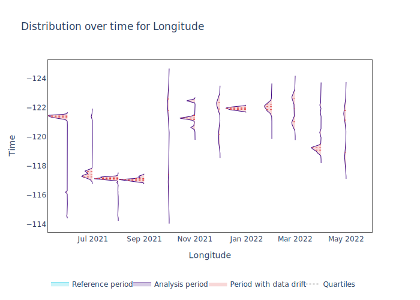
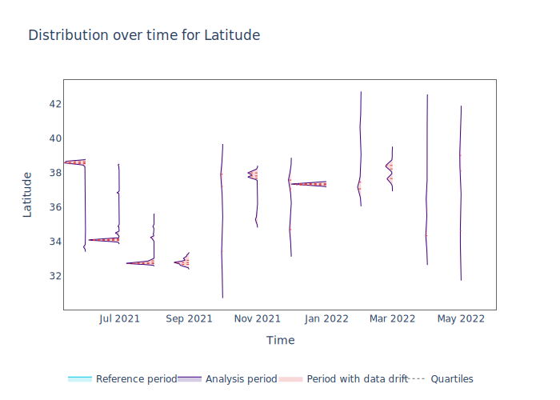

=================================================
Binary Classification: California Housing Dataset
=================================================

This document outlines a typical workflow for estimating performance of a model without access to ground truth, detecting performance issues and identifying potential root causes for these issues.
Below, one can find an example use of NannyML on the modified California Housing Prices dataset.

See what modifications were made to the data to make it suitable for the
use case :ref:`here<dataset-california>`.

Load and prepare data
=====================

Let's load the dataset from NannyML datasets:

.. code:: python

    >>> import pandas as pd
    >>> import nannyml as nml
    >>> # load data
    >>> reference, analysis, analysis_targets = nml.datasets.load_modified_california_housing_dataset()
    >>> reference.head(3)

+----+----------+------------+------------+-------------+--------------+------------+------------+-------------+---------------------+-------------+--------------+----------------+----------+--------------+
|    |   MedInc |   HouseAge |   AveRooms |   AveBedrms |   Population |   AveOccup |   Latitude |   Longitude | timestamp           | partition   |   clf_target |   y_pred_proba |   y_pred |   identifier |
+====+==========+============+============+=============+==============+============+============+=============+=====================+=============+==============+================+==========+==============+
|  0 |   9.8413 |         32 |    7.17004 |     1.01484 |         4353 |    2.93725 |      34.22 |     -118.19 | 2020-10-01 00:00:00 | reference   |            1 |           0.99 |        1 |            0 |
+----+----------+------------+------------+-------------+--------------+------------+------------+-------------+---------------------+-------------+--------------+----------------+----------+--------------+
|  1 |   8.3695 |         37 |    7.45875 |     1.06271 |          941 |    3.10561 |      34.22 |     -118.21 | 2020-10-01 01:00:00 | reference   |            1 |           1    |        1 |            1 |
+----+----------+------------+------------+-------------+--------------+------------+------------+-------------+---------------------+-------------+--------------+----------------+----------+--------------+
|  2 |   8.72   |         44 |    6.16318 |     1.04603 |          668 |    2.79498 |      34.2  |     -118.18 | 2020-10-01 02:00:00 | reference   |            1 |           1    |        1 |            2 |
+----+----------+------------+------------+-------------+--------------+------------+------------+-------------+---------------------+-------------+--------------+----------------+----------+--------------+

Let's extract metadata.

.. code:: python

    >>> # extract metadata, add target column name
    >>> metadata = nml.extract_metadata(reference, exclude_columns=['identifier'], model_type='classification_binary')
    >>> metadata.target_column_name = 'clf_target'
    >>> metadata.timestamp_column_name = 'timestamp'

Performance Estimation
======================

Let's estimate performance for reference and analysis partitions:

.. code:: python

    >>> # fit performance estimator and estimate for combined reference and analysis
    >>> cbpe = nml.CBPE(model_metadata=metadata, chunk_period='M', metrics=['roc_auc'])
    >>> cbpe.fit(reference_data=reference)
    >>> est_perf = cbpe.estimate(pd.concat([reference, analysis]))

.. parsed-literal::

    UserWarning: The resulting list of chunks contains 1 underpopulated chunks.They contain too few records to be statistically relevant and might negatively influence the quality of calculations.Please consider splitting your data in a different way or continue at your own risk.

Some chunks are too small, let's  quickly check:

.. code:: python

    >>> est_perf.data['end_index'] - est_perf.data['start_index']

    0     743
    1     719
    2     743
    3     743
    4     671
    5     743
    6     719
    7     743
    8     719
    9     743
    10    743
    11    719
    12    743
    13    719
    14    743
    15    743
    16    671
    17    743
    18    719
    19    215
    dtype: int64

The last one is smaller than the others due to the selected chunking method. Let's remove it for clarity of
visualizations.

.. code:: python

    >>> est_perf.data = est_perf.data[:-1].copy()
    >>> est_perf.data.tail(2)

+----+---------+---------------+-------------+---------------------+-------------------------------+-------------+----------------------+--------------------+---------------------+---------------------------+---------------------------+-----------------+
|    | key     |   start_index |   end_index | start_date          | end_date                      | partition   |   confidence_roc_auc |   realized_roc_auc |   estimated_roc_auc |   upper_threshold_roc_auc |   lower_threshold_roc_auc | alert_roc_auc   |
+====+=========+===============+=============+=====================+===============================+=============+======================+====================+=====================+===========================+===========================+=================+
| 17 | 2022-03 |         12384 |       13127 | 2022-03-01 00:00:00 | 2022-03-31 23:59:59.999999999 | analysis    |             0.051046 |                nan |            0.829077 |                  0.708336 |                         1 | False           |
+----+---------+---------------+-------------+---------------------+-------------------------------+-------------+----------------------+--------------------+---------------------+---------------------------+---------------------------+-----------------+
| 18 | 2022-04 |         13128 |       13847 | 2022-04-01 00:00:00 | 2022-04-30 23:59:59.999999999 | analysis    |             0.051046 |                nan |            0.910661 |                  0.708336 |                         1 | False           |
+----+---------+---------------+-------------+---------------------+-------------------------------+-------------+----------------------+--------------------+---------------------+---------------------------+---------------------------+-----------------+

Let's plot the estimated performance:

.. code:: python

    >>> fig = est_perf.plot(kind='performance', metric='roc_auc')
    >>> fig.show()

.. image:: ../_static/example_california_performance.svg

CBPE estimates a significant performance drop in the chunk corresponding
to the month of September.

Comparison with the actual performance
======================================

Let's use the ground truth that we have to
calculate ROC AUC on relevant chunks and compare:

.. code:: python

    >>> from sklearn.metrics import roc_auc_score
    >>> import matplotlib.pyplot as plt
    >>> # add ground truth to analysis
    >>> analysis_full = pd.merge(analysis,analysis_targets, on = 'identifier')
    >>> df_all = pd.concat([reference, analysis_full]).reset_index(drop=True)
    >>> df_all['timestamp'] = pd.to_datetime(df_all['timestamp'])
    >>> # calculate actual ROC AUC
    >>> target_col = metadata.target_column_name
    >>> pred_score_col = 'y_pred_proba'
    >>> actual_performance = []
    >>> for idx in est_perf.data.index:
    >>>     start_date, end_date = est_perf.data.loc[idx, 'start_date'], est_perf.data.loc[idx, 'end_date']
    >>>     sub = df_all[df_all['timestamp'].between(start_date, end_date)]
    >>>     actual_perf = roc_auc_score(sub[target_col], sub[pred_score_col])
    >>>     est_perf.data.loc[idx, 'actual_roc_auc'] = actual_perf
    >>> # plot
    >>> first_analysis = est_perf.data[est_perf.data['partition']=='analysis']['key'].values[0]
    >>> plt.plot(est_perf.data['key'], est_perf.data['estimated_roc_auc'], label='estimated AUC')
    >>> plt.plot(est_perf.data['key'], est_perf.data['actual_roc_auc'], label='actual ROC AUC')
    >>> plt.xticks(rotation=90)
    >>> plt.axvline(x=first_analysis, label='First analysis chunk', linestyle=':', color='grey')
    >>> plt.ylabel('ROC AUC')
    >>> plt.legend()
    >>> plt.show()

.. image:: ../_static/example_california_performance_estimation_tmp.svg

The significant drop at the first few chunks of the analysis period was
estimated accurately. After that, the overall trend seems to be well
represented. The estimation of performance has a lower variance than
actual performance.

Drift detection
===============

The next step is to dig deeper to find out what might be responsible for this drop in ROC AUC. Let’s do it using
univariate drift detection.

.. code:: python

    >>> univariate_calculator = nml.UnivariateStatisticalDriftCalculator(model_metadata=metadata, chunk_period='M').fit(reference_data=reference)
    >>> univariate_results = univariate_calculator.calculate(data=analysis)
    >>> nml.Ranker.by('alert_count').rank(univariate_results, metadata)

+----+--------------+--------------------+--------+
|    | feature      |   number_of_alerts |   rank |
+====+==============+====================+========+
|  0 | Latitude     |                 12 |      1 |
+----+--------------+--------------------+--------+
|  1 | AveOccup     |                 12 |      2 |
+----+--------------+--------------------+--------+
|  2 | Longitude    |                 12 |      3 |
+----+--------------+--------------------+--------+
|  3 | HouseAge     |                 12 |      4 |
+----+--------------+--------------------+--------+
|  4 | MedInc       |                 11 |      5 |
+----+--------------+--------------------+--------+
|  5 | AveRooms     |                 11 |      6 |
+----+--------------+--------------------+--------+
|  6 | AveBedrms    |                  8 |      7 |
+----+--------------+--------------------+--------+
|  7 | Population   |                  8 |      8 |
+----+--------------+--------------------+--------+

It looks like there is a lot of drift in this dataset. Since we have 12 chunks in the analysis period, top 4 features drifted in all analyzed chunks. Let’s look at the magnitude of this drift by looking at the KS distance statistics.

.. code:: python

    >>> # get columns with d statistics only
    >>> d_stat_cols = [x for x in univariate_results.data if 'dstat' in x]
    >>> univariate_results.data[d_stat_cols].mean().sort_values(ascending=False)

+------------------+-----------+
| Longitude_dstat  | 0.836534  |
+------------------+-----------+
| Latitude_dstat   | 0.799592  |
+------------------+-----------+
| HouseAge_dstat   | 0.173479  |
+------------------+-----------+
| MedInc_dstat     | 0.158278  |
+------------------+-----------+
| AveOccup_dstat   | 0.133803  |
+------------------+-----------+
| AveRooms_dstat   | 0.110907  |
+------------------+-----------+
| AveBedrms_dstat  | 0.0786656 |
+------------------+-----------+
| Population_dstat | 0.0713122 |
+------------------+-----------+

The mean value of D-statistic for Longitude and Latitude on analysis chunks is the largest. Let’s plot their
distributions for the analysis period.

.. code:: python

    >>> for label in ['Longitude', 'Latitude']:
    >>>     fig = univariate_results.plot(
    >>>         kind='feature_distribution',
    >>>         feature_label=label)
    >>>     fig.show()

Indeed, distributions of these variables are completely different in each
chunk. This was expected, as the original dataset has observations from
nearby locations next to each other. Let’s see it on a scatter plot:

.. code:: python

    >>> analysis_res = est_perf.data[est_perf.data['partition']=='analysis']
    >>> plt.figure(figsize=(8,6))
    >>> for idx in analysis_res.index[:10]:
    >>>     start_date, end_date = analysis_res.loc[idx, 'start_date'], analysis_res.loc[idx, 'end_date']
    >>>     sub = df_all[df_all['timestamp'].between(start_date, end_date)]
    >>>     plt.scatter(sub['Latitude'], sub['Longitude'], s=5, label="Chunk {}".format(str(idx)))
    >>> plt.legend()
    >>> plt.xlabel('Latitude')
    >>> plt.ylabel('Longitude')

.. image:: ../_static/example_california_latitude_longitude_scatter.svg

In summary, NannyML estimated the performance (ROC AUC) of a model without accessing the target data. The estimate is
quite accurate. Next, the potential root causes of the drop in performance were indicated by
detecting data drift. This was achieved using univariate methods that identify features which drifted the most.
