=============================================================
Full Monitoring Workflow - Regression: NYC Green Taxi Dataset
=============================================================
.. raw:: html

    

In this tutorial, we will use the `NYC Green Taxi Dataset <https://api.openml.org/d/42729>`_ to build a machine-learning model that predicts the tip amount a passenger 
will leave after a taxi ride. Later, we will use NannyML to monitor this model and measure its performance with unseen production data. Additionally, 
we will investigate plausible reasons for the performance drop using data drift detection methods.

Import libraries
================

The following cell will import the necessary libraries plus install NannyML. NannyML is an open-source library to do post-deployment data science.
We will use it to estimate the model's performance with unseen data and run multivariate and univariate drift tests.

.. nbimport::
    :path: ./example_notebooks/Examples Green Taxi.ipynb
    :cells: 1

Load the data
=============

We will be using the following columns from the NYC Taxi Dataset:

* lpep_pickup_datetime: pick-up datetime.
* PULocationID: ID of the pick-up location.
* DOLocationID: ID of the drop-out location.
* trip_distance: Trip distance in Miles.
* VendorID: Vendor ID.
* payment_type: Payment Type. We will be using only credit cards.
* fare_amount: Total fare amount in USD.
* tip_amount: Tip amount in USD. This column will be the target.

Other columns were omitted because of having multiple missing values, having the same value for every record, or being directly associated with the target variable.

.. nbimport::
    :path: ./example_notebooks/Examples Green Taxi.ipynb
    :cells: 2

.. nbtable::
    :path: ./example_notebooks/Examples Green Taxi.ipynb
    :cell: 3

Preprocessing the data
======================

Before modeling, we will do some preprocessing:

1. We'll only consider trips paid with a credit card as a payment type because they are the only ones with a tip amount in the dataset.
2. Choose only examples with positive tip amounts. Since negative tip amounts are not relevant for this use case, given that they may be related to chargebacks or possible errors in the data quality pipeline.
3. We will sort the data by pick-up date. This will be helpful later on when we have to partition our dataset into train, test, and production sets.
4. We will create an extra feature containing only the information about the pick-up time.

.. nbimport::
    :path: ./example_notebooks/Examples Green Taxi.ipynb
    :cells: 4

Now, let's split the data. When training an ML model, we often split the data into 2 (train, test) or 3 (train, validation, test) sets. But, since the final goal of
this tutorial is to learn how to monitor an ML model with unseen "production" data, we will split the original data into three parts:

- train: data from the **first week** of December 2016
- test: data from the **second week** of December 2016
- prod: data from **the third and fourth weeks** of December 2016

The production dataset will help us simulate a real-case scenario where a trained model is used in a production environment. Typically, production data don't contain targets. 
This is why monitoring the model performance on it is a challenging task.

But let's not worry too much about it (yet). We will return later to this when learning how to estimate model performance.

.. nbimport::
    :path: ./example_notebooks/Examples Green Taxi.ipynb
    :cells: 5

.. nbimport::
    :path: ./example_notebooks/Examples Green Taxi.ipynb
    :cells: 6

Exploring the training data
===========================

Let's quickly explore the train data to ensure we understand it and check that everything makes sense. Since we are building a model that can predict the tip amount
that the customers will leave at the end of the ride is essential that we look at how the distribution looks.

The table below shows that the most common tip amount is close to \$2. However, we also observe a high max value of \$250, meaning there are probably some outliers. 
So, let's take a closer look by plotting a box plot and a histogram of the tip amount column.

.. nbimport::
    :path: ./example_notebooks/Examples Green Taxi.ipynb
    :cells: 7
    :show_output:

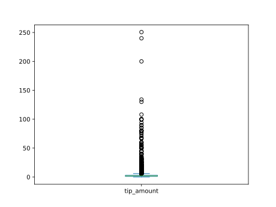

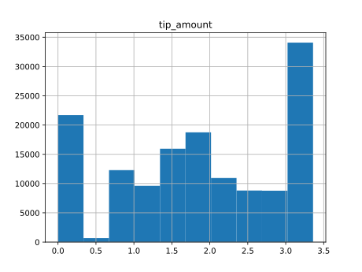

Indeed we see some outliers. There are several tips amounts bigger than $50. We are still going to consider them since these are completely reasonable amounts.
Maybe some clients are very generous!

Looking at the histogram below, we see that many passengers don't tip. This is something that we would expect in this kind of scenario.
A big group of people does not leave tips, and another one does. We can see a gap between both groups, meaning tipping very low is uncommon.

.. nbimport::
    :path: ./example_notebooks/Examples Green Taxi.ipynb
    :cells: 8
    :show_output:

Training a model
================

We will train an LGBMRegressor with its default parameters.

.. nbimport::
    :path: ./example_notebooks/Examples Green Taxi.ipynb
    :cells: 9

Evaluating the model
====================

To evaluate the model, we will compare its train and test Mean Absolute Error with a baseline model that always predicts the mean of the training tip amount.

.. nbimport::
    :path: ./example_notebooks/Examples Green Taxi.ipynb
    :cells: 10

Below we plotted two scatter plots, one with the actual and predicted values for training and a similar one with the predicted values for the testing data.
Both mean absolute errors are relatively low, meaning the model performs well enough for this use case.

.. nbimport::
    :path: ./example_notebooks/Examples Green Taxi.ipynb
    :cells: 11

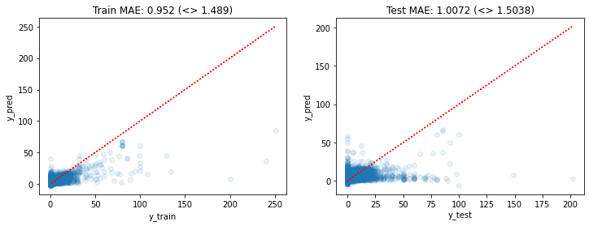

It makes sense that the most relevant feature is the fare amount since the tip is often a percentage of it.
Interestingly, the drop-out location is more important than the pick-up location. Let's try to reason why.

People often pick up a taxi in crowded places like cities and business centers. So, pick-up locations tend to be similar and less variable.
In contrast, drop-out locations can be very variable since people often take a taxi to their houses, restaurants, offices, etc. One could argue that
the drop-out location contains/encodes some information about the economic and social status of the passenger. Explaining why the drop-out location is more relevant
to predict the tip amount than the pick-up location.

.. nbimport::
    :path: ./example_notebooks/Examples Green Taxi.ipynb
    :cells: 12

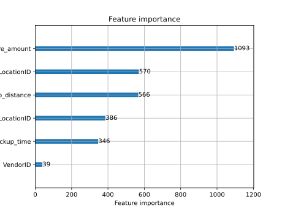

Deploying the model
===================

To simulate that we are in a production environment, we will use the trained model to make predictions on unseen production data.

We will later use NannyML to check how well the model performs on this data.

.. nbimport::
    :path: ./example_notebooks/Examples Green Taxi.ipynb
    :cells: 13
    :show_output:

Analysing ML model performance in production
============================================

We need to create a reference and analysis set to properly analyze the model performance in production.

* **Reference dataset:** The reference dataset should be one where the model behaves as expected. Ideally, one that the model did not see during training, but we know the correct targets and the model's predictions. This dataset allows us to establish a baseline for every metric we want to monitor. Ideally, we use the test set as a reference set, which is what we use in the code cell below.
* **Analysis dataset:** The analysis dataset is typically the latest production data up to a desired point in the past, which should be after the reference period ends. The analysis period is not required to have targets available. The analysis period is where NannyML analyzes/monitors the model's performance and data drift of the model using the knowledge gained from the reference set.

.. nbimport::
    :path: ./example_notebooks/Examples Green Taxi.ipynb
    :cells: 14

Estimating the model's performance
==================================

Once an ML model is in production, we would like to get a view of how the model is performing. The tricky part is that we can not always measure the actual performance.
To measure it, we need the correct targets, in this case, the tip amounts. But these targets may take a while before they are updated in the system.
The tip goes straight to the taxi drivers, so we will only know the actual values when they report it.

The good news is that we can leverage probabilistic methods to *estimate* the model performance. So instead of waiting for data to have targets, we will use a method
called `DLE <https://nannyml.readthedocs.io/en/stable/how_it_works/performance_estimation.html#how-it-works-dle>`_, short for Direct Loss Estimation, to *estimate* the model
performance.

The idea behind DLE is to train an extra ML model whose task is to estimate the value of the loss function of the monitored model. This can be later used to estimate
the original's model performance. DLE works for regression tasks like the one we are working on in this tutorial. But if you are interested in estimating the model
performance for a classification task,
check out `Estimating Performance for Classification <https://nannyml.readthedocs.io/en/stable/tutorials/performance_estimation/binary_performance_estimation.html>`_.

.. nbimport::
    :path: ./example_notebooks/Examples Green Taxi.ipynb
    :cells: 15

.. nbimport::
    :path: ./example_notebooks/Examples Green Taxi.ipynb
    :cells: 16

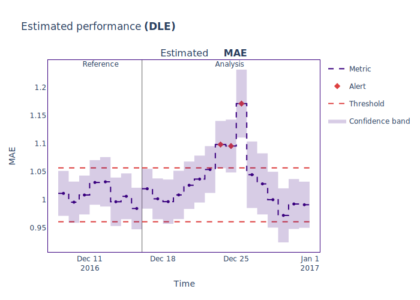

The plot above shows that the estimated performance exceeded the threshold during some days of the last week of December, which means that the model failed to make
reliable predictions during those days.

The next step is to go down the rabbit hole and figure out what went wrong during those days and see if we can find the root cause of these issues.

We will use multivariate and univariate data drift detection methods to achieve this. They will allow us to check if a drift in the data caused the performance issue.

Detecting multivariate data drift
=================================

Multivariate data drift detection gives us a general overview of changes across the entire feature space. It detects if there is a drift in the general distribution of all
the features. So, instead of looking at the distribution of each feature independently, it looks at all features at once.

This method allows us to look for more subtle changes in the data structure that univariate approaches cannot detect, such as changes in the linear relationships between
features.

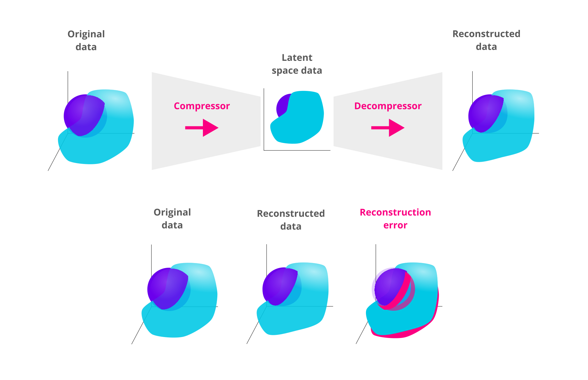

To do this, we use the method `DataReconstructionDriftCalculator` which compresses the **reference feature space** to a latent space using a PCA algorithm.
The algorithm later decompresses the latent space data and reconstructs it with some error. This error is called the reconstruction error.

We can later use the learned compressor/decompressor to transform the **production**
set and measure its reconstruction error. If the reconstruction error is bigger than a threshold, the structure learned by PCA no longer
accurately resembles the underlying structure of the analysis data. This indicates that there is data drift in the analysis/production data.

To learn more about how this works, check out our
documentation `Data Reconstruction with PCA Deep Dive <https://nannyml.readthedocs.io/en/stable/how_it_works/data_reconstruction.html>`_.

.. nbimport::
    :path: ./example_notebooks/Examples Green Taxi.ipynb
    :cells: 17

.. nbimport::
    :path: ./example_notebooks/Examples Green Taxi.ipynb
    :cells: 18

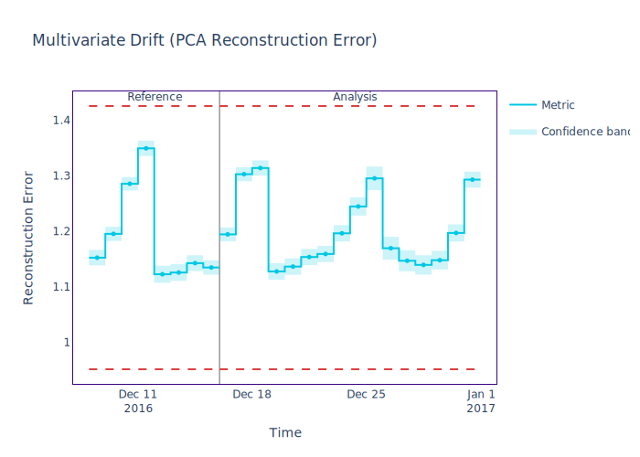

We don't see any multivariate drift happening. This may occur because the linear relationships between features did not change much, even though some features may have changed.

Imagine the points moving from an area with an average reconstruction error of 1.2 to another that is ≈1.2 instead of one that is 2 x 1.2.
In this case, the reconstruction error wouldn't change. `DataReconstructionDriftCalculator` is not expected to always capture the drift. We need both multivariate and
univariate to have the full picture.

Let's analyze it at a feature level and run the univariate drift detection methods.

Detecting univariate data drift
===============================

Univariate drift detection allows us to perform a more granular investigation. This time we will look at each feature individually and compare the reference and
analysis periods in search for drift in any relevant feature.

.. nbimport::
    :path: ./example_notebooks/Examples Green Taxi.ipynb
    :cells: 19

.. nbimport::
    :path: ./example_notebooks/Examples Green Taxi.ipynb
    :cells: 20

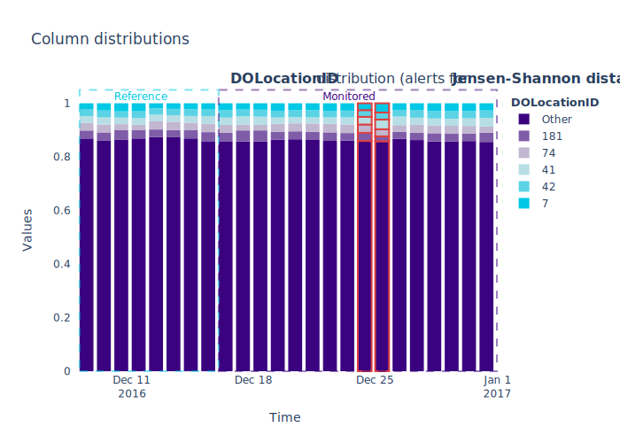

.. nbimport::
    :path: ./example_notebooks/Examples Green Taxi.ipynb
    :cells: 21

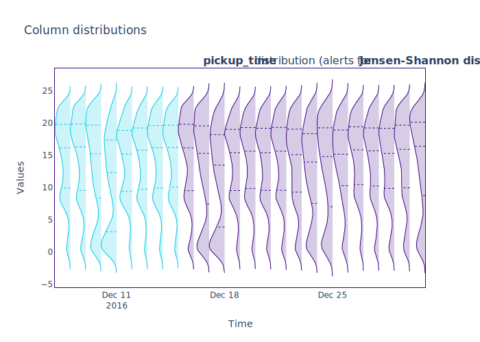

On the plots above, we see some drift happening for the `DOLocationID` and the `pickup_time` columns around Dec 18th and the week of Christmas.

Looking back at the performance estimation plot, we see that the performance did not drop on Dec 18th. This means that the drift on this date is a false alarm.

What is more interesting is the week of the 25th. Again, we see a drift in the pick-up location and pick-up time that correlates with the dates of the performance drop.

For this example, we picked the plots of the `DOLocationID` and the `pickup_time` since they are the two most important features showing data drift.

But, If you want to check if the other features drifted, you can run the following code and analyze each column distribution.

.. nbimport::
    :path: ./example_notebooks/Examples Green Taxi.ipynb
    :cells: 22

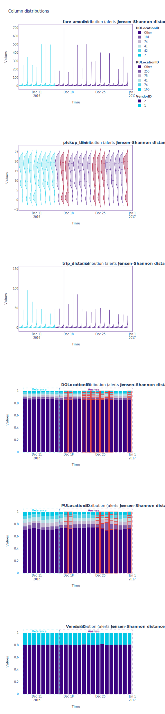

Bonus: Comparing realized and estimated performance
===================================================

When targets become available, we can calculate the actual model performance on production data. Also called realized performance.
In the cell below, we calculate the realized performance and compare it with NannyML's estimation.

.. nbimport::
    :path: ./example_notebooks/Examples Green Taxi.ipynb
    :cells: 23

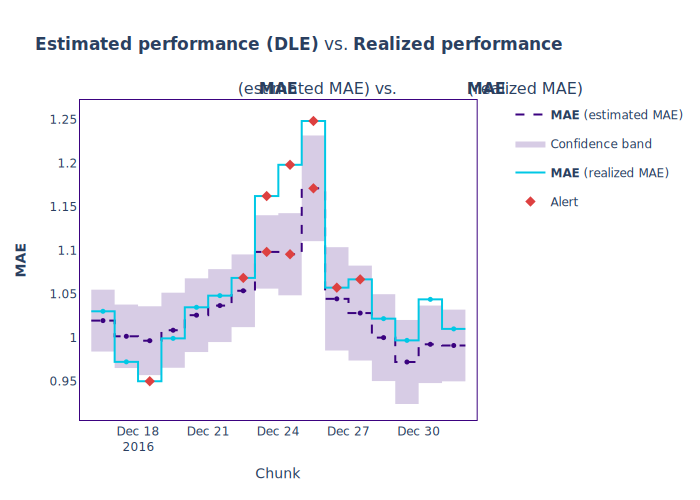

In the plot above, the estimated performance is usually close to the realized one. Except for some points during the holidays where the performance degradation is bigger
than estimated.

This may be because we have less than a year of data, so the model has no notion of what a holiday is and what it looks like. This is a sign of concept drift.
Currently, NannyML's algorithms don't support concept drift. But, the good news is that concept drift often coincides with data drift,
so in this case, `DLE <https://nannyml.readthedocs.io/en/stable/how_it_works/performance_estimation.html#how-it-works-dle>`_ was able to pick up some of the degradation
issues during the holidays.

Conclusion
==========

We built an ML model to predict the tip amount a passenger will leave after a taxi ride. Then, we used this model to make predictions on actual production data.
And we applied NannyML's performance estimation to spot performance degradation patterns. We also used data drift detection methods to explain these performance issues.

After finding what is causing the performance degradation issues, we need to figure out how to fix it.
Check out our previous blog post to learn six ways `to address data distribution shift <https://www.nannyml.com/blog/6-ways-to-address-data-distribution-shift>`_.