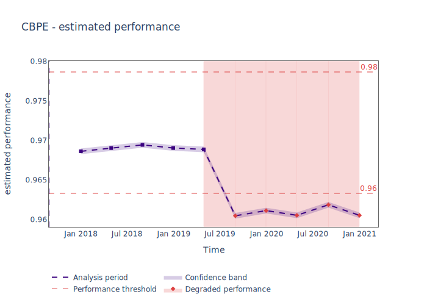

.. _chunk-data:

=============
Chunking data
=============

.. note::
    Not sure what data chunk is in the first place? Read about :term:`Data Chunk`.

Why do we need chunks?
======================

NannyML monitors ML models in production by doing data drift detection and performance estimation or monitoring.
This functionality relies on aggregate metrics that are evaluated on samples of production data.
These samples are called chunks. All the results generated are
calculated and presented per chunk i.e. a chunk is a single data point on the monitoring results. You
can refer to :ref:`Data Drift guide<data-drift>` or :ref:`Performance Estimation guide<performance-estimation>`
to review example results.

Creating chunks
===============
To allow for flexibility there are many ways to create chunks. The examples provided will explain how chunks are
created depending on the instructions provided. The examples will be run based on the performance estimation flow on
synthetic dataset provided by NannyML. Set up first with:

.. code-block:: python

    >>> import pandas as pd
    >>> import nannyml as nml
    >>> reference, analysis, _ = nml.datasets.load_synthetic_sample()
    >>> metadata = nml.extract_metadata(reference)
    >>> metadata.target_column_name = 'work_home_actual'

Time-based chunking
~~~~~~~~~~~~~~~~~~~

Time-based chunking creates chunks based on time intervals. One chunk can contain all the observations
from a single hour, day, week, month etc. In most cases, such chunks will vary in length. Specify ``chunk_period``
argument to get appropriate split. See the example below that chunks data quarterly:

.. code-block:: python

    >>> cbpe = nml.CBPE(model_metadata=metadata, chunk_period="Q")
    >>> cbpe.fit(reference_data=reference)
    >>> est_perf = cbpe.estimate(analysis)
    >>> est_perf.data.iloc[:3,:5]

+----+--------+---------------+-------------+---------------------+---------------------+
|    | key    |   start_index |   end_index | start_date          | end_date            |
+====+========+===============+=============+=====================+=====================+
|  0 | 2017Q3 |             0 |        1261 | 2017-08-31 00:00:00 | 2017-09-30 23:59:59 |
+----+--------+---------------+-------------+---------------------+---------------------+
|  1 | 2017Q4 |          1262 |        4951 | 2017-10-01 00:00:00 | 2017-12-31 23:59:59 |
+----+--------+---------------+-------------+---------------------+---------------------+
|  2 | 2018Q1 |          4952 |        8702 | 2018-01-01 00:00:00 | 2018-03-31 23:59:59 |
+----+--------+---------------+-------------+---------------------+---------------------+

.. note::
    Notice that each calendar quarter was taken into account, even if it was not fully covered with records.
    This makes some chunks smaller (usually the last and the first). See the first row above - Q3 is July-September,
    but the first record in the data is from the last day of August. First chunk has ~1.2k of observations while the 2nd
    and 3rd above 3k.

Possible time offsets are listed in the table below:

+------------+------------+
| Alias      | Description|
+============+============+
| S          | second     |
+------------+------------+
| T, min     | minute     |
+------------+------------+
| H          | hour       |
+------------+------------+
| D          | day        |
+------------+------------+
| W          | week       |
+------------+------------+
| M          | month      |
+------------+------------+
| Q          | quarter    |
+------------+------------+
| A, y       | year       |
+------------+------------+

Size-based chunking
~~~~~~~~~~~~~~~~~~~

Chunks can be of fixed size, i.e. each chunk contains the same number of observations. Set this up by specifying
``chunk_size`` parameter:

.. code-block:: python

    >>> cbpe = nml.CBPE(model_metadata=metadata, chunk_size=3500)
    >>> cbpe.fit(reference_data=reference)
    >>> est_perf = cbpe.estimate(analysis)
    >>> est_perf.data.iloc[:3,:5]

+----+--------------+---------------+-------------+---------------------+---------------------+
|    | key          |   start_index |   end_index | start_date          | end_date            |
+====+==============+===============+=============+=====================+=====================+
|  0 | [0:3499]     |             0 |        3499 | 2017-08-31 00:00:00 | 2017-11-26 23:59:59 |
+----+--------------+---------------+-------------+---------------------+---------------------+
|  1 | [3500:6999]  |          3500 |        6999 | 2017-11-26 00:00:00 | 2018-02-18 23:59:59 |
+----+--------------+---------------+-------------+---------------------+---------------------+
|  2 | [7000:10499] |          7000 |       10499 | 2018-02-18 00:00:00 | 2018-05-14 23:59:59 |
+----+--------------+---------------+-------------+---------------------+---------------------+

.. note::
    If the number of observations is not divisible by the chunk size required, the number of rows equal to the
    remainder of a division will be dropped. This ensures that each chunk has the same size, but in worst case
    scenario it results in dropping ``chunk_size-1`` rows. Notice that the last index in last chunk is 48999 while
    the last index in raw data is 49999:

    .. code-block:: python

        >>> est_perf.data.iloc[-2:,:5]

    +----+---------------+---------------+-------------+---------------------+---------------------+
    |    | key           |   start_index |   end_index | start_date          | end_date            |
    +====+===============+===============+=============+=====================+=====================+
    | 12 | [42000:45499] |         42000 |       45499 | 2020-06-18 00:00:00 | 2020-09-13 23:59:59 |
    +----+---------------+---------------+-------------+---------------------+---------------------+
    | 13 | [45500:48999] |         45500 |       48999 | 2020-09-13 00:00:00 | 2020-12-08 23:59:59 |
    +----+---------------+---------------+-------------+---------------------+---------------------+

    .. code-block:: python

        >>> analysis.index.max()
        49999

Number-based chunking
~~~~~~~~~~~~~~~~~~~~~

The total number of chunks can be fixed by ``chunk_number`` parameter:

.. code-block:: python

    >>> cbpe = nml.CBPE(model_metadata=metadata, chunk_number=9)
    >>> cbpe.fit(reference_data=reference)
    >>> est_perf = cbpe.estimate(analysis)
    >>> len(est_perf.data)
    9

.. note::
    Created chunks will be equal in size. If the number of observations is not divisible by the ``chunk_number`` then
    the number of observations equal to the residual of the division will be dropped. See:

    .. code-block:: python

        >>> est_perf.data.iloc[-2:,:5]

    +----+---------------+---------------+-------------+---------------------+---------------------+
    |    | key           |   start_index |   end_index | start_date          | end_date            |
    +====+===============+===============+=============+=====================+=====================+
    |  7 | [38885:44439] |         38885 |       44439 | 2020-04-03 00:00:00 | 2020-08-18 23:59:59 |
    +----+---------------+---------------+-------------+---------------------+---------------------+
    |  8 | [44440:49994] |         44440 |       49994 | 2020-08-18 00:00:00 | 2021-01-01 23:59:59 |
    +----+---------------+---------------+-------------+---------------------+---------------------+

    .. code-block:: python

        >>> analysis.index.max()
        49999

.. note::
    The same splitting rule is always applied to the dataset used for fitting (``reference``) and the dataset of
    interest (in the presented case - ``analysis``). Unless these two datasets are of the same size, the chunk sizes
    can be considerably different. Additionally, if the data drift or performance estimation is calculated on
    combined ``reference`` and ``analysis`` the results presented for ``reference`` will be calculated on different
    chunks than they were fitted.

Automatic chunking
~~~~~~~~~~~~~~~~~~

The default chunking method is size-based, with the size being three times the
estimated minimum size for the monitored data and model (see how NannyML estimates minimum chunk size in :ref:`deep
dive<minimum-chunk-size>`):

.. code-block:: python

    >>> cbpe = nml.CBPE(model_metadata=metadata)
    >>> cbpe.fit(reference_data=reference)
    >>> est_perf = cbpe.estimate(pd.concat([reference, analysis]))
    >>> est_perf.data.iloc[:3,:5]

+----+-------------+---------------+-------------+---------------------+---------------------+
|    | key         |   start_index |   end_index | start_date          | end_date            |
+====+=============+===============+=============+=====================+=====================+
|  0 | [0:899]     |             0 |         899 | 2014-05-09 00:00:00 | 2014-06-01 23:59:59 |
+----+-------------+---------------+-------------+---------------------+---------------------+
|  1 | [900:1799]  |           900 |        1799 | 2014-06-01 00:00:00 | 2014-06-23 23:59:59 |
+----+-------------+---------------+-------------+---------------------+---------------------+
|  2 | [1800:2699] |          1800 |        2699 | 2014-06-23 00:00:00 | 2014-07-15 23:59:59 |
+----+-------------+---------------+-------------+---------------------+---------------------+

Chunks on plots with results
============================

Finally, once the chunking method is selected, the full performance estimation can be run:

    .. code-block:: python

        >>> cbpe = nml.CBPE(model_metadata=metadata, chunk_size=5_000)
        >>> cbpe.fit(reference_data=reference)
        >>> est_perf = cbpe.estimate(analysis)
        >>> est_perf.plot(kind='performance').show()

Each marker on the plot represents estimated performance for a single chunk (y axis). Markers are placed at the end of the period covered by the chunk i.e. they indicate the last timestamp in the chunk (x axis). Plots are interactive - hovering over the marker will display the information about the period.

Additional considerations
=========================

Different partitions within one chunk
~~~~~~~~~~~~~~~~~~~~~~~~~~~~~~~~~~~~~

If you want to get performance estimation or data drift results for a dataset that contains two
partitions - ``reference`` and ``analysis``, most likely there will be a chunk that contains  observations from both of
them. Such a chunk will be considered as an ``analysis`` chunk, even if only one observation belongs to ``analysis``
observations. In the example below, chunk which contains observations from 44444 to 55554 is considered an analysis
chunk but indices from 44444 to 49999 point to reference observations:

.. code-block:: python

    >>> cbpe = nml.CBPE(model_metadata=metadata, chunk_number=9)
    >>> cbpe.fit(reference_data=reference)
    >>> # Estimate on concatenated reference and analysis
    >>> est_perf = cbpe.estimate(pd.concat([reference, analysis]))
    >>> est_perf.data.iloc[3:5,:7]

+----+---------------+---------------+-------------+---------------------+---------------------+-------------+---------------------+
|    | key           |   start_index |   end_index | start_date          | end_date            | partition   |   estimated_roc_auc |
+====+===============+===============+=============+=====================+=====================+=============+=====================+
|  3 | [33333:44443] |         33333 |       44443 | 2016-07-25 00:00:00 | 2017-04-19 23:59:59 | reference   |            0.968876 |
+----+---------------+---------------+-------------+---------------------+---------------------+-------------+---------------------+
|  4 | [44444:55554] |         44444 |       55554 | 2017-04-19 00:00:00 | 2018-01-15 23:59:59 | analysis    |            0.968921 |
+----+---------------+---------------+-------------+---------------------+---------------------+-------------+---------------------+

.. code-block:: python

    >>> reference.index.max()
    49999

.. note::
    This is especially important for Performance Estimation. Since the Performance Estimation algorithm is calibrated
    on the ``reference`` dataset (see :ref:`PE deep dive <performance-estimation-deep-dive>`), it will perform better on
    it. If the first ``analysis`` chunk contains ``reference`` data, the performance estimation may perform better on this
    chunk as well. Keep this in mind when interpreting the results.

Underpopulated chunks
~~~~~~~~~~~~~~~~~~~~~

Depending on the selected chunking method and the provided datasets, some chunks may be tiny. In fact, they
might be so small that results obtained are governed by noise rather than actual signal. NannyML estimates minimum chunk
size for the monitored data and model provided (see how in :ref:`deep dive<minimum-chunk-size>`). If some of the chunks
created are smaller than the minimum chunk size, a warning will be raised. For example:

.. code-block:: python

    >>> cbpe = nml.CBPE(model_metadata=metadata, chunk_period="Q")
    >>> cbpe.fit(reference_data=reference)
    >>> est_perf = cbpe.estimate(analysis)
    UserWarning: The resulting list of chunks contains 1 underpopulated chunks. They contain too few records to be
    statistically relevant and might negatively influence the quality of calculations. Please consider splitting
    your data in a different way or continue at your own risk.

When the warning is about 1 chunk, it is usually the last chunk and this is due to the reasons described in above
sections. When there are more chunks mentioned - the selected splitting method is most likely not suitable.
Look at the :ref:`deep dive on minimum chunk size <minimum-chunk-size>` to get more information about the effect of
small chunks. Beware of the trade-offs involved, when selecting the chunking method.

Not enough chunks
~~~~~~~~~~~~~~~~~
Sometimes the selected chunking method may result in not enough chunks being generated in the ``reference``
period. NannyML calculates thresholds based on variability of metrics on the ``reference`` chunks (see how thresholds
are calculated for :ref:`performance estimation<performance-estimation-thresholds>`). Having 6 chunks is
far from optimal but a reasonable minimum. If there are less than 6 chunks, a warning will be raised:

.. code-block:: python

    >>> cbpe = nml.CBPE(model_metadata=metadata, chunk_number=5)
    >>> cbpe.fit(reference_data=reference)
    >>> est_perf = cbpe.estimate(analysis)
    UserWarning: The resulting number of chunks is too low. Please consider splitting your data in a different way or
    continue at your own risk.
