.. _data-drift:

====================
Data Drift Detection
====================

What is data drift and why is it important?
===========================================

Take a machine learning model that uses some multidimensional input data
:math:`\mathbf{X}` and makes predictions :math:`y`.

The model has been trained on some data distribution :math:`P(\mathbf{X})`.
There is data drift when the production data comes from a different distribution
:math:`P(\mathbf{X'}) \neq P(\mathbf{X})`.

A machine learning model operating on an input distribution different from
the one it has been trained on will probably underperform. It is therefore crucial to detect
data drift, in a timely manner, when a model is in production. By further investigating the
characteristics of the observed drift, the data scientists operating the model
can potentially estimate the impact of the drift on the model's performance.

There is also a special case of data drift called label shift. In this case, the outcome
distributions between the training and production data are different, meaning
:math:`P(y') \neq P(y)`. However, the relationship between the population characteristics and
a specific outcome does not change, namely :math:`P(\mathbf{X'}|y') = P(\mathbf{X}|y)`.

It is important to note that data drift is not the only change that can happen when there is a
machine learning model in production. Another important change is concept drift, where the relationship
between the model inputs and the target changes. In this case we have: :math:`P(y'|\mathbf{X'}) \neq P(y|\mathbf{X})`.
In production it can happen that a model experiences data drift and concept drift simultaneously.

.. _data-drift-partitions:

Data Partitions
===============

In order to detect data drift NannyML needs two datasets. The reference partition and the
analysis partition.

Reference Partition
-------------------

The reference partition's purpose is to establish a baseline of expectations for the machine
learning model being monitored. The model inputs, model outputs and
the performance results of the monitored model are needed in the reference partition and are assumed
to be stable and acceptable.

The reference dataset can be a reference (or benchmark) period when the
monitored model has been in production and its performance results were satisfactory.
Alternatively, it can be the test set used when evaluating the monitored model before
deploying it to production. The reference dataset **cannot** be the training set used to fit the model.

Analysis Partition
------------------

The analysis partition is where NannyML analyzes the data drift and performance characteristics of the monitored
model and compares them to the reference partition.
The analysis partition will usually consist of the latest production data up to a desired point in
the past, which needs to be after the point where the reference partition ends.
The analysis partition is not required to have ground truth and associated performance results
available.

NannyML when performing drift analysis compares each :term:`Data Chunk` of the analysis partition
with the reference data. NannyML will flag any meaningful changes data distributions as data drift.

Drift alerts
============

NannyML uses statistics to issue an :term:`Alert`. It establishes an expected baseline from
the reference data and when the drift results for a chunk are unlikely, given the expectations
from the baseline, then it issues a drift alert. Given this statistical approach, there can be
cases where the alert is a false positive. However when reviewing the data drift visualizations
they can be easily spotted and discarded. An example of that will be presented later.

.. _data-drift-practice:

Detecting drift in model inputs
===============================

Let’s start by loading some synthetic data provided by the NannyML package.

.. code-block:: python

    >>> import nannyml as nml
    >>> import pandas as pd
    >>> reference, analysis, analysis_target = nml.load_synthetic_sample()
    >>> metadata = nml.extract_metadata(data = reference, model_name='wfh_predictor')
    >>> metadata.target_column_name = 'work_home_actual'
    >>> reference.head()

+----+------------------------+----------------+-----------------------+------------------------------+--------------------+-----------+----------+--------------+--------------------+---------------------+----------------+-------------+
|    |   distance_from_office | salary_range   |   gas_price_per_litre |   public_transportation_cost | wfh_prev_workday   | workday   |   tenure |   identifier |   work_home_actual | timestamp           |   y_pred_proba | partition   |
+====+========================+================+=======================+==============================+====================+===========+==========+==============+====================+=====================+================+=============+
|  0 |               5.96225  | 40K - 60K €    |               2.11948 |                      8.56806 | False              | Friday    | 0.212653 |            0 |                  1 | 2014-05-09 22:27:20 |           0.99 | reference   |
+----+------------------------+----------------+-----------------------+------------------------------+--------------------+-----------+----------+--------------+--------------------+---------------------+----------------+-------------+
|  1 |               0.535872 | 40K - 60K €    |               2.3572  |                      5.42538 | True               | Tuesday   | 4.92755  |            1 |                  0 | 2014-05-09 22:59:32 |           0.07 | reference   |
+----+------------------------+----------------+-----------------------+------------------------------+--------------------+-----------+----------+--------------+--------------------+---------------------+----------------+-------------+
|  2 |               1.96952  | 40K - 60K €    |               2.36685 |                      8.24716 | False              | Monday    | 0.520817 |            2 |                  1 | 2014-05-09 23:48:25 |           1    | reference   |
+----+------------------------+----------------+-----------------------+------------------------------+--------------------+-----------+----------+--------------+--------------------+---------------------+----------------+-------------+
|  3 |               2.53041  | 20K - 20K €    |               2.31872 |                      7.94425 | False              | Tuesday   | 0.453649 |            3 |                  1 | 2014-05-10 01:12:09 |           0.98 | reference   |
+----+------------------------+----------------+-----------------------+------------------------------+--------------------+-----------+----------+--------------+--------------------+---------------------+----------------+-------------+
|  4 |               2.25364  | 60K+ €         |               2.22127 |                      8.88448 | True               | Thursday  | 5.69526  |            4 |                  1 | 2014-05-10 02:21:34 |           0.99 | reference   |
+----+------------------------+----------------+-----------------------+------------------------------+--------------------+-----------+----------+--------------+--------------------+---------------------+----------------+-------------+

.. _data-drift-univariate:

Univariate drift detection
--------------------------

NannyML's Univariate approach for data drift looks at each variable individually and conducts
statistical tests comparing the chunks created from the data provided with the reference dataset.
NannyML uses the KS Test for continuous features and the 2 sample
Chi squared test for categorical features. Both tests provide a statistic where they measure the
observed drift and a p-value that shows how likely we are to get the observed sample
under the assumption that there was no drift. If the p-value is less than 0.05 NannyML considers
the result unlikely and issues an alert for the associated chunk and feature.

The :py:class:`nannyml.drift.univariate_statistical_drift_calculator.UnivariateStatisticalDriftCalculator`
class implements the functionality needed for Univariate Drift Detection.
An example using it can be seen below:

.. code-block:: python

    >>> # Let's initialize the object that will perform the Univariate Drift calculations
    >>> # Let's use a chunk size of 5000 data points to create our drift statistics
    >>> univariate_calculator = nml.UnivariateStatisticalDriftCalculator(model_metadata=metadata, chunk_size=5000)
    >>> # NannyML compares drift versus the full reference dataset.
    >>> univariate_calculator.fit(reference_data=reference)
    >>> # let's see drift statistics for all available data
    >>> data = pd.concat([reference, analysis], ignore_index=True)
    >>> univariate_results = univariate_calculator.calculate(data=data)
    >>> # let's view a small subset of our results:
    >>> # We use the data property of the results class to view the relevant data.
    >>> univariate_results.data.iloc[:5, :9]

+----+---------------+---------------+-------------+---------------------+---------------------+-------------+-------------------------+----------------------------+--------------------------+
|    | key           |   start_index |   end_index | start_date          | end_date            | partition   |   wfh_prev_workday_chi2 |   wfh_prev_workday_p_value | wfh_prev_workday_alert   |
+====+===============+===============+=============+=====================+=====================+=============+=========================+============================+==========================+
|  5 | [25000:29999] |         25000 |       29999 | 2016-01-08 00:00:00 | 2016-05-09 23:59:59 | reference   |               3.61457   |                      0.057 | False                    |
+----+---------------+---------------+-------------+---------------------+---------------------+-------------+-------------------------+----------------------------+--------------------------+
|  6 | [30000:34999] |         30000 |       34999 | 2016-05-09 00:00:00 | 2016-09-04 23:59:59 | reference   |               0.0757052 |                      0.783 | False                    |
+----+---------------+---------------+-------------+---------------------+---------------------+-------------+-------------------------+----------------------------+--------------------------+
|  7 | [35000:39999] |         35000 |       39999 | 2016-09-04 00:00:00 | 2017-01-03 23:59:59 | reference   |               0.414606  |                      0.52  | False                    |
+----+---------------+---------------+-------------+---------------------+---------------------+-------------+-------------------------+----------------------------+--------------------------+
|  8 | [40000:44999] |         40000 |       44999 | 2017-01-03 00:00:00 | 2017-05-03 23:59:59 | reference   |               0.0126564 |                      0.91  | False                    |
+----+---------------+---------------+-------------+---------------------+---------------------+-------------+-------------------------+----------------------------+--------------------------+
|  9 | [45000:49999] |         45000 |       49999 | 2017-05-03 00:00:00 | 2017-08-31 23:59:59 | reference   |               2.20383   |                      0.138 | False                    |
+----+---------------+---------------+-------------+---------------------+---------------------+-------------+-------------------------+----------------------------+--------------------------+

.. code-block:: python

    >>> univariate_results.data.iloc[-5:, :9]

+----+---------------+---------------+-------------+---------------------+---------------------+-------------+-------------------------+----------------------------+--------------------------+
|    | key           |   start_index |   end_index | start_date          | end_date            | partition   |   wfh_prev_workday_chi2 |   wfh_prev_workday_p_value | wfh_prev_workday_alert   |
+====+===============+===============+=============+=====================+=====================+=============+=========================+============================+==========================+
| 15 | [75000:79999] |         75000 |       79999 | 2019-04-30 00:00:00 | 2019-09-01 23:59:59 | analysis    |                 1179.9  |                          0 | True                     |
+----+---------------+---------------+-------------+---------------------+---------------------+-------------+-------------------------+----------------------------+--------------------------+
| 16 | [80000:84999] |         80000 |       84999 | 2019-09-01 00:00:00 | 2019-12-31 23:59:59 | analysis    |                 1162.99 |                          0 | True                     |
+----+---------------+---------------+-------------+---------------------+---------------------+-------------+-------------------------+----------------------------+--------------------------+
| 17 | [85000:89999] |         85000 |       89999 | 2019-12-31 00:00:00 | 2020-04-30 23:59:59 | analysis    |                 1170.49 |                          0 | True                     |
+----+---------------+---------------+-------------+---------------------+---------------------+-------------+-------------------------+----------------------------+--------------------------+
| 18 | [90000:94999] |         90000 |       94999 | 2020-04-30 00:00:00 | 2020-09-01 23:59:59 | analysis    |                 1023.35 |                          0 | True                     |
+----+---------------+---------------+-------------+---------------------+---------------------+-------------+-------------------------+----------------------------+--------------------------+
| 19 | [95000:99999] |         95000 |       99999 | 2020-09-01 00:00:00 | 2021-01-01 23:59:59 | analysis    |                 1227.54 |                          0 | True                     |
+----+---------------+---------------+-------------+---------------------+---------------------+-------------+-------------------------+----------------------------+--------------------------+

NannyML returns a dataframe with 3 columns for each feature. The first column contains the corresponding test
statistic. The second column contains the corresponding p-value and the third column says whether there
is a drift alert for that feature and the relevant chunk.

NannyML can also visualize those results with the following code:

.. code-block:: python

    >>> # let's plot drift results for all model inputs
    >>> for feature in metadata.features:
    ...     figure = univariate_results.plot(kind='feature_drift', metric='statistic', feature_label=feature.label)
    ...     figure.show()

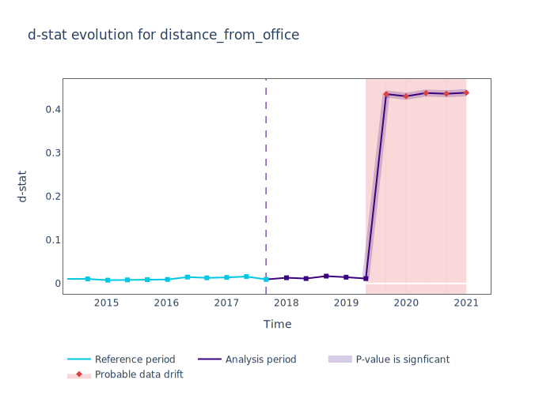

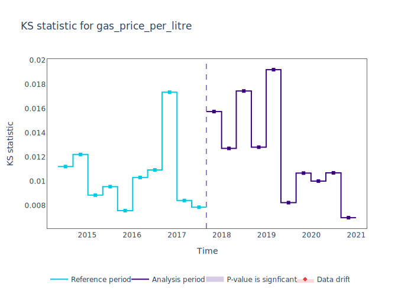

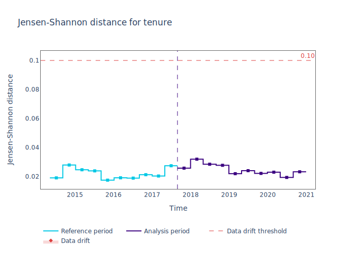

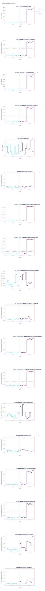

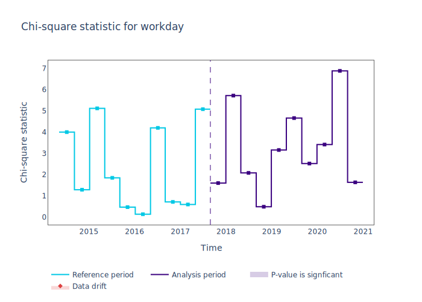

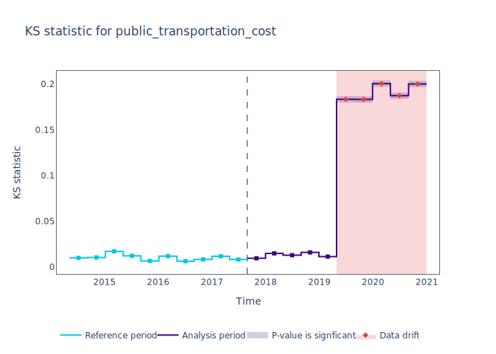

NannyML also shows details about the distributions of continuous variables and
stacked bar charts for categorical variables. It does so with the following code:

.. code-block:: python

    >>> # let's plot distribution drift results for continuous model inputs
    >>> for feature in metadata.continuous_features:
    ...     figure = univariate_results.plot(
    ...         kind='feature_distribution',
    ...         feature_label=feature.label
    ...     )
    ...     figure.show()

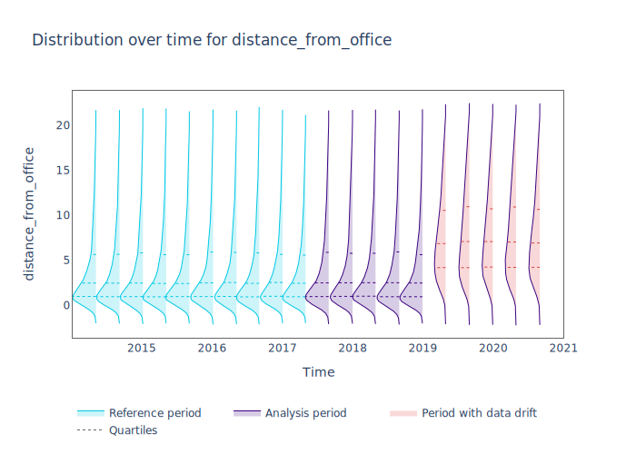

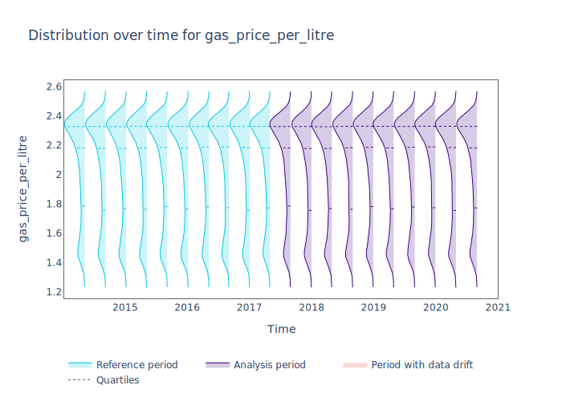

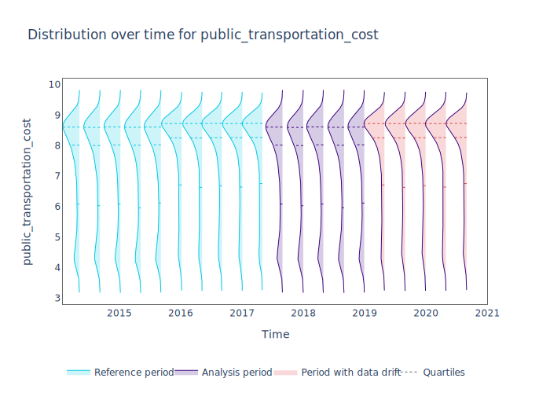

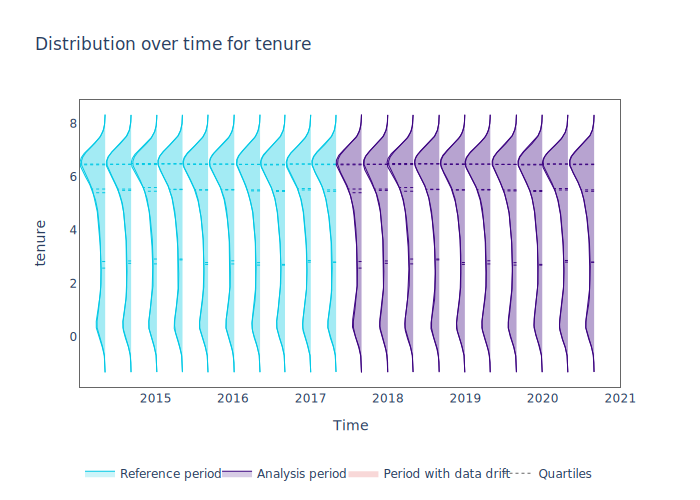

.. code-block:: python

    >>> # let's plot distribution drift results for categorical model inputs
    >>> for feature in metadata.categorical_features:
    ...     figure = univariate_results.plot(
    ...         kind='feature_distribution',
    ...         feature_label=feature.label
    ...     )
    ...     figure.show()

.. image:: ../_static/drift-guide-stacked-salary_range.svg

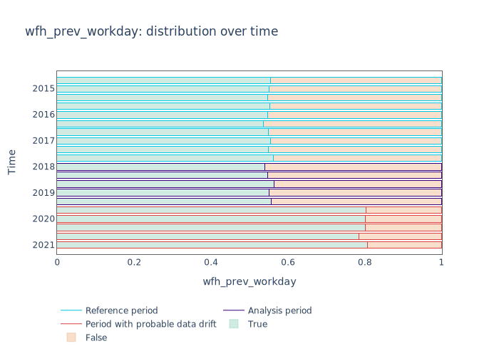

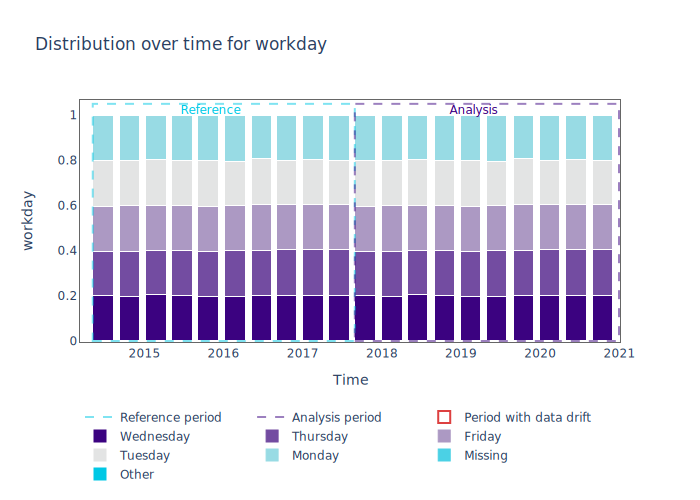

NannyML highlights the areas with possible data drift.
Here, the ``tenure`` feature has two alerts that are false positives, from a model monitoring
point of view. That is so because the measure of the drift, as shown by the KS d-statistic is very low. This is
in conrast to the alerts for the ``public_transportation_cost`` for example, where
the KS d-statistc grows significantly.
The features ``distance_from_office``, ``salary_range``, ``public_transportation_cost``,
``wfh_prev_workday`` have been rightly identified as exhibiting drift.

NannyML can rank features according to how many alerts they have had within the data analyzed
for data drift. NannyML allows for the option to view the ranking of all the model inputs or just the ones that have drifted.
NannyML provides a dataframe with the resulting ranking of features using the code below:

.. code-block:: python

    >>> ranker = nml.Ranker.by('alert_count')
    >>> ranked_features = ranker.rank(univariate_results, model_metadata=metadata, only_drifting = False)
    >>> ranked_features

+----+----------------------------+--------------------+--------+
|    | feature                    |   number_of_alerts |   rank |
+====+============================+====================+========+
|  0 | wfh_prev_workday           |                  5 |      1 |
+----+----------------------------+--------------------+--------+
|  1 | salary_range               |                  5 |      2 |
+----+----------------------------+--------------------+--------+
|  2 | distance_from_office       |                  5 |      3 |
+----+----------------------------+--------------------+--------+
|  3 | public_transportation_cost |                  5 |      4 |
+----+----------------------------+--------------------+--------+
|  4 | tenure                     |                  2 |      5 |
+----+----------------------------+--------------------+--------+
|  5 | workday                    |                  0 |      6 |
+----+----------------------------+--------------------+--------+
|  6 | gas_price_per_litre        |                  0 |      7 |
+----+----------------------------+--------------------+--------+

.. _data-drift-multivariate:

Multivariate drift detection
----------------------------

The univariate approach to data drift detection is simple and interpretable but has a few significant downsides.
Multidimensional data can have complex structures
whose change may not be visible by just viewing the distributions of each feature.

NannyML uses Data Reconstruction with PCA to detect such changes. For a detailed explanation of
the method see
:ref:`Data Reconstruction with PCA Deep Dive<data-reconstruction-pca>`.
The method returns a single number, :term:`Reconstruction Error`. The changes in this value
reflect a change in the structure of the model inputs. NannyML monitors the
reconstruction error over time for the monitored model and raises an alert if the
values get outside the range observed in the reference partition.

The :py:class:`nannyml.drift.data_reconstruction_drift_calcutor.DataReconstructionDriftCalculator`
module implements this functionality.
An example of us using it can be seen below:

.. code-block:: python

    >>> # Let's initialize the object that will perform Data Reconstruction with PCA
    >>> # Let's use a chunk size of 5000 data points to create our drift statistics
    >>> rcerror_calculator = nml.DataReconstructionDriftCalculator(model_metadata=metadata, chunk_size=5000)
    >>> # NannyML compares drift versus the full reference dataset.
    >>> rcerror_calculator.fit(reference_data=reference)
    >>> # let's see RC error statistics for all available data
    >>> rcerror_results = rcerror_calculator.calculate(data=data)

An important detail is that :ref:`Data Reconstruction with PCA Deep Dive<data-reconstruction-pca>` cannot process missing values,
therefore they need to be imputed. The default :term:`Imputation` implemented by NannyML imputes
the most frequent value for categorical features and the mean for continuous features. It takes place if the relevant optional
arguments are not specified. If needed they can be specified with an instannce of `SimpleImputer`_ class
in which cases NannyML will perform the imputation as instructed. An example where custom imputation strategies are used can be seen below:

.. code-block:: python

    >>> from sklearn.impute import SimpleImputer
    >>>
    >>> # Let's initialize the object that will perform Data Reconstruction with PCA
    >>> rcerror_calculator = nml.DataReconstructionDriftCalculator(
    >>>     model_metadata=metadata,
    >>>     chunk_size=5000,
    >>>     imputer_categorical=SimpleImputer(strategy='constant', fill_value='missing'),
    >>>     imputer_continuous=SimpleImputer(strategy='median')
    >>> )
    >>> # NannyML compares drift versus the full reference dataset.
    >>> rcerror_calculator.fit(reference_data=reference)
    >>> # let's see RC error statistics for all available data
    >>> rcerror_results = rcerror_calculator.calculate(data=data)

Because our synthetic dataset does not have missing values, the results are the same in both cases:

.. code-block:: python

    >>> # We use the data property of the results class to view the relevant data.
    >>> rcerror_results.data

+----+---------------+---------------+-------------+---------------------+---------------------+-------------+------------------------+-------------------+-------------------+---------+
|    | key           |   start_index |   end_index | start_date          | end_date            | partition   |   reconstruction_error |   lower_threshold |   upper_threshold | alert   |
+====+===============+===============+=============+=====================+=====================+=============+========================+===================+===================+=========+
|  0 | [0:4999]      |             0 |        4999 | 2014-05-09 00:00:00 | 2014-09-09 23:59:59 | reference   |                1.12096 |           1.09658 |           1.13801 | False   |
+----+---------------+---------------+-------------+---------------------+---------------------+-------------+------------------------+-------------------+-------------------+---------+
|  1 | [5000:9999]   |          5000 |        9999 | 2014-09-09 00:00:00 | 2015-01-09 23:59:59 | reference   |                1.11807 |           1.09658 |           1.13801 | False   |
+----+---------------+---------------+-------------+---------------------+---------------------+-------------+------------------------+-------------------+-------------------+---------+
|  2 | [10000:14999] |         10000 |       14999 | 2015-01-09 00:00:00 | 2015-05-09 23:59:59 | reference   |                1.11724 |           1.09658 |           1.13801 | False   |
+----+---------------+---------------+-------------+---------------------+---------------------+-------------+------------------------+-------------------+-------------------+---------+
|  3 | [15000:19999] |         15000 |       19999 | 2015-05-09 00:00:00 | 2015-09-07 23:59:59 | reference   |                1.12551 |           1.09658 |           1.13801 | False   |
+----+---------------+---------------+-------------+---------------------+---------------------+-------------+------------------------+-------------------+-------------------+---------+
|  4 | [20000:24999] |         20000 |       24999 | 2015-09-07 00:00:00 | 2016-01-08 23:59:59 | reference   |                1.10945 |           1.09658 |           1.13801 | False   |
+----+---------------+---------------+-------------+---------------------+---------------------+-------------+------------------------+-------------------+-------------------+---------+
|  5 | [25000:29999] |         25000 |       29999 | 2016-01-08 00:00:00 | 2016-05-09 23:59:59 | reference   |                1.12276 |           1.09658 |           1.13801 | False   |
+----+---------------+---------------+-------------+---------------------+---------------------+-------------+------------------------+-------------------+-------------------+---------+
|  6 | [30000:34999] |         30000 |       34999 | 2016-05-09 00:00:00 | 2016-09-04 23:59:59 | reference   |                1.10714 |           1.09658 |           1.13801 | False   |
+----+---------------+---------------+-------------+---------------------+---------------------+-------------+------------------------+-------------------+-------------------+---------+
|  7 | [35000:39999] |         35000 |       39999 | 2016-09-04 00:00:00 | 2017-01-03 23:59:59 | reference   |                1.12713 |           1.09658 |           1.13801 | False   |
+----+---------------+---------------+-------------+---------------------+---------------------+-------------+------------------------+-------------------+-------------------+---------+
|  8 | [40000:44999] |         40000 |       44999 | 2017-01-03 00:00:00 | 2017-05-03 23:59:59 | reference   |                1.11424 |           1.09658 |           1.13801 | False   |
+----+---------------+---------------+-------------+---------------------+---------------------+-------------+------------------------+-------------------+-------------------+---------+
|  9 | [45000:49999] |         45000 |       49999 | 2017-05-03 00:00:00 | 2017-08-31 23:59:59 | reference   |                1.11045 |           1.09658 |           1.13801 | False   |
+----+---------------+---------------+-------------+---------------------+---------------------+-------------+------------------------+-------------------+-------------------+---------+
| 10 | [50000:54999] |         50000 |       54999 | 2017-08-31 00:00:00 | 2018-01-02 23:59:59 | analysis    |                1.11854 |           1.09658 |           1.13801 | False   |
+----+---------------+---------------+-------------+---------------------+---------------------+-------------+------------------------+-------------------+-------------------+---------+
| 11 | [55000:59999] |         55000 |       59999 | 2018-01-02 00:00:00 | 2018-05-01 23:59:59 | analysis    |                1.11504 |           1.09658 |           1.13801 | False   |
+----+---------------+---------------+-------------+---------------------+---------------------+-------------+------------------------+-------------------+-------------------+---------+
| 12 | [60000:64999] |         60000 |       64999 | 2018-05-01 00:00:00 | 2018-09-01 23:59:59 | analysis    |                1.12546 |           1.09658 |           1.13801 | False   |
+----+---------------+---------------+-------------+---------------------+---------------------+-------------+------------------------+-------------------+-------------------+---------+
| 13 | [65000:69999] |         65000 |       69999 | 2018-09-01 00:00:00 | 2018-12-31 23:59:59 | analysis    |                1.12845 |           1.09658 |           1.13801 | False   |
+----+---------------+---------------+-------------+---------------------+---------------------+-------------+------------------------+-------------------+-------------------+---------+
| 14 | [70000:74999] |         70000 |       74999 | 2018-12-31 00:00:00 | 2019-04-30 23:59:59 | analysis    |                1.12289 |           1.09658 |           1.13801 | False   |
+----+---------------+---------------+-------------+---------------------+---------------------+-------------+------------------------+-------------------+-------------------+---------+
| 15 | [75000:79999] |         75000 |       79999 | 2019-04-30 00:00:00 | 2019-09-01 23:59:59 | analysis    |                1.22839 |           1.09658 |           1.13801 | True    |
+----+---------------+---------------+-------------+---------------------+---------------------+-------------+------------------------+-------------------+-------------------+---------+
| 16 | [80000:84999] |         80000 |       84999 | 2019-09-01 00:00:00 | 2019-12-31 23:59:59 | analysis    |                1.22003 |           1.09658 |           1.13801 | True    |
+----+---------------+---------------+-------------+---------------------+---------------------+-------------+------------------------+-------------------+-------------------+---------+
| 17 | [85000:89999] |         85000 |       89999 | 2019-12-31 00:00:00 | 2020-04-30 23:59:59 | analysis    |                1.23739 |           1.09658 |           1.13801 | True    |
+----+---------------+---------------+-------------+---------------------+---------------------+-------------+------------------------+-------------------+-------------------+---------+
| 18 | [90000:94999] |         90000 |       94999 | 2020-04-30 00:00:00 | 2020-09-01 23:59:59 | analysis    |                1.20605 |           1.09658 |           1.13801 | True    |
+----+---------------+---------------+-------------+---------------------+---------------------+-------------+------------------------+-------------------+-------------------+---------+
| 19 | [95000:99999] |         95000 |       99999 | 2020-09-01 00:00:00 | 2021-01-01 23:59:59 | analysis    |                1.24258 |           1.09658 |           1.13801 | True    |
+----+---------------+---------------+-------------+---------------------+---------------------+-------------+------------------------+-------------------+-------------------+---------+

NannyML can also visualize multivariate drift results with the following code:

.. code-block:: python

    >>> figure = rcerror_results.plot(kind='drift')
    >>> figure.show()

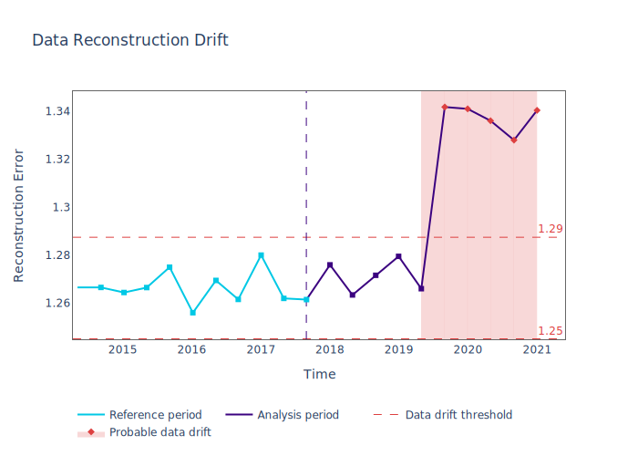

The multivariate drift results provide a consice summary of where data drift
is happening in our input data.

.. _SimpleImputer: https://scikit-learn.org/stable/modules/generated/sklearn.impute.SimpleImputer.html

Drift detection for model outputs
=================================

NannyML also detects data drift in the :term:`Model Outputs`. It uses the same univariate methodology as for a
continuous feature. The results are in our previously created ``univariate_results`` object. We can visualize them with:

.. code-block:: python

    >>> univariate_calculator = nml.UnivariateStatisticalDriftCalculator(model_metadata=metadata, chunk_size=5000)
    >>> univariate_calculator.fit(reference_data=reference)
    >>> data = pd.concat([reference, analysis], ignore_index=True)
    >>> univariate_results = univariate_calculator.calculate(data=data)
    >>> figure = univariate_results.plot(kind='prediction_drift', metric='statistic')
    >>> figure.show()

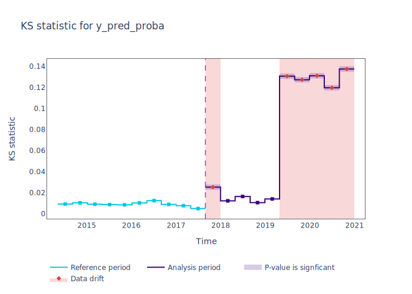

NannyML can also show how the distributions of the model predictions evolved over time:

.. code-block:: python

    >>> figure = univariate_results.plot(kind='prediction_distribution', metric='statistic')
    >>> figure.show()

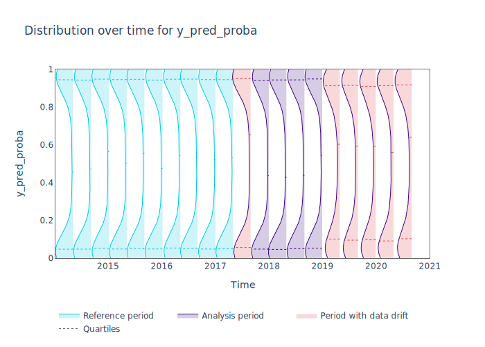

Looking at the results we see that we have a false alert on the first chunk of the analysis data. Similar
to the ``tenure`` variable this is a false alert because the drift measured by the KS d-statistic is very low. This
can happen when the statistical tests consider significant a small change in the distribtion of a variable
in the chunks.

Drift detection for model targets
=================================

NannyML provides tools to calculate drift in the distribution of target values.
The :class:`~nannyml.drift.target.target_distribution.calculator.TargetDistributionCalculator` will calculate both
the *mean** and the *2 sample Chi squared test* of the target values for each chunk.

In order to calculate target drift, the target values must be available. Let's manually join them with the analysis
data first.

.. code-block:: python

    >>> data = pd.concat([reference, analysis.set_index('identifier').join(analysis_target.set_index('identifier'), on='identifier', rsuffix='_r')], ignore_index=True).reset_index(drop=True)
    >>> data.loc[data['partition'] == 'analysis'].head(3)

+-------+------------------------+----------------+-----------------------+------------------------------+--------------------+-----------+----------+--------------+--------------------+---------------------+----------------+-------------+----------+
|       |   distance_from_office | salary_range   |   gas_price_per_litre |   public_transportation_cost | wfh_prev_workday   | workday   |   tenure |   identifier |   work_home_actual | timestamp           |   y_pred_proba | partition   |   y_pred |
+=======+========================+================+=======================+==============================+====================+===========+==========+==============+====================+=====================+================+=============+==========+
| 50000 |               0.527691 | 0 - 20K €      |               1.8     |                      8.96072 | False              | Tuesday   |  4.22463 |          nan |                  1 | 2017-08-31 04:20:00 |           0.99 | analysis    |        1 |
+-------+------------------------+----------------+-----------------------+------------------------------+--------------------+-----------+----------+--------------+--------------------+---------------------+----------------+-------------+----------+
| 50001 |               8.48513  | 20K - 20K €    |               2.22207 |                      8.76879 | False              | Friday    |  4.9631  |          nan |                  1 | 2017-08-31 05:16:16 |           0.98 | analysis    |        1 |
+-------+------------------------+----------------+-----------------------+------------------------------+--------------------+-----------+----------+--------------+--------------------+---------------------+----------------+-------------+----------+
| 50002 |               2.07388  | 40K - 60K €    |               2.31008 |                      8.64998 | True               | Friday    |  4.58895 |          nan |                  1 | 2017-08-31 05:56:44 |           0.98 | analysis    |        1 |
+-------+------------------------+----------------+-----------------------+------------------------------+--------------------+-----------+----------+--------------+--------------------+---------------------+----------------+-------------+----------+

Now that the data is in place we'll create a new
:class:`~nannyml.drift.target.target_distribution.calculator.TargetDistributionCalculator` and *fit* it to the
reference data using the :meth:`~nannyml.drift.target.target_distribution.calculator.TargetDistributionCalculator.fit`
method.

.. code-block:: python

    >>> target_distribution_calculator = nml.TargetDistributionCalculator(model_metadata=metadata, chunk_size=5000)
    >>> target_distribution_calculator.fit(reference_data=reference)

After fitting the :class:`calculator<nannyml.drift.target.target_distribution.calculator.TargetDistributionCalculator>`
is ready to use. We calculate the target distribution by calling the
:meth:`~nannyml.drift.target.target_distribution.calculator.TargetDistributionCalculator.calculate`
method, providing our previously assembled dat as an argument.

.. code-block:: python

    >>> target_distribution = target_distribution_calculator.calculate(data)
    >>> target_distribution.data.head(3)

+----+---------------+---------------+-------------+---------------------+---------------------+-------------+------------------------+-----------------------+----------------------------+-----------+--------------+---------+---------------+
|    | key           |   start_index |   end_index | start_date          | end_date            | partition   |   targets_missing_rate |   metric_target_drift |   statistical_target_drift |   p_value |   thresholds | alert   | significant   |
+====+===============+===============+=============+=====================+=====================+=============+========================+=======================+============================+===========+==============+=========+===============+
|  0 | [0:4999]      |             0 |        4999 | 2014-05-09 22:27:20 | 2014-09-09 08:18:27 | reference   |                      0 |                0.4944 |                   0.467363 |  0.494203 |         0.05 | False   | False         |
+----+---------------+---------------+-------------+---------------------+---------------------+-------------+------------------------+-----------------------+----------------------------+-----------+--------------+---------+---------------+
|  1 | [5000:9999]   |          5000 |        9999 | 2014-09-09 09:13:35 | 2015-01-09 00:02:51 | reference   |                      0 |                0.493  |                   0.76111  |  0.382981 |         0.05 | False   | False         |
+----+---------------+---------------+-------------+---------------------+---------------------+-------------+------------------------+-----------------------+----------------------------+-----------+--------------+---------+---------------+
|  2 | [10000:14999] |         10000 |       14999 | 2015-01-09 00:04:43 | 2015-05-09 15:54:26 | reference   |                      0 |                0.505  |                   0.512656 |  0.473991 |         0.05 | False   | False         |
+----+---------------+---------------+-------------+---------------------+---------------------+-------------+------------------------+-----------------------+----------------------------+-----------+--------------+---------+---------------+

The results can be easily plotted by using the
:meth:`~nannyml.drift.target.target_distribution.result.TargetDistributionResult.plot` method.

.. code-block:: python

    >>> fig = target_distribution.plot(kind='distribution', distribution='metric')
    >>> fig.show()

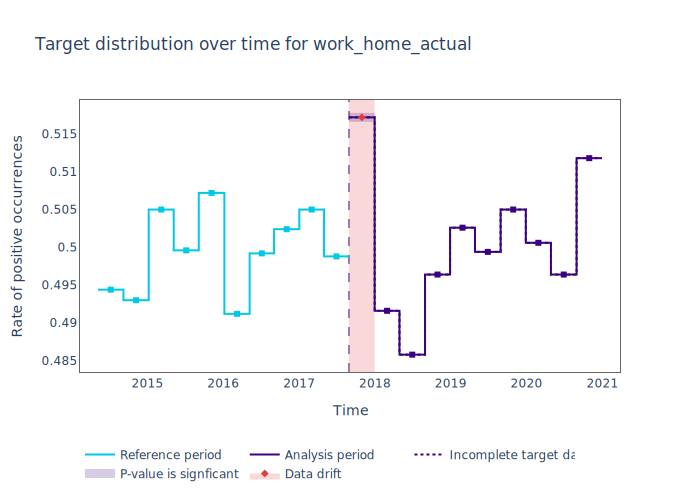

.. code-block:: python

    >>> fig = target_distribution.plot(kind='distribution', distribution='statistical')
    >>> fig.show()

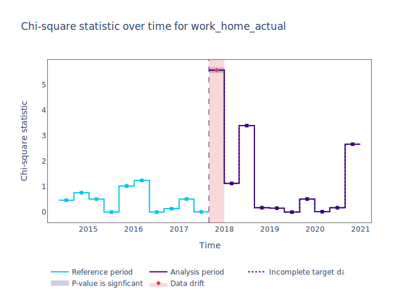
