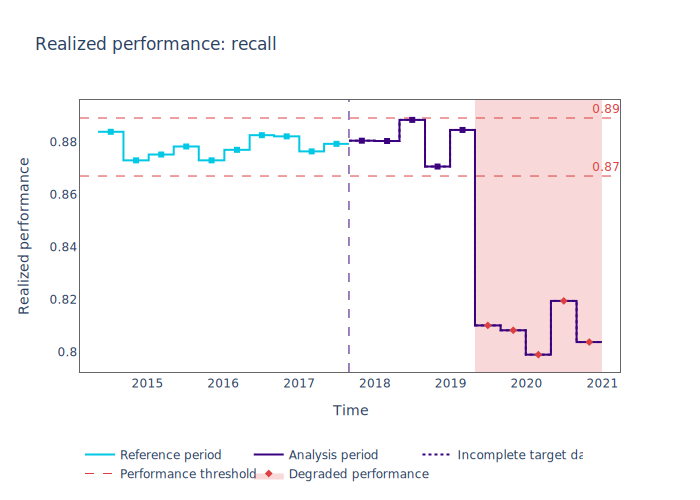

.. _performance-calculation:

=======================
Performance Calculation
=======================

This guide explains how to use NannyML to calculate the **realized performance** of a monitored model.
Note that this will require target values to be available in both the reference and analysis data.
The guide is based on a synthetic dataset where the monitored model predicts whether an employee will work from home.
Let's set things up to calculate the *ROC AUC* and *recall* values.

Prepare the data
================

Let's load the data first. The sample dataset only contains *predicted probabilities*, not the actual *predicted labels*.
In order to calculate *recall* values, we'll need to have the predicted labels as well.

These are added to the set by thresholding the probabilities, done here with a simple constant for the sake of simplicity.

.. code-block:: python

    >>> import pandas as pd
    >>> import nannyml as nml

    >>> reference, analysis, analysis_target = nml.datasets.load_synthetic_sample()
    >>> reference['y_pred'] = reference['y_pred_proba'].map(lambda p: int(p >= 0.8))
    >>> analysis['y_pred'] = analysis['y_pred_proba'].map(lambda p: int(p >= 0.8))

    >>> reference.head(3)

+----+------------------------+----------------+-----------------------+------------------------------+--------------------+-----------+----------+--------------+--------------------+---------------------+----------------+-------------+--------+
|    |   distance_from_office | salary_range   |   gas_price_per_litre |   public_transportation_cost | wfh_prev_workday   | workday   |   tenure |   identifier |   work_home_actual | timestamp           |   y_pred_proba | partition   | y_pred |
+====+========================+================+=======================+==============================+====================+===========+==========+==============+====================+=====================+================+=============+========+
|  0 |               5.96225  | 40K - 60K €    |               2.11948 |                      8.56806 | False              | Friday    | 0.212653 |            0 |                  1 | 2014-05-09 22:27:20 |           0.99 | reference   |      1 |
+----+------------------------+----------------+-----------------------+------------------------------+--------------------+-----------+----------+--------------+--------------------+---------------------+----------------+-------------+--------+
|  1 |               0.535872 | 40K - 60K €    |               2.3572  |                      5.42538 | True               | Tuesday   | 4.92755  |            1 |                  0 | 2014-05-09 22:59:32 |           0.07 | reference   |      0 |
+----+------------------------+----------------+-----------------------+------------------------------+--------------------+-----------+----------+--------------+--------------------+---------------------+----------------+-------------+--------+
|  2 |               1.96952  | 40K - 60K €    |               2.36685 |                      8.24716 | False              | Monday    | 0.520817 |            2 |                  1 | 2014-05-09 23:48:25 |           1    | reference   |      1 |
+----+------------------------+----------------+-----------------------+------------------------------+--------------------+-----------+----------+--------------+--------------------+---------------------+----------------+-------------+--------+

The realized performance will be calculated on the combination of both reference and analysis data. The analysis target
values are joined on the analysis frame by the ``identifier`` column.

.. code-block:: python

    >>> data = pd.concat([reference, analysis.set_index('identifier').join(analysis_target.set_index('identifier'), on='identifier', rsuffix='_r')], ignore_index=True).reset_index(drop=True)
    >>> data.loc[data['partition'] == 'analysis'].head(3)

+-------+------------------------+----------------+-----------------------+------------------------------+--------------------+-----------+----------+--------------+--------------------+---------------------+----------------+-------------+----------+
|       |   distance_from_office | salary_range   |   gas_price_per_litre |   public_transportation_cost | wfh_prev_workday   | workday   |   tenure |   identifier |   work_home_actual | timestamp           |   y_pred_proba | partition   |   y_pred |
+=======+========================+================+=======================+==============================+====================+===========+==========+==============+====================+=====================+================+=============+==========+
| 50000 |               0.527691 | 0 - 20K €      |               1.8     |                      8.96072 | False              | Tuesday   |  4.22463 |          nan |                  1 | 2017-08-31 04:20:00 |           0.99 | analysis    |        1 |
+-------+------------------------+----------------+-----------------------+------------------------------+--------------------+-----------+----------+--------------+--------------------+---------------------+----------------+-------------+----------+
| 50001 |               8.48513  | 20K - 20K €    |               2.22207 |                      8.76879 | False              | Friday    |  4.9631  |          nan |                  1 | 2017-08-31 05:16:16 |           0.98 | analysis    |        1 |
+-------+------------------------+----------------+-----------------------+------------------------------+--------------------+-----------+----------+--------------+--------------------+---------------------+----------------+-------------+----------+
| 50002 |               2.07388  | 40K - 60K €    |               2.31008 |                      8.64998 | True               | Friday    |  4.58895 |          nan |                  1 | 2017-08-31 05:56:44 |           0.98 | analysis    |        1 |
+-------+------------------------+----------------+-----------------------+------------------------------+--------------------+-----------+----------+--------------+--------------------+---------------------+----------------+-------------+----------+

Let's extract the metadata and complete any missing information:

.. code-block:: python

    >>> metadata = nml.extract_metadata(reference)
    >>> metadata.target_column_name = 'work_home_actual'
    >>> metadata.to_df()

+----+-----------------------------------+----------------------------+-------------+-----------------------------------------------+
|    | label                             | column_name                | type        | description                                   |
+====+===================================+============================+=============+===============================================+
|  0 | identifier_column_name            | identifier                 | continuous  | identifier                                    |
+----+-----------------------------------+----------------------------+-------------+-----------------------------------------------+
|  1 | timestamp_column_name             | timestamp                  | continuous  | timestamp                                     |
+----+-----------------------------------+----------------------------+-------------+-----------------------------------------------+
|  2 | partition_column_name             | partition                  | categorical | partition                                     |
+----+-----------------------------------+----------------------------+-------------+-----------------------------------------------+
|  3 | target_column_name                | work_home_actual           | categorical | target                                        |
+----+-----------------------------------+----------------------------+-------------+-----------------------------------------------+
|  4 | prediction_column_name            | y_pred                     | continuous  | predicted label                               |
+----+-----------------------------------+----------------------------+-------------+-----------------------------------------------+
|  5 | predicted_probability_column_name | y_pred_proba               | continuous  | predicted score/probability                   |
+----+-----------------------------------+----------------------------+-------------+-----------------------------------------------+
|  6 | distance_from_office              | distance_from_office       | continuous  | extracted feature: distance_from_office       |
+----+-----------------------------------+----------------------------+-------------+-----------------------------------------------+
|  7 | salary_range                      | salary_range               | categorical | extracted feature: salary_range               |
+----+-----------------------------------+----------------------------+-------------+-----------------------------------------------+

Full information on how the data should be prepared can be found in the guide on :ref:`importing data<import-data>`.

Fit calculator and calculate
============================

In the next step a :class:`~nannyml.performance_calculation.calculator.PerformanceCalculator` is created using the previously
extracted :class:`~nannyml.metadata.ModelMetadata`, a list of metrics and an optional :ref:`chunking<chunk-data>` specification.
The list of metrics specifies which metrics should be calculated. For an overview of all metrics,
check the :mod:`~nannyml.performance_calculation.metrics` module.

The new :class:`~nannyml.performance_calculation.calculator.PerformanceCalculator` is then fitted using the
:meth:`~nannyml.performance_calculation.calculator.PerformanceCalculator.fit` method using the available ``reference`` data.

.. code-block:: python

    >>> performance_calculator = nml.PerformanceCalculator(model_metadata=metadata, metrics=['roc_auc', 'recall'], chunk_size=5000)
    >>> performance_calculator.fit(reference_data=reference)

The fitted :class:`~nannyml.performance_calculation.calculator.PerformanceCalculator` can be used to calculate
realized performance metrics on data for which target values are available.
This is typically done on all data (both reference and analysis) for which target values are available.

.. code-block:: python

    >>> realized_performance = performance_calculator.calculate(data)

View the results
==============================

To get the data frame with results:

.. code-block:: python

    >>> realized_performance.data.head(3)

+----+---------------+---------------+-------------+---------------------+---------------------+-------------+------------------------+-----------+-----------------------------------------+-----------------+----------+------------------------------------------+----------------+
|    | key           |   start_index |   end_index | start_date          | end_date            | partition   |   targets_missing_rate |   roc_auc | roc_auc_thresholds                      | roc_auc_alert   |   recall | recall_thresholds                        | recall_alert   |
+====+===============+===============+=============+=====================+=====================+=============+========================+===========+=========================================+=================+==========+==========================================+================+
|  0 | [0:4999]      |             0 |        4999 | 2014-05-09 22:27:20 | 2014-09-09 08:18:27 | reference   |                      0 |  0.976253 | (0.963316535948479, 0.9786597341713761) | False           | 0.8839   | (0.8670598996318404, 0.8891521304432684) | False          |
+----+---------------+---------------+-------------+---------------------+---------------------+-------------+------------------------+-----------+-----------------------------------------+-----------------+----------+------------------------------------------+----------------+
|  1 | [5000:9999]   |          5000 |        9999 | 2014-09-09 09:13:35 | 2015-01-09 00:02:51 | reference   |                      0 |  0.969045 | (0.963316535948479, 0.9786597341713761) | False           | 0.873022 | (0.8670598996318404, 0.8891521304432684) | False          |
+----+---------------+---------------+-------------+---------------------+---------------------+-------------+------------------------+-----------+-----------------------------------------+-----------------+----------+------------------------------------------+----------------+
|  2 | [10000:14999] |         10000 |       14999 | 2015-01-09 00:04:43 | 2015-05-09 15:54:26 | reference   |                      0 |  0.971742 | (0.963316535948479, 0.9786597341713761) | False           | 0.875248 | (0.8670598996318404, 0.8891521304432684) | False          |
+----+---------------+---------------+-------------+---------------------+---------------------+-------------+------------------------+-----------+-----------------------------------------+-----------------+----------+------------------------------------------+----------------+

.. _performance-estimation-thresholds:

Apart from chunking and chunk and partition-related data, the results data have the a set of columns for each
calculated metric. When taking ``roc_auc`` as an example:

 - ``roc_auc`` - the value of the metric for a specific chunk,
 - ``confidence`` - the width of the confidence band. It is equal to 1 standard deviation of performance estimates on
   `reference` data (hence calculated during ``fit`` phase).
 - ``roc_auc_thresholds`` - a tuple containing the lower and upper thresholds. Crossing them will raise an alert on significant
   metric change. The thresholds are calculated based on the realized performance metric of the monitored model on chunks in
   the ``reference`` partition. The thresholds are 3 standard deviations away from the mean performance calculated on
   ``reference`` chunks.
 - ``roc_auc_alert`` - flag indicating potentially significant performance change. ``True`` if realized performance crosses
   upper or lower threshold.

The results can be also plotted:

.. code-block:: python

    >>> fig = realized_performance.plot(kind='performance', metric='roc_auc')
    >>> fig.show()

.. image:: ../_static/performance_calculation_roc_auc.svg

.. code-block:: python

    >>> fig = realized_performance.plot(kind='performance', metric='recall')
    >>> fig.show()

