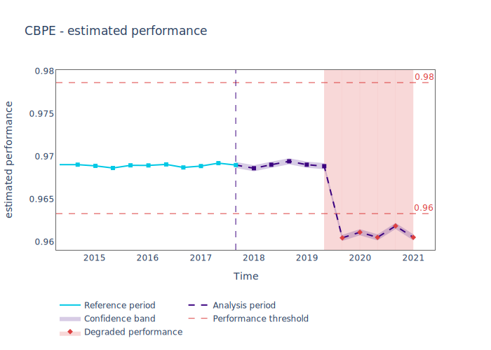
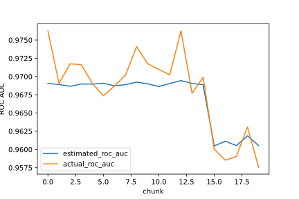

.. _performance-estimation:

====
Performance Estimation
====

This guide will explain how to use NannyML to estimate performance of monitored model (in absence of ground truth).
The guide is based on synthetic dataset where the monitored model is predicting whether an employee is working from
home.

Prepare the data
====
Let's first load the data and have a quick look:

    .. code-block:: python

        >>> import pandas as pd
        >>> import nannyml as nml
        >>> df_ref, df_ana, df_ana_gt = nml.datasets.load_synthetic_sample()
        >>> df_ref.head(3)

    +----+------------------------+----------------+-----------------------+------------------------------+--------------------+-----------+----------+--------------+--------------------+---------------------+----------------+-------------+
    |    |   distance_from_office | salary_range   |   gas_price_per_litre |   public_transportation_cost | wfh_prev_workday   | workday   |   tenure |   identifier |   work_home_actual | timestamp           |   y_pred_proba | partition   |
    +====+========================+================+=======================+==============================+====================+===========+==========+==============+====================+=====================+================+=============+
    |  0 |               5.96225  | 40K - 60K €    |               2.11948 |                      8.56806 | False              | Friday    | 0.212653 |            0 |                  1 | 2014-05-09 22:27:20 |           0.99 | reference   |
    +----+------------------------+----------------+-----------------------+------------------------------+--------------------+-----------+----------+--------------+--------------------+---------------------+----------------+-------------+
    |  1 |               0.535872 | 40K - 60K €    |               2.3572  |                      5.42538 | True               | Tuesday   | 4.92755  |            1 |                  0 | 2014-05-09 22:59:32 |           0.07 | reference   |
    +----+------------------------+----------------+-----------------------+------------------------------+--------------------+-----------+----------+--------------+--------------------+---------------------+----------------+-------------+
    |  2 |               1.96952  | 40K - 60K €    |               2.36685 |                      8.24716 | False              | Monday    | 0.520817 |            2 |                  1 | 2014-05-09 23:48:25 |           1    | reference   |
    +----+------------------------+----------------+-----------------------+------------------------------+--------------------+-----------+----------+--------------+--------------------+---------------------+----------------+-------------+

    .. code-block:: python

        >>> df_ana.head(3)

    +----+------------------------+----------------+-----------------------+------------------------------+--------------------+-----------+----------+--------------+---------------------+----------------+-------------+
    |    |   distance_from_office | salary_range   |   gas_price_per_litre |   public_transportation_cost | wfh_prev_workday   | workday   |   tenure |   identifier | timestamp           |   y_pred_proba | partition   |
    +====+========================+================+=======================+==============================+====================+===========+==========+==============+=====================+================+=============+
    |  0 |               0.527691 | 0 - 20K €      |               1.8     |                      8.96072 | False              | Tuesday   |  4.22463 |        50000 | 2017-08-31 04:20:00 |           0.99 | analysis    |
    +----+------------------------+----------------+-----------------------+------------------------------+--------------------+-----------+----------+--------------+---------------------+----------------+-------------+
    |  1 |               8.48513  | 20K - 20K €    |               2.22207 |                      8.76879 | False              | Friday    |  4.9631  |        50001 | 2017-08-31 05:16:16 |           0.98 | analysis    |
    +----+------------------------+----------------+-----------------------+------------------------------+--------------------+-----------+----------+--------------+---------------------+----------------+-------------+
    |  2 |               2.07388  | 40K - 60K €    |               2.31008 |                      8.64998 | True               | Friday    |  4.58895 |        50002 | 2017-08-31 05:56:44 |           0.98 | analysis    |
    +----+------------------------+----------------+-----------------------+------------------------------+--------------------+-----------+----------+--------------+---------------------+----------------+-------------+

``df_ref`` and ``df_ana`` correspond to respectively ``reference`` and ``analysis`` partitions of monitored data. To
understand what they are read about :ref:`data partitions<data-partitions>`. Let's leave
``df_ana_gt`` for now, it will be described and used later.

Lets extract the metadata and fill the missing values required:

    .. code-block:: python

        >>> df_ana.head(3)
        >>> md = nml.extract_metadata(df_ref)
        >>> md.ground_truth_column_name = 'work_home_actual'

Full information on how the data should be prepared can be found in guide on :ref:`importing data<import-data>`.

Fit estimator and estimate
====
In the next step Confidence-based Performance Estimation (CBPE) estimator is fitted on ``reference`` data. Chunking
method needs to be specified now. Read more about chunking in relevant :ref:`guide<chunk-data>`.

    .. code-block:: python

        >>> cbpe = nml.CBPE(model_metadata=md, chunk_size=5000)
        >>> cbpe.fit(reference_data=df_ref)

Now we can use the ``cbpe`` to estimate performance on other data. Typically this would be used on ``analysis`` data
where the ground truth is actually missing. However, to get a better context it can be also used on combined
``reference`` and ``analysis`` data:

    .. code-block:: python

        >>> est_perf = cbpe.estimate(pd.concat([df_ref, df_ana]))

To find out how CBPE estimates performance read the relevant :ref:`deep dive<performance-estimation-deep-dive>`.

View and interpret the results
====

The results can be investigated in the form of data:

    .. code-block:: python

        >>> est_perf.head(3)

    +----+---------------+---------------+-------------+---------------------+---------------------+-------------+---------------------+--------------+-------------------+-------------------+---------+
    |    | key           |   start_index |   end_index | start_date          | end_date            | partition   |   estimated_roc_auc |   confidence |   upper_threshold |   lower_threshold | alert   |
    +====+===============+===============+=============+=====================+=====================+=============+=====================+==============+===================+===================+=========+
    |  0 | [0:4999]      |             0 |        4999 | 2014-05-09 00:00:00 | 2014-09-09 23:59:59 | reference   |            0.969051 |   0.00035752 |           0.97866 |          0.963317 | False   |
    +----+---------------+---------------+-------------+---------------------+---------------------+-------------+---------------------+--------------+-------------------+-------------------+---------+
    |  1 | [5000:9999]   |          5000 |        9999 | 2014-09-09 00:00:00 | 2015-01-09 23:59:59 | reference   |            0.968909 |   0.00035752 |           0.97866 |          0.963317 | False   |
    +----+---------------+---------------+-------------+---------------------+---------------------+-------------+---------------------+--------------+-------------------+-------------------+---------+
    |  2 | [10000:14999] |         10000 |       14999 | 2015-01-09 00:00:00 | 2015-05-09 23:59:59 | reference   |            0.968657 |   0.00035752 |           0.97866 |          0.963317 | False   |
    +----+---------------+---------------+-------------+---------------------+---------------------+-------------+---------------------+--------------+-------------------+-------------------+---------+

.. _performance-estimation-thresholds:

Apart form chunking and chunk and partition-related data, the results data has the following columns:

 - ``estimated_roc_auc`` - the estimate of performance for specific chunk,
 - ``confidence`` - the width of confidence band. It is equal to 1 standard deviation of performance estimates on
   `reference` data (hence calculated during ``fit`` phase).
 - ``upper_threshold`` and ``lower_threshold`` - crossing these thresholds will raise an alert on significant
   performance change. The thresholds are calculated based on the actual performance of monitored model on chunks in
   ``reference`` partition. The thresholds are 3 standard deviations away from the mean performance calculated on chunks.
   They are calculated during ``fit`` phase.
 - ``alert`` - flag indicating potentially severe performance change. ``True`` if estimated performance crosses upper
   or lower threshold.
   provided. together with ``confidence``.

Results can be also view in the form of plot:

Compare with the actual performance
====

When the ground truth becomes available, the quality of estimation can be evaluated. For the synthetic dataset, the
ground truth is given in ``df_ana_gt`` variable. It consists of ``identifier`` that allows to match it with
``analysis`` data and the target for monitored model - ``work_home_actual``:

    .. code-block:: python

        >>> est_perf.head(3)

+----+--------------+--------------------+
|    |   identifier |   work_home_actual |
+====+==============+====================+
|  0 |        50000 |                  1 |
+----+--------------+--------------------+
|  1 |        50001 |                  1 |
+----+--------------+--------------------+
|  2 |        50002 |                  1 |
+----+--------------+--------------------+

    .. code-block:: python

        >>> from sklearn.metrics import roc_auc_score
        >>> import matplotlib.pyplot as plt
        >>>
        >>> df_ana_full = pd.merge(df_ana, df_ana_gt, on = 'identifier')
        >>> df_all = pd.concat([df_ref, df_ana_full]).reset_index(drop=True)
        >>>
        >>> target_col = 'work_home_actual'
        >>> pred_score_col = 'y_pred_proba'
        >>> actual_performance = []
        >>>
        >>> for idx in est_perf.index:
        >>>     start_index, end_index = est_perf.loc[idx, 'start_index'], est_perf.loc[idx, 'end_index']
        >>>     sub = df_all.loc[start_index:end_index]
        >>>     actual_perf = roc_auc_score(sub[target_col], sub[pred_score_col])
        >>>     est_perf.loc[idx, 'actual_roc_auc'] = actual_perf
        >>>
        >>>     est_perf[['estimated_roc_auc', 'actual_roc_auc']].plot()
        >>>     plt.xlabel('chunk')
        >>>     plt.ylabel('ROC AUC')
        >>>     plt.show()

