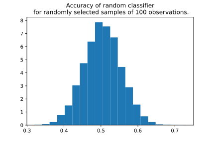

.. _chunk-data:

Chunking Considerations
=======================

For an introduction on :term:`Chunks<Data Chunk>` please have a look at our
:ref:`chunking tutorial Chunking<chunking>`. This guide focuses on the
potential issues that may arise from using chunks. They are described below.

Not Enough Chunks
-----------------

Sometimes the selected chunking method might not generate enough chunks in the reference period.

NannyML calculates thresholds based on the variability of metrics measured in the reference chunks (see how thresholds
are calculated for :ref:`performance estimation<performance-estimation-thresholds>`). Having 6 chunks is
far from optimal, but it is a reasonable minimum. If there are less than 6 chunks, a warning will be raised.

.. code-block:: python

    >>> cbpe = nml.CBPE(
    ...     y_pred_proba='y_pred_proba',
    ...     y_pred='y_pred',
    ...     y_true='work_home_actual',
    ...     timestamp_column_name='timestamp',
    ...     chunk_number=5,
    ...     metrics=['roc_auc']
    >>> ).fit(reference_data=reference)
    >>> est_perf = cbpe.estimate(analysis)
    UserWarning: The resulting number of chunks is too low. Please consider splitting your data in a different way or continue at your own risk.

Not Enough Observations in Chunk
--------------------------------

Sometimes the selected chunking method may result in some chunks being relatively small.
This may lead to a situation when it is infeasible to calculate some metric on such chunk.

Imagine a binary classification task with some chunks that do not contain positive targets at all.
In that case, performance metrics like precision (True Positives/All positives) just cannot be calculated.
In such situations NannyML, will return ``NaN`` in the results data for that specific chunk.

.. _sampling-error-introduction:

Impact of Chunk Size on Reliability of Results
----------------------------------------------

Small sample size strongly affects the reliability of any ML or statistical analysis.
NannyML allows splitting data into chunks in different ways to let users choose chunks that
are meaningful for them.

However, when the chunks are too small, statistical results may become unreliable. In such
cases, results are governed by sampling noise rather than the actual signal. For example, when the chunk size is small, what could look like a significant drop in performance of the monitored model may only be a sampling effect.

To better understand that, have a look at the
histogram below. It shows the sampling distribution of accuracy for a random model predicting a random binary target (which by definition should be 0.5)
for samples containing 100 observations. It is not uncommon to get an accuracy of 0.6 for some samples. The effect is even
stronger for more complex metrics like ROC AUC.

.. code-block:: python

    >>> import numpy as np
    >>> import matplotlib.pyplot as plt
    >>> from sklearn.metrics import accuracy_score

    >>> sample_size = 100
    >>> dataset_size = 10_000
    >>> # random model
    >>> np.random.seed(23)
    >>> y_true = np.random.binomial(1, 0.5, dataset_size)
    >>> y_pred = np.random.binomial(1, 0.5, dataset_size)
    >>> accuracy_scores = []

    >>> for experiment in range(10_000):
    >>>     subset_indexes = np.random.choice(dataset_size, sample_size, replace=False) # get random indexes
    >>>     y_true_subset = y_true[subset_indexes]
    >>>     y_pred_subset = y_pred[subset_indexes]
    >>>     accuracy_scores.append(accuracy_score(y_true_subset, y_pred_subset))

    >>> plt.hist(accuracy_scores, bins=20, density=True)
    >>> plt.title("Accuracy of random classifier\n for randomly selected samples of 100 observations.");

When there are many chunks, it is easy to spot the noisy nature of fluctuations. However, with only a few chunks,
it is difficult to tell whether the observed changes are significant or not. To make this easier, NannyML quantifies
the sampling error by estimating the standard error (i.e. standard deviation of the sampling distribution).
To find out exactly how this is done, see :ref:`Estimation of Standard Error<estimation_of_standard_error>`.
