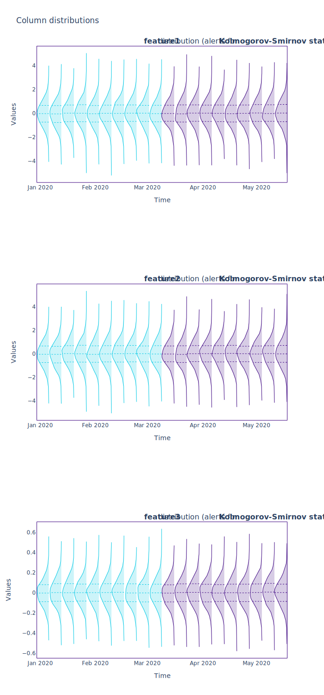

.. _data-reconstruction-pca:

============================
Data Reconstruction with PCA
============================

Here we will explain why data reconstruction with PCA is useful, and how it is performed.
For information on how to use this feature of the library, read the tutorial on
:ref:`Multivariate Data Drift Detection<multivariate_drift_detection>`.

Limitations of Univariate Drift Detection
-----------------------------------------

Machine Learning models typically have a multidimensional input space. In binary
classification problems, models are trained to find the optimal decision
boundary. This boundary depends on the structure of the data within the model input
space. However the world is not static, and the structure of a model's input data can
change. This change can then cause our existing decision boundary to be suboptimal.

:ref:`The Univariate Drift Detection tutorial<univariate_drift_detection>` describes how NannyML analyzes
each feature individually, and observes whether there are changes in the resulting feature
distributions over time.

However, this is not enough to capture all the changes that may affect a machine learning model.
The changes in correlations and more complex changes in relationships between model inputs might have
a significant impact on model performance without changing univariate distributions of features.
The "butterfly" dataset, introduced below, demonstrates this.

"Butterfly" Dataset
~~~~~~~~~~~~~~~~~~~

Let's see first how we can construct an instance of the Butterfly dataset.

.. nbimport::
    :path: ./example_notebooks/How It Works - Data Reconstruction with PCA.ipynb
    :cells: 1

The key property of the butterfly dataset is the data drift on its first two features.
This data drift is introduced by a 90 degree rotation across the z-axis. The practical effect
of this rotation is that we started with two features, `feature1` and `feature2` that were positively correlated
but are now negatively correlated. The following code creates a plot that clearly shows the
resulting data drift.

.. nbimport::
    :path: ./example_notebooks/How It Works - Data Reconstruction with PCA.ipynb
    :cells: 2

.. image:: ../_static/butterfly-scatterplot.svg

The plot shows that the univariate distribution of features `feature1` and
`feature2` are unchanged. With blue color you can see the original distribution
of the two features and with red color you can see the resulting distribution
after we have applied our transformation.

Using NannyML to compute and plot the univariate
drift statistics shows that on the individual feature level no changes are visible.

.. nbimport::
    :path: ./example_notebooks/How It Works - Data Reconstruction with PCA.ipynb
    :cells: 4

These results make it clear that the univariate distribution results do not detect any drift.
However, we know there is data drift in the butterfly dataset. As mentioned, the correlation between features
`feature1` and `feature2` has changed from positive to negative.
A methodology that is able to identify this change is needed. This is where :term:`Multivariate Drift Detection`
using Data Reconstruction with PCA can be applied.

Data Reconstruction with PCA
----------------------------

This method is able to capture complex changes in our data. The algorithm implementing Data
Reconstruction with PCA works in three steps as described below.

The first step is data preparation. This includes missing values :term:`Imputation`,
frequency encoding, and scaling the data. Missing values need to be imputed because it is a PCA requirement.
Frequency encoding is used to convert all categorical features into numbers. The next thing to do
is standardize all features to 0 mean and unit variance, to make sure that all features
contribute to PCA on equal footing.

The second step is the dimensionality reduction where PCA comes in.
By default it aims to capture 65% of the dataset's variance, but this is a parameter that
can be changed. The PCA algorithm is fitted on the reference dataset and
learns a transformation from the pre-processed model input space to a :term:`latent space<Latent space>`.

NannyML then applies this transformation to compress the data that is
being analyzed. It is important to note that the PCA method captures the internal structure of the
model input data and ignores any random noise that is usually present.

The third step is decompressing the data we just compressed.
This is done using the inverse PCA transformation which transforms the data from latent space
back to the prepocessed model input space.

Then, the euclidean distance between the original data points and their re-cosntructed counterparts
is computed. The resulting distances are then aggregated to get their average. The resulting
number is called :term:`Reconstruction Error`.

Understanding Reconstruction Error with PCA
-------------------------------------------

As PCA learns the internal structure of the data, a significant change in the reconstruction error means
that the learned structure no longer accurately approximates the current data structure. This indicates data drift.

When applying PCA we lose some information about our dataset.
This means that the reconstructed data will always be slightly different compared to the original,
and the reconstruction error reflects that.
Because of this the valuable insight doesn't come from the value of the reconstruction
error but from **the change in reconstruction error values over time**. The change tells if there is data drift.

This is because when there is data drift the principal components the PCA method has learnt become suboptimal.
This will result in worse reconstruction of the new data and therefore a different reconstruction error.

Because of the noise present in real world datasets, there will always be some
variability in the reconstruction error results. So not every change in reconstruction
error values means that we have data drift.

The variability of reconstruction error values on a known good dataset is used to determine an acceptable
variance on the reconstruction error values. Any reconstruction error values outside of that
variance represent a significant change in reconstruction error.

NannyML computes the mean and standard deviation of the reconstruction error with PCA on the reference
dataset based on the different results for each :term:`Data Chunk`. This establishes
a range of expected values of reconstruction error. A threshold for significant change
in NannyML is defined as values that are more than three standard deviations away from the mean
of the reference data.

Reconstruction Error with PCA on the butterfly dataset
~~~~~~~~~~~~~~~~~~~~~~~~~~~~~~~~~~~~~~~~~~~~~~~~~~~~~~

Now that we have a better understanding of Reconstruction Error with PCA, let's see
what it does on the butterfly dataset.

.. nbimport::
    :path: ./example_notebooks/How It Works - Data Reconstruction with PCA.ipynb
    :cells: 6

.. image:: ../_static/butterfly-multivariate-drift.svg

The change in the butterfly dataset is now clearly visible through the change in the
reconstruction error, while our earlier univariate approach detected no change.

For more information on using Reconstruction Error with PCA check
the :ref:`Multivariate Drift Detection<multivariate_drift_detection>` tutorial.
