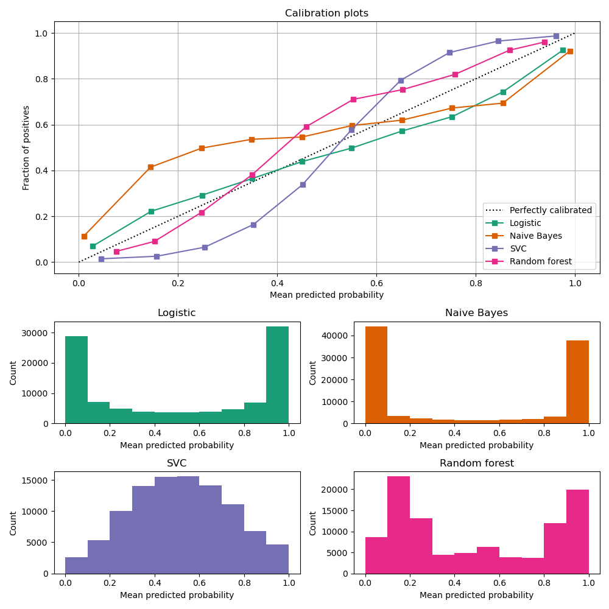
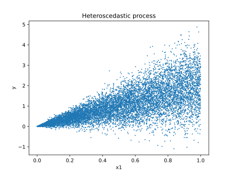
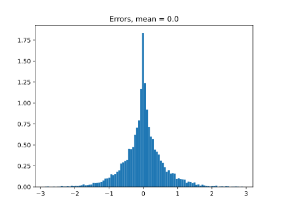
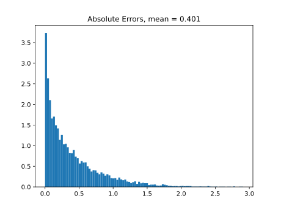

.. _performance-estimation-deep-dive:

================================================
Estimation of Performance of the Monitored Model
================================================

This page describes the algorithms that NannyML uses to estimate performance metrics of monitored models
in the absence of ground truth. Currently, there are two approaches. One is called Confidence-based
Performance Estimation (:class:`~nannyml.performance_estimation.confidence_based.cbpe.CBPE`), which leverages
the :term:`confidence score` of the predictions. CBPE is used to estimate performance of classification models as they
return predictions with an associated :term:`confidence score`.

The other approach is called Direct Loss Estimation (:class:`~nannyml.performance_estimation.direct_loss_estimation.dle.DLE`).
The idea behind DLE is to train a :term:`nanny model` that directly estimates the value of the :term:`loss` of
the monitored model for each observation (sometimes referred to as a :term:`child model`). This approach is used to
estimate the performance of regression models as the value of the :term:`loss` function can be calculated for a single
observation and turned into performance metrics (unlike classification metrics - one cannot calculate F1 for a single prediction).

Even if you are interested only in one of the algorithms, reading the whole page is recommended to get a full understanding
of the concepts.

.. _how-it-works-cbpe:

----------------------------------------------
Confidence-based Performance Estimation (CBPE)
----------------------------------------------

The Intuition
=============

Classification model predictions usually come with an associated uncertainty. For example, a binary classification model
typically returns two outputs for each prediction - a predicted class (binary) and a class
probability estimate (sometimes referred to as score). The score provides information about the confidence of the
prediction. A rule of thumb is that the closer the score is to its lower or upper limit (usually 0 and 1), the higher
the probability that the classifier's prediction is correct. When this score is an actual probability, it can be
directly used to estimate the probability of making an error. For instance, imagine a high-performing model which,
for a large set of observations, returns a prediction of 1 (positive class) with a probability of 0.9. It means that the model is
correct for approximately 90% of these observations, while for the other 10%, the model is wrong.

Assuming properly calibrated probabilities, confusion matrix elements can be estimated and then used to calculate any
performance metric. Given the :ref:`assumptions<CBPE-assumptions-limitations>` are met, CBPE provides an unbiased
estimation of the performance of the monitored model based on the monitored model's outputs only (i.e. without access
to targets).

Implementation details
======================

Currently, NannyML supports :class:`~nannyml.performance_estimation.confidence_based.cbpe.CBPE` for performance estimation of binary and multiclass classification models.
The sections below give details on CBPE's implementation for these use cases for selected metrics.

Binary classification
---------------------
Algorithms for estimating one of the simplest metrics (accuracy) and of the most complex (ROC AUC)
are described below. Common notations used in the sections below are the following:

    :math:`n` - number of analyzed observations/predictions,

    :math:`\hat{p} = Pr(y=1)` - probability estimate of the monitored model,

    :math:`y` - target label, in binary classification :math:`y\in{\{0,1\}}`,

    :math:`\hat{y}` - predicted label, in binary classification :math:`\hat{y}\in{\{0,1\}}`.

Let's start with accuracy as it should help us to quickly build the intuition. Accuracy is simply the ratio of correct
predictions to all predictions. It can be therefore expressed as:

.. math::
    Accuracy = \frac{TP+TN}{TP+FP+TN+FN} = \frac{TP+TN}{n}

Since the number of observations (:math:`n`) is known, the task comes down to estimating True Positives (TP) and
True Negatives (TN). The algorithm runs as follows:

    1. Get the :math:`j`-*th* prediction from :math:`\mathbf{\hat{p}}`, denote by :math:`\hat{p}_j`, and it's corresponding
    predicted label :math:`\hat{y}_j` from :math:`\mathbf{\hat{y}}`.

    2. Calculate the estimated probability that the prediction is false:

    .. math::
        P(\hat{y} \neq y)_{j} = |\hat{y}_{j} -  \hat{p}_{j}|

    3. Calculate the estimated probability that the prediction is correct:

    .. math::
        P(\hat{y} = y)_{j}=1-P(\hat{y} \neq y)_{j}

    4. Calculate estimated confusion matrix element required for the metric:

    .. math::
        TP_{j}=\begin{cases}P(\hat{y} = y)_{j},\qquad  \ \hat{y}_{j}=1  \\  0, \qquad \qquad \qquad
        \hat{y}_{j}=0 \end{cases}

    .. math::
        TN_{j}=\begin{cases} 0,\qquad \qquad \qquad \hat{y}_{j}=1 \\ P(\hat{y} = y)_{j},\qquad \
        \hat{y}_{j}=0\end{cases}

    5. Get estimated confusion matrix elements for the whole set of predictions, e.g. for True Positives:

    .. math::
        {TP} = \sum_{j=1}^{n} {TP}_{j}

    6. Estimate accuracy:

    .. math::
        accuracy = \frac{TP+TN}{n}

The first three steps are enough to estimate expected accuracy. Once the probabilities of the predictions
being correct are known, all that needs to be done is taking the mean of these probabilities.
The steps after are there to show how the confusion matrix elements are estimated, which are needed
for other confusion-matrix-based metrics like precision, recall etc. Notice, that for models returning
a positive class when the probability is larger than 50%, CBPE cannot estimate accuracy lower than 0.5.
This is because CBPE works only for models that estimate probabilities well and a model that is worse
than a random guess certainly does not do this. Read
more in :ref:`Limitations <CBPE-assumptions-limitations>`.

A different type of metric is ROC AUC.
To estimate it one needs values of the confusion matrix elements (True
Positives, False Positives, True Negatives, False Negatives)
for a set of all thresholds :math:`t`.
This set is obtained by selecting the :math:`m` unique values from all predicted probabilities. We then sort these values
in increasing order. Therefore :math:`\mathbf{t}=\{\hat{p_1}, \hat{p_2}, ..., \hat{p_m}\}` where
:math:`\hat{p_1} < \hat{p_2} < ... < \hat{p_m}` for :math:`1 < m \leq n`.

The algorithm for estimating ROC AUC runs as follows:

    1. Get :math:`i`-*th* threshold from :math:`\mathbf{t}` (:math:`i` ranges from 1 to :math:`m`),  denote :math:`t_i`, .
    2. Get :math:`j`-*th* prediction from :math:`\mathbf{\hat{p}}` (:math:`j` ranges from 1 to :math:`n`), denote :math:`\hat{p}_j`.
    3. Get the predicted label by thresholding the probability estimate:

    .. math::
        \hat{y}_{i,j}=\begin{cases}1,\qquad  \hat{p}_j \geq t_i \\ 0,\qquad  \hat{p}_j < t_i \end{cases}

    4. Calculate the estimated probability that the prediction is false:

    .. math::
        P(\hat{y} \neq y)_{i,j} = |\hat{y}_{i,j} -  \hat{p}_{j}|

    5. Calculate the estimated probability that the prediction is correct:

    .. math::
        P(\hat{y} = y)_{i,j}=1-P(\hat{y} \neq y)_{i,j}

    6. Calculate the confusion matrix elements probability:

    .. math::
        TP_{i,j}=\begin{cases}P(\hat{y} = y)_{i,j},\qquad  \hat{y}_{i,j}=1  \\  0,\qquad \qquad \qquad \thinspace  \hat{y}_{i,j}=0 \end{cases}

    .. math::
        FP_{i,j}=\begin{cases}P(\hat{y} \neq y)_{i,j},\qquad  \hat{y}_{i,j}=1  \\  0,\qquad \qquad \qquad \thinspace  \hat{y}_{i,j}=0
        \end{cases}

    .. math::
        TN_{i,j}=\begin{cases} 0,\qquad \qquad \qquad \thinspace  \hat{y}_{i,j}=1 \\ P(\hat{y} = y)_{i,j},\qquad \hat{y}_{i,j}=0\end{cases}

    .. math::
        FN_{i,j}=\begin{cases} 0,\qquad \qquad \qquad \thinspace  \hat{y}_{i,j}=1 \\ P(\hat{y} \neq y)_{i,j},\qquad \hat{y}_{i,j}=0\end{cases}

    7. Calculate steps 2-6 for all predictions in :math:`\hat{\mathbf{p}}`
       (i.e. for all :math:`j` from 1 to :math:`n`) so
       that confusion matrix elements are calculated for each prediction.

    8. Get the estimated confusion matrix elements for the whole set of predictions, e.g. for True Positives:

    .. math::
        {TP}_i = \sum_{j=1}^{n} {TP}_{i,j}

    9. Calculate the estimated true positive rate and the false positive rate:

    .. math::
        {TPR}_i = \frac{{TP}_i}{{TP}_i + {FN}_i}
    .. math::
        {FPR}_i = \frac{{FP}_i}{{FP}_i + {TN}_i}

    10. Repeat steps 1-9 to get :math:`TPR` and :math:`FPR` for all thresholds :math:`\mathbf{t}` (i.e. for
        :math:`i` from 1 to :math:`m`). As a result, get vectors of decreasing true positive rates and true
        negative rates, e.g.:

    .. math::
        \mathbf{TPR} = ({TPR}_1, {TPR}_2, ..., {TPR}_m)

    11. Calculate ROC AUC.

Multiclass Classification
-------------------------

A multiclass classification model outputs prediction labels (predicted class) and
probability estimates for each class. This means that when there are three classes, for example A, B and C, the model
output should contain four pieces of information - the predicted class (e.g. A) and three scores, one for each class.
Assuming these scores are well calibrated probabilities, they can be used to the estimate performance of the model
without using targets. As an example,
let's describe the process of estimating macro-averaged precision. But, first, let's introduce math notation:

    :math:`n` - number of analyzed observations/predictions,

    :math:`c` - number of classes,

    :math:`k` - a particular class, :math:`k\in{\{1, ..., c\}}`,

    :math:`\hat{p} = Pr(y=1)` - probability estimate of the monitored model,

    :math:`y` - target label, :math:`y\in{\{1, ..., c\}}`,

    :math:`\hat{y}` - predicted label :math:`\hat{y}\in{\{1, ..., c\}}`.

    The algorithm runs as follows:

    1. Estimate precision for each class separately, just like in binary classification. Transform the vector of
       multiclass predictions :math:`\mathbf{\hat{y}}` to a binary vector relevant for the class :math:`k` i.e.
       :math:`\mathbf{\hat{y}_k}` and take corresponding predicted probabilities :math:`\mathbf{\hat{p}_k}`:

        .. math::
            {precision}_k = precision(\mathbf{\hat{y}_k}, \mathbf{\hat{p}_k})

        where:

        .. math::
            \hat{y}_{k,j} = \begin{cases} 1, \qquad  \hat{y}_{j}=k \\ 0, \qquad \hat{y}_{j} \neq
            k\end{cases}

    2. Calculate macro-averaged precision:

        .. math::
            {precision} = \frac{1}{c} \sum_{k=1}^{c} {precision}_{k}

Recall, f1, specificity and *one-vs-rest* ROC AUC are estimated in the exact same way. Multiclass accuracy is
just estimated as the mean of predicted probabilities corresponding to the predicted classes.

.. _CBPE-assumptions-limitations:

Assumptions and Limitations
===========================

In general, :class:`~nannyml.performance_estimation.confidence_based.cbpe.CBPE` works well when estimating performance of
*good* models i.e. models which most of the error is an irreducible error. Such models tend to return well-calibrated
probabilities (or score that can be easily calibrated) and are less prone to :term:`concept drift` which
CBPE does not cope with. CBPE will handle covariate shift well. The detailed assumptions are:

**The monitored model returns well-calibrated probabilities.**
    Well-calibrated probabilities allow to accurately estimate confusion matrix elements and thus estimate any metric
    based on them. A model that returns perfectly calibrated probabilities
    is an ideal probabilistic model (Bayes Classifier).

    One may ask if there's anything to estimate if the model is perfect?
    Performance of an ideal model is usually far from being equal to the maximum possible value for a given metric.
    It is lower because of the irreducible error originating from classes not being perfectly separable given the
    available data. In reality, many models are very close to a Bayes Classifier and close enough for CBPE to work.
    Usually *good models* (e.g. ROC AUC>0.9) return well-calibrated probabilities, or scores that can be accurately
    :ref:`calibrated in postprocessing<cbpe_probability_calibration>`.

    There are also models considered as *poor*
    (with performance just better than random) that still return well-calibrated probabilities. This happens when
    dominant share of the error is the irreducible error i.e. when there is not enough signal in the features to
    predict the target. Performance of all models change in time as a result of changes in the distributions of inputs (X).
    The good news is that **CBPE will remain accurate under data drift i.e. when distribution of inputs P(X) changes but
    probability of target given inputs P(Y|X) stays the same** (or in other words - if probabilities remain
    well-calibrated). An example might be a situation when one segment of population starts to dominate in
    the data. In medical applications we might have training data which is balanced with respect to patients' age
    but in production mainly older patients are analyzed. Performance of the monitored model will probably change in such
    case and this change will be noticed by CBPE.

**There is no covariate shift to previously unseen regions in the input space.**
    The algorithm will most likely not work if
    the drift happens to subregions previously unseen in the input
    space. In such case the monitored  model was not able to learn P(Y|X). Using
    the same example, this will happen when the model was trained on young people only but then it is applied to
    middle-aged people. If the true relationship
    between age and the target is nonlinear, most models will not estimate probability correctly on previously unseen data.

    This also depends on the type of the algorithm used and its ability to extrapolate estimation of probabilities. For
    example Random Forest model estimated probability will remain constant and equal to the one in the closest input space
    region covered by training data. In our case this will be the probability for *the oldest patients of youngsters*.
    On the other hand, Logistic Regression will learn a parameter (coefficient) between age and the target and then extrapolate
    linearly. Provided that true underlying relationship is also linear, Logistic Regression model will estimate probability
    correctly even for unseen age ranges.

**There is no concept drift**.
    While dealing well with data drift, CBPE will not work under :term:`concept drift` i.e. when
    P(Y|X) changes. Except
    from very specific cases, there is no way to identify concept drift without any ground truth data.

**The sample of data used for estimation is large enough.**
    CBPE calculates expected values of confusion matrix elements. It means it will get less accurate with decreasing
    sample size. On top, when the sample size is small it is not just CBPE that won't work well,
    but the calculated metric (when targets are available) won't be reliable either. For example, if we evaluate a
    random model (true accuracy = 0.5) on a sample of 100 observations, for some samples we can get accuracy as high
    as 0.65. More information can be found in our :ref:`Reliability of results guide<sampling-error-introduction>`.

.. _cbpe_probability_calibration:

Appendix: Probability calibration
=================================

In order to accurately estimate the performance from the model scores, they need to be well calibrated.
Suppose a classifier assigns a probability of 0.9 for a set of observations and 90% of these observations belong to
the positive class. In that case, we consider that classifier to be well calibrated with respect to that subset.

Most predictive models focus on performance rather than on probability estimation,
therefore their scores are rarely calibrated.
Examples of different models and their calibration curves are shown below [1]_:

Probabilities can be calibrated in post-processing. NannyML calibrates probabilities based on reference data and
currently uses isotonic regression [1]_ [2]_ . Since some of the models
are probabilistic and their probabilities are calibrated by design, NannyML will first check if calibration is
really required. This is how NannyML does it:

1. First the reference data gets partitioned using a stratified shuffle split
   [3]_ (controlled for the positive class). This partitioning will happen three times, creating three splits
2. For each split, a calibrator is fitted on the train folds and *predicts* new probabilities for the test fold.
3. The Expected Calibration Error (ECE) [4]_ for each of the test folds is calculated for raw and calibrated
   probabilities.
4. The average ECE from all test folds for raw and calibrated probabilities is calculated.
5. If the mean ECE for calibrated probabilities is lower than the mean ECE for raw probabilities then it is
   beneficial to calibrate probabilities. Calibrator is fitted on the whole reference set and probabilities get
   calibrated on the set that is subject to analysis. Otherwise, raw probabilities are used.

For multiclass models the logic above is applied to each class-probability pair separately (so probabilities for
some classes might get calibrated while for others not). At the end, probabilities are normalized so they sum up to 1.

Calibrating probabilities is yet another reason why NannyML requires reference data that is not a training set of the monitored model.
Fitting a calibrator on model training data would introduce bias [1]_.

.. _how-it-works-dle:

-----------------
Direct Loss (DLE)
-----------------

The Intuition
=============

Long story short - the idea behind :class:`~nannyml.performance_estimation.direct_loss_estimation.dle.DLE` is to train an
extra ML model to estimate the value of the :term:`loss` of the monitored model by doing so, we can be later turn
the difference of the estimated and actual loss into performance metric.
For clarity we call this model a :term:`nanny model` and sometimes we refer to the monitored model as a :term:`child model`.

Each prediction of the :term:`child model` has an error associated with it (the difference between the actual target and
the prediction). For both - learning and evaluation purposes this error is modified and it becomes :term:`loss` (e.g. absolute or
squared error for regression tasks). The value of the :term:`loss` for each prediction of the :term:`child model`
becomes the target for the :term:`nanny model`.

Isn't this exactly what gradient boosting algorithms for regression do? How can this even work? Wouldn't it
work only if the :term:`nanny model` is smarter (more flexible) than the :term:`child model`?
Good questions. Yes, it is similar to what gradient boosting does with one crucial difference. Each weak model of the gradient
boosting algorithm tries to find patterns in residuals i.e. in the actual errors. The errors have signs or directions - they
can be positive (when the target is larger than prediction) or negative (otherwise). If there is a pattern that maps model
features to residuals, it can be used to train another weak learner and improve the overall performance of an ensemble of models.
DLE tries to predict :term:`loss` which is directionless (like already mentioned absolute or squared error). This is a significantly
easier problem to solve. For this reason, the :term:`nanny model` algorithm does not have to be better than the child
algorithm. It can even be the same algorithm.
Look at the simple example shown in
:ref:`implementation details<dle_implementation_details>` to see a linear regression algorithm used by :term:`nanny model` to
estimate the performance of another linear regression :term:`child model`.

.. _dle_implementation_details:

Implementation details
======================

Currently NannyML supports :class:`~nannyml.performance_estimation.direct_loss_estimation.dle.DLE` for performance estimation
of regression models. The algorithm is rather simple. Let's denote with :math:`f` the monitored model and :math:`h` the
:term:`nanny model`. Let's assume we are interested in estimating
mean absolute error (MAE) of :math:`f` for some analysis data for which targets are not available.
:math:`f` was trained on train data and used on reference data providing :math:`f(X_{reference})`
predictions. Targets for reference set :math:`y_{reference}` are available. The algorithm runs as follows:

    1. For each observation of reference data calculate :term:`loss` which in case of MAE is  absolute error of
       :math:`f`, i.e. :math:`AE_{reference} = |y_{reference} - f(X_{reference})|`.
    2. Train a :term:`nanny model` on reference data. As features use the monitored model features
       :math:`X_{reference}` and
       monitored model predictions :math:`f(X_{reference})`. The target is absolute error :math:`AE_{reference}`
       calculated in previous step. So :math:`\hat{AE} = h(X,f(X))`.
    3. Estimate performance of :term:`child model` on analysis data. Estimate absolute error for each observation
       :math:`\hat{AE}_{reference}` with :math:`h` and, finally calculate the mean of :math:`\hat{AE}_{reference}` to get MAE.

For other metrics step 1 and 3 are slightly modified. For example, for root mean squared error (RMSE) in step 1 we
would calculate the squared error while in step 3 we would calculate the root of the mean of all predictions.

The code below shows a simple implementation of the DLE
approach. We use a 1d-dataset with a continuous target with heteroscedastic normal noise
(i.e. the variation of the noise is not constant, in this case it is dependent on the value of the input
feature - see the target generating function in the code).
The example here is to show that estimating directionless
:term:`loss` value is easier than estimating the actual error. In this example, the linear regression :term:`nanny model`
estimates the performance of linear regression :term:`child model`.
Let's create synthetic data first:

.. code-block:: python

    >>> import numpy as np
    >>> from sklearn.linear_model import LinearRegression
    >>> from sklearn.metrics import mean_absolute_error
    >>> import matplotlib.pyplot as plt
    >>> np.random.seed(1)
    >>> size = 10_000
    >>> x1 = np.random.uniform(0, 1, size)
    >>> x1 = np.asarray([x1]).T
    >>> y = 2*x1 + np.random.normal(0, x1) # true target generating function
    >>> plt.scatter(x1, y, s=1)
    >>> plt.ylabel('y')
    >>> plt.xlabel('x1')
    >>> plt.title('Heteroscedastic regression target')

Let's just fit the :term:`child model` using linear regression and see what the predictions are:

.. code-block:: python

    >>> child_model = LinearRegression()
    >>> child_model.fit(x1, y)
    >>> child_pred = child_model.predict(x1)
    >>> x1_coef = np.round(child_model.coef_[0][0], 3)

    >>> plt.scatter(x1, y, s=1)
    >>> plt.ylabel('y')
    >>> plt.xlabel('x1')
    >>> plt.title('Linear Regression prediction, x1 coeff:{}'.format(x1_coef))
    >>> plt.scatter(x1, child_pred, s=1, color='red', label='Linear Regression')
    >>> plt.legend()
    >>> plt.savefig("../_static/how-it-works-dle-regression.svg", format="svg")

.. image:: ../_static/how-it-works-dle-regression.svg
    :width: 400pt

The relationship between ``x1`` and the target was linear (see the generating function) with coefficient equal to 2.
And as expected, linear regression did well on finding that coefficient. We can clearly see that for values of ``x1`` close to 0
the :term:`child model` is much more accurate compared to when ``x1`` is close to 1. The :term:`child
model` itself however does not provide this
information together with its prediction. Unlike classification models, regression models do not provide  :term:`confidence score`.
All we get is a prediction point.
Fortunately we can train another model that will predict e.g. absolute error. The algorithm does not have to be smarter
than the child algorithm - we will use linear regression again. This is possible because the distribution of absolute
errors is not zero-centered and it is dependent on input feature ``x1``. See the histograms of errors and absolute errors:

.. code-block:: python

    >>> errors = y - child_pred
    >>> plt.hist(errors, bins=100, density=True);
    >>> mean_errors = np.mean(errors)
    >>> plt.title("Errors, mean = {}".format(np.round(mean_errors, 3)))

.. code-block:: python

    >>> abs_errors = abs(y - child_pred)
    >>> plt.hist(abs_errors, bins=100, density=True);
    >>> mean_errors = np.mean(abs_errors)
    >>> plt.title("Absolute Errors, mean = {}".format(np.round(mean_errors, 3)))

So the absolute errors become the target for :term:`nanny model`. After we fit it, we can for example use it to create naive
prediction intervals:

.. code-block:: python

    >>> nanny_model_target = abs_errors
    >>> nanny_model = LinearRegression()
    >>> nanny_features = np.asarray([x1.T[0], child_pred.T[0]]).T
    >>> nanny_model.fit(nanny_features, nanny_model_target)
    >>> nanny_abs_error_estimate = nanny_model.predict(nanny_features)
    >>> prediction_interval_lower = child_pred - nanny_abs_error_estimate
    >>> prediction_interval_upper = child_pred + nanny_abs_error_estimate

    >>> plt.scatter(x1, y, s=1)
    >>> plt.scatter(x1, child_pred, s=1, color='red', label='Linear Regression')
    >>> plt.scatter(x1, prediction_interval_lower, s=1, color='black', label='LR prediction +/- estimated abs error')
    >>> plt.scatter(x1, prediction_interval_upper, s=1, color='black')
    >>> plt.ylabel('y')
    >>> plt.xlabel('x1')
    >>> plt.title('Linear Regression fit.')
    >>> plt.title("DLE used for naive prediction intervals.");
    >>> plt.legend();

.. image:: ../_static/how-it-works-dle-regression-PI.svg
    :width: 400pt

Or finally, it can be used to estimate performance of the :term:`child model`. When the :term:`nanny model` target was
absolute error, we can estimate mean absolute error. Let's estimate it for two sets: randomly selected observations
for which ``x1`` < 0.5 (better performance region)
and correspondingly - a set for which ``x1`` > 0.5 (worse performance region).

.. code-block:: python

    >>> # randomly select observations where x1 < 0.5
    >>> idx_x1_lt_05 = np.where(x1 < 0.5)[0]
    >>> random_indexes = np.random.choice(idx_x1_lt_05, 1000)

    >>> y_drawn = y[random_indexes]
    >>> child_pred_drawn = child_pred[random_indexes]
    >>> nanny_abs_error_estimate_drawn = nanny_abs_error_estimate[random_indexes]

    >>> # true MAE, estimated MAE
    >>> mean_absolute_error(y_drawn, child_pred_drawn), np.mean(nanny_abs_error_estimate_drawn)
    (0.2011172972379807, 0.20295689868927003)

.. code-block:: python

    >>> # randomly select observations where x1 > 0.5
    >>> idx_x1_gt_05 = np.where(x1 > 0.5)[0]
    >>> random_indexes = np.random.choice(idx_x1_gt_05, 1000)
    >>>
    >>> y_drawn = y[random_indexes]
    >>> child_pred_drawn = child_pred[random_indexes]
    >>> nanny_abs_error_estimate_drawn = nanny_abs_error_estimate[random_indexes]
    >>>
    >>> # true MAE, estimated MAE
    >>> mean_absolute_error(y_drawn, child_pred_drawn), np.mean(nanny_abs_error_estimate_drawn)
    (0.6101016454957128, 0.5981612548828125)

The example above is just to build an intuition and showcase that :term:`nanny model` can work well using the same algorithm
as the monitored model. The important details of the current NannyML implementations are listed below:

    * The :term:`nanny model` uses LGBM [5]_ algorithm. It is a well-developed, robust and lightning fast algorithm
      that has provided the best models for tabular data in many Kaggle competitions. Even with default
      hyperparameters, it often gives results that are difficult to beat with other models.

    * The :term:`nanny model` is trained on the reference dataset. It can be used to estimate performance of unseen
      (analysis) data as long as :ref:`assumptions<dee_assumptions>` are met.

    * The :term:`child model` prediction is used as an input feature for the :term:`nanny model`.
      Depending on the :term:`child model` used,
      this is an important piece of information. Without this, :term:`nanny model` tries to estimate :term:`loss` value
      without knowing the target and :term:`child model`'s prediction. This is a harder problem compared to the
      situation when :term:`child model`'s prediction is known. This was proven in experiments on real and
      synthetic datasets.

    * The user can define hyperparameters of the nanny LGBM model or request hyperparameter tuning. Hyperparameter
      tuning is done with flaml [6]_. The user can specify configuration of hyperparameter tuning. See details in the
      :ref:`tutorial<regression-performance-estimation>`.

    * One of the most important hyperparameters is the loss function. By default LGBM uses squared error (L2) metric.
      Absolute error (L1) is worth consideration when the user expects more stable loss estimation (i.e. less
      sensitive to large :term:`child model` errors). This is relevant for both - :term:`nanny model` hyperparameters and
      hyperparameter tuning configuration.

.. _dee_assumptions:

Assumptions and limitations
===========================

In general, :class:`~nannyml.performance_estimation.direct_loss_estimation.dle.DLE` works well if there are regions in the feature space where the model performs better or worse and there
are enough observations from these regions in the reference dataset so that the :term:`nanny model` can learn this pattern.
Just like :class:`~nannyml.performance_estimation.confidence_based.cbpe.CBPE`, it will handle covariate shifts well. The detailed assumptions are:

**There is no concept drift**.
    While dealing well with covariate shift, DLE will not work under :term:`concept drift`.
    This shouldn't happen when the :term:`child model` has access to all the variables affecting the outcome and
    the problem is stationary. An example of a stationary model would be forecasting energy demand for heating
    purposes. Since the phyiscal laws underpinning the problem are the same, energy demand based on outside temperature
    should stay the same. However if energy prices became too high and people decide to heat their houses less
    because they couldn't pay, then our model would experience concept drift.

**There is no covariate shift to previously unseen regions in the input space.**
    The monitored model will most likely not work if the drift happens to subregions in the inputs space that were not
    seen before. In such case the monitored model has not been able to learn how to predict the target. The same applies
    to the :term:`nanny model` - it cannot predict how big of an error the monitored model will make.
    There might be no error at all, if the monitored model happens to extrapolate well. Using the same example - heat
    demand forecasting model will most likely fail during extremely warm days during winter that did not happen
    before (i.e. were not included in the model training data).

**The noise is heteroscedastic around the monitored model target and it is dependent on the monitored model input features.**
    This is equivalent to *there are regions where the monitored model performs better or worse*.
    DLE also works when the noise is homoscedastic (noise distribution around the target is constant) but
    then the true performance of the monitored model is constant (depending on the metric used, it will be constant
    for MAE and MSE, it will change when measured e.g. with MAPE).
    Variation of true performance on the samples of data will be then an effect of :ref:`sampling error <estimation_of_standard_error>`
    only.
    Heat demand forecasting model is again a good example here.
    It is known that such models perform worse in some periods, for example in intermediate periods
    (that would be spring and autumn in Europe).
    The demand in such periods is governed by many factors that are hard to account for in the demand predicting model,
    therefore for the similar conditions (date, time, weather etc.) the target variable takes different values
    as it is affected by these unobserved variables.
    On the other hand during winter these models are precise as the demand is mostly driven by the outdoor temperature.

**The sample of data used for estimation is large enough.**
    When the sample size is small, the actual performance calculated on the sample is not reliable as it is a subject of
    random sampling effects (sampling error). Read more about it on our:ref:`sampling error guide <estimation_of_standard_error>`.

-------------------------------------------------------------
Other Approaches to Estimate Performance of Regression Models
-------------------------------------------------------------

When it comes to estimating performance of classification models we believe that CBPE is the best NannyML can currently offer. It can
still be improved (by better probability calibration etc.) which is on our radar, but in general the theory behind
the approach is solid. We wanted to use the same for estimation of performance of regression models but it cannot be
used directly.
Unlike classification models, most regression models do not inherently provide information
about confidence of the prediction (:term:`confidence score`). They just return a point prediction. If probability distribution was given
together with point prediction,
the expected error for regression models could be calculated with CBPE approach. We would then have a point prediction
:math:`\hat{y}` and a probability distribution :math:`P(y|X)`. We could subtract one from another and have a
probability distribution of the error. We could then modify it (e.g. by calculating absolute or squared error) and
calculate the expected value.
Averaging over all observations in a chunk we could then estimate metrics like MAE, MSE etc.
Assuming that only a handful of users will have regression models that return point predictions together with
probability distributions in production, we have tried to train nanny models that will use the same features
and predict the same target but with associated probability distribution/prediction intervals. Here are the
approaches we have evaluated. If you think we have missed something - let us know!

Bayesian approaches
===================

When probabilistic predictions are mentioned Bayesian approaches are the first thing that comes to one's mind.
We have explored various approaches but none of them worked well enough. The main issues arise from the
fact that in Bayesian approaches one needs to set a prior for the noise distribution
(i.e. for :math:`P(y|X)`) and explicitly define the relationship of noise and model inputs.
These could be set to something simple: for example that the :math:`P(y|X)`
is normal with standard deviation being a linear combination of input features.
Based on our experience and datasets we have seen and tested - this is not true for most of the cases.

Other approaches would be more flexible - for example assumption that :math:`P(y|X)` is a mixture of Gaussians and that
the relationship between parameters of the mixture and input features are more complex than linear (e.g. higher
order polynomials with interactions). This on the other hand was hard to implement correctly, had issues with
convergence and even if it worked it would take a lot of data and time to provide reliable results. For these
reasons we have suspended our research with Bayesian approaches.

Conformalized Quantile Regression
=================================

Quantile regression is an approach that allows to get prediction intervals instead of point prediction. Any regression
algorithm can provide quantile predictions as long as the so-called *pinball loss* can be used for training.
In order to make sure quantiles are accurate, we have calibrated them using Conformal Prediction [7]_.
We have tried several approaches taking advantage of conformalized quantile regression models.

For example, we have trained two nanny models to predict two quantiles, say 0.16 and 0.84. We would then assume that
:math:`P(y|X)`
is normally distributed so by subtracting one from another we would get a value of 2 standard deviations. Having
:math:`P(y|X)` and point prediction, the expected error could be calculated. The problem with this solution was again
that it was not general enough - as it needed to assume the form of :math:`P(y|X)`. Another approach would involve
training multiple quantile regression models (for example 10 or 20) and recreating :math:`P(y|X)` based on their predictions.
This overcomes the issue of the first approach, but suffers from other problems. One of them being the fact that the
more extreme the quantiles are (e.g. 0.01) the less reliable are the models trained to predict them.

Conclusions from Bayesian and Conformalized Quantile Regression approaches
==========================================================================

After exploring the approaches described above, we have realized that we are adding extra steps
to the task. Take one of the CQR approaches: we fit two conformalized quantile regression models, then we
estimate the distribution of uncertainty assuming its form, then we calculate the expected error based on that. What if we
just drop the unnecessary steps that base on assumptions (not on data) and directly estimate what we need? This
is what we eventually did with :ref:`DLE<how-it-works-dle>`.

**References**

.. [1] https://scikit-learn.org/stable/modules/calibration.html
.. [2] https://scikit-learn.org/stable/modules/generated/sklearn.isotonic.IsotonicRegression.html
.. [3] https://scikit-learn.org/stable/modules/generated/sklearn.model_selection.StratifiedShuffleSplit.html
.. [4] Naeini, Mahdi Pakdaman, Gregory Cooper, and Milos Hauskrecht: "Obtaining well calibrated probabilities using bayesian binning." Twenty-Ninth AAAI Conference on Artificial Intelligence, 2015.
.. [5] https://lightgbm.readthedocs.io/en/v3.3.2/
.. [6] https://microsoft.github.io/FLAML/
.. [7] Anastasios N. Angelopoulos, Stephen Bates: "A Gentle Introduction to Conformal Prediction and Distribution-Free Uncertainty Quantification"
