Choosing Univariate Drift Detection Methods
===========================================

.. list-table:: At a glance comparison of different methods
   :widths: 20 10 10 20 40
   :header-rows: 1

   * - Name
     - Categorical
     - Continuous
     - Recommended use
     - Characteristics
   * - Jensen-Shannon
     - Yes
     - Yes
     - Versatile
     - | Does not differentiate
       | between very strong and
       | extreme drifts
   * - Hellinger
     - Yes
     - Yes
     - Medium-strength shifts
     - | Breaks down
       | in extreme shifts
   * - Wasserstein
     - No
     - Yes
     - | Work as a shift measure
       | is relevant
     - Sensitive to outliers
   * - L-infinity
     - Yes
     - No
     - | Works well with many
       | categories
     - | Sensitive to big changes
       | to one category
   * - Kolmogorov-Smirnov
     - No
     - Yes
     - Statistical significance
     - | False positives,
       | insensitive to changes in tails
   * - Chi-2
     - Yes
     - No
     - Statistical significance
     - | False positives,
       | function of sample size

The data experiments on this page show how the Univariate Drift Detection methods available in NannyML
respond to data distribution shifts of chosen type and magnitude. The main purpose is to build intuition and
help select the right method given the type (categorical vs. continuous) and distribution of the variable that we
want
to monitor. Some of
the
distribution shifts introduced are extreme and thus not very likely to happen in real-life scenarios. But again -
we are trying to build an intuition here, and part of it is - for example -  to show how big of a shift needs to
happen to see a selected distance metric reaching its upper limit. In all the experiments described below,
we compare two samples of data - one of which we call a **reference** sample and the other an **analysis** sample.

Comparison of Methods for Continuous Variables
----------------------------------------------

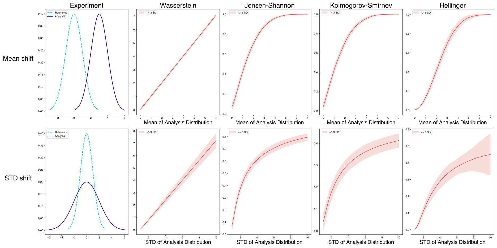

Shifting the Mean of the Analysis Data Set
..........................................
In this experiment, we show how each method responds as the mean of the analysis data set moves further away from the mean of the reference data set.
To demonstrate this, the reference data set was sampled from :math:`\mathcal{N}(0,1)`, and the analysis data set was sampled from :math:`\mathcal{N}(\mu,1)` for
each value of :math:`\mu` in :math:`\{0,0.1,0.2,...,7\}`. So, there is one reference sample and 71 analysis samples and each of the analysis
samples is compared to the reference sample.

We show +/- 3 standard deviations of the mean of the analysis data set for each method to illustrate the stability of each method.

In this experiment, the sample size of both the reference and analysis datasets was 1000 observations and the number of trials
for each value of the mean of the analysis data set was 500.

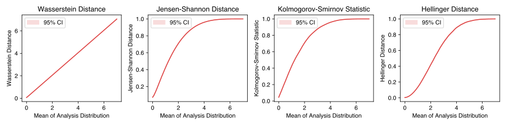

The results illustrate that Wasserstein distance changes proportionally to the mean shift. Jensen-Shannon Distance
(JS) and
the Kolmogorov-Smirnov (KS) statistic test is relatively
more sensitive to smaller shifts than bigger ones. This means that a shift in the mean of the analysis data set from 0 to 0.1 will cause a more significant change than a change from 5.0 to 5.1.
On the other hand, Hellinger Distance displays behavior resembling a sigmoid function; Hellinger Distance is not as sensitive to small and large changes to the mean of the analysis data set
compared to shifts of medium size. Also, in this case, all the methods are relatively stable, and thus the confidence intervals are very small.

Now let's take a closer look at the behavior of the methods for smaller, more realistic shifts. Below we show data from the experiment above, but we
truncate the domain to :math:`[0,1]`.

.. image:: ../_static/univariate-comparison/shifting_mean_0_to_1.svg
    :width: 1400pt

We observe that the Wasserstein distance, Jensen-Shannon distance, and Kolmogorov-Smirnov statistic test all appear to increase roughly linearly with the mean shift.
On the other hand, the Hellinger distance increases more slowly, to begin with, and thus is slightly less sensitive to smaller shifts.

Shifting the Standard Deviation of the Analysis Data Set
........................................................
In this experiment, we show how each method responds as the standard deviation of the analysis set increases. The reference data set was sampled from :math:`\mathcal{N}(0, 1)` and the analysis data set
was sampled from :math:`\mathcal{N}(0, \sigma)` for each :math:`\sigma` in :math:`\{1, 1.1, 1.2,...,10\}`.
So, there is one reference sample and 91 analysis samples. The size of the reference and analysis data sets was again 1000 observations, and the experiment consisted of 500 trials.

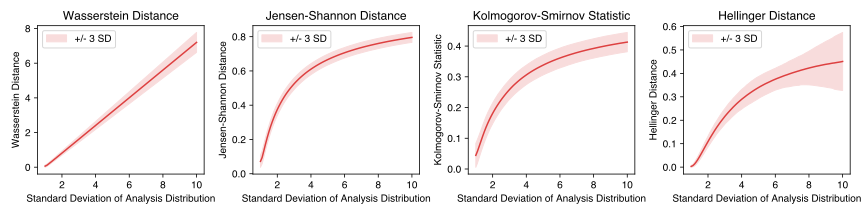

In this case, Wasserstein distance again changes proportionally to the change in standard deviation. Jensen-Shannon
distance, the Kolmogorov-Smirnov D-statistic, and the Hellinger distance exhibit high sensitivity, even
to small changes. However, the Hellinger distance has a slightly *softer* start than the Jensen-Shannon distance and
the Kolmogorov-Smirnov statistic. In this experiment, the main difference between the Jensen-Shannon distance,
the Kolmogorov-Smirnov statistic, and the Hellinger distance is that the stability of the measures (illustrated by the bands showing the standard deviation)
differs, with the Jensen-Shannon distance exhibiting the highest relative stability of the three, followed by the Kolmogorov-Smirnov statistic and Hellinger distance in turn.

We can now take a look at the behavior of the methods for smaller, more realistic shifts. Below we show data from the experiment above, but we
truncate the domain to :math:`[1,2]`.

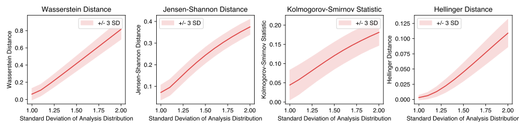

Each method appears to increase roughly linearly with the increase in standard deviation.
The Hellinger distance, however, increases more slowly, to begin with, before taking on more linear behavior.

Tradeoffs of The Kolmogorov-Smirnov Statistic
.............................................
The KS D-statistic is simply the maximum distance
between the empirical cumulative density functions (ECDFs) of the two analyzed samples. This can lead to cases where
drift occurring
in one region
of the analysis distribution *hides* drift occurring in other areas. The visualization below shows an example of such
a situation.

In this visualization, the reference distribution is a combination of two normal distributions and thus is bimodal. On the top row, labeled Analysis 1, only the right mode of the analysis distribution shifts. On the bottom row, labeled Analysis 2,
both the left mode and the right mode of the analysis distribution shift.

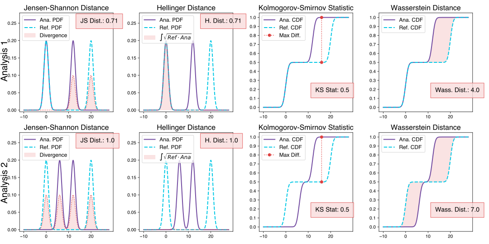

Looking at columns 1 and 2, which show JS and Hellinger distance, respectively, we see that their
value increases as they compare *similarity* of Empirical Probability Density Functions (EPDFs). **In the
third column,
which visualizes the KS statistic, we see that the largest difference between the analysis ECDF and the
reference ECDF remains the same, which makes KS D-statistic insensitive for this type of shift.** The fourth column
shows Wasserstein distance which looks at the area between the reference ECDF and analysis ECDF, hence it catches the
shift, and its value increases.

Tradeoffs of Jensen-Shannon Distance and Hellinger Distance
...........................................................

Experiment 1
************
Both JS Distance and Hellinger Distance are related to the *amount of overlap* between probability distributions.
In cases where the *amount of overlap* stays the same but drift increases, neither the JS
distance nor the Hellinger distance will detect the change. Such cases are very
rare in practice, but they can occur.
An example of this is shown below:

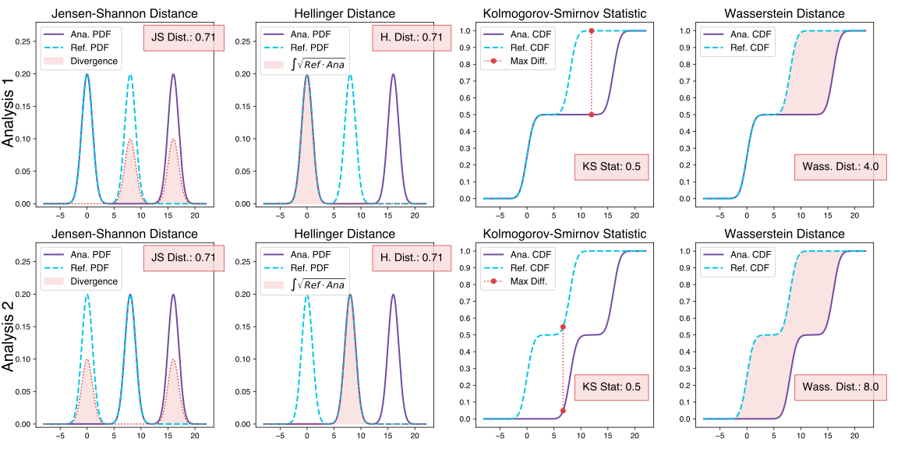

In this example, the reference distribution is a combination of two normal distributions and is thus bimodal. In the
the first case (top row), the right
mode of the analysis distribution shifts to the right, and in the second case (bottom row), both modes shift to the
right. In
the
the second case, this could
mean that either the left mode shifted over to the right of what was initially the right mode of the analysis or both the left mode and the
the right mode of analysis shifted to the right. In either case, this subjectively seems like *more drift*, and neither
JS distance nor
Hellinger distance catches this, but Wasserstein distance does. This is because Wasserstein distance *measures* the
amount
of *work* required to transform one distribution into the other. In this context, *work* can be thought of
as the amount of probability density multiplied by the distance it has to *travel*.

Experiment 2
************
Since JS distance and Hellinger distance are related to the *overlap* between distributions, if the
distributions are completely *disjoint*,
then both measures will be maxed out at 1. So, if the distributions begin disjoint and get even further apart, JS distance and Hellinger will not increase.
On the other hand, since Wasserstein Distance quantifies the distance between distributions, the measure will increase.

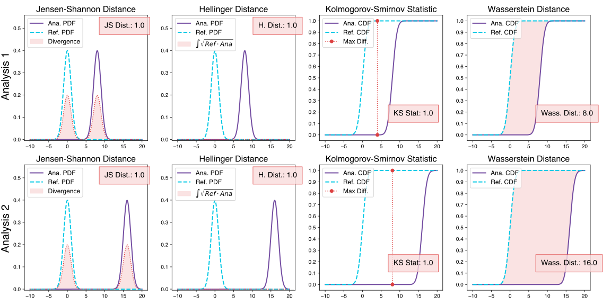

In this experiment, we double the distance between the reference and analysis, and we see that JS distance, the KS statistic,
and Hellinger distance remains at 1 (their max value), while Wasserstein distance increases proportionally to the distance that the distribution has moved.
This example is more of an edge case, but disjoint distributions can arise in real-world scenarios. For example, when training generative adversarial networks,
this issue can arise, and a common remedy is using a loss function based on Wasserstein Distance.

Tradeoffs of Wasserstein Distance
.................................

Experiment 1
************
As a reminder - Wasserstein distance can be thought of as the *amount of work* (defined as the amount of density
times the distance it must be moved) that it
would take to transform one distribution into the other,
the presence of extreme data points can greatly increase its value. If two distributions are mostly identical, but one
has an outlier, then the work it takes to transport that
a small bit of probability density to the other distribution is still significant (small density multiplied by a large distance).

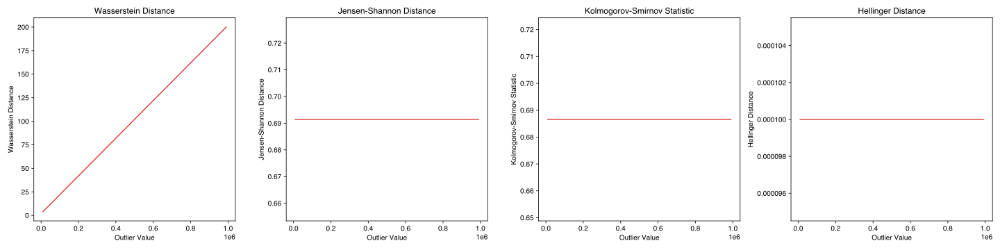

In this experiment, we move one data point to increasingly extreme values, and the result is that Wasserstein Distance increases in proportion to the size of that extreme value while the
other methods are not affected. In most cases, changes in the overall shape of the distribution are the main focus. If
your data can contain extreme outliers, we advise against using Wasserstein distance.

Experiment 2
************
In this experiment, we further exemplify the sensitivity of Wasserstein Distance to extreme values. To do so, we compare a normal distribution to a
Cauchy distribution. The Cauchy distribution has no analytically derivable moments. Generating samples from a random variable distributed
according to the Cauchy distribution will result in a data set with much of its density in a small range but with fat tails. The probability
density functions (PDFs) of :math:`\mathcal{N}(0,1)`, :math:`\text{Cauchy}(0, 0.5)` and :math:`\text{Cauchy}(0, 3)` in the range :math:`[-10,10]` are visualized below.

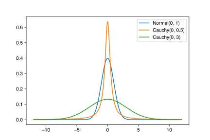

Notably, the general shape of the Cauchy distribution resembles the normal distribution, but there is much more density in the tails.
When increasing the scale parameter, the Cauchy distribution spreads out, and the tails become even denser. The behavior of Wasserstein
distance, JS distance, Hellinger distance, and the JS statistic when the reference sample is drawn from
:math:`\mathcal{N}(0,1)` and the analysis is drawn from :math:`\text{Cauchy}(0,\Gamma)` where :math:`\Gamma = \{0.5, 0.6,...,3\}` is shown below:

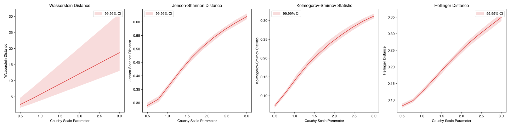

Since Wasserstein distance is sensitive to extreme values, the variance of the measure is high and increases together
with the scale parameter.
JS distance, the KS statistic, and the Hellinger distance are much more stable.

Experiment 3
************
In this experiment, we demonstrate a case where Wasserstein distance behaves differently from the JS
distance and Hellinger distance.

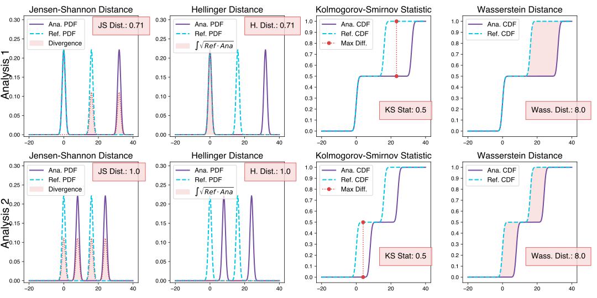

In this example, the reference and analysis distributions are both mixtures of normal distributions with two modes.
Distribution shift is introduced in a way that the overall *distance* as measured by Wasserstein between the reference
and analysis,
remains the same, but the amount of
overlap changes. The distance stays the same because one mode of the analysis distribution moves a significant distance in the case visualized in the first row. In the
second case, which is visualized in row 2, each mode moves half of that distance. The KS statistic and the Wasserstein distance treat both cases
the same, while Hellinger and JS distances spot the difference.

Comparison of Methods for Categorical Variables
-----------------------------------------------

Sensitivity to Sample Size of Different Drift Measures
......................................................

Generally, we would like methods that return the same value for the same magnitude of drift, regardless of the sample
size of
either the reference or
analysis set. JS distance, Hellinger distance, and L-Infinity distance all exhibit this property, while the Chi-Squared statistic does not. In
cases where the chunks in your analysis may be different sizes, as can be the case when using period-based chunking, we suggest considering this behavior
before you use the Chi-squared statistic.

In this experiment, the proportions of each category were held constant in both the reference and analysis data sets. In the reference data set, the relative
frequency of category **a** was always 0.5, the relative frequency of category **b** was also 0.5, and the data set size
was held constant at 2000 observations.
In the analysis data set, the relative frequency of category **a** was always 0.8, the relative frequency of category **b** was always 0.2, and
the data size increased from 100 points to 1000 points, as shown below. Notably, the Chi-Squared statistic increases with the sample size while the other metrics
do not.

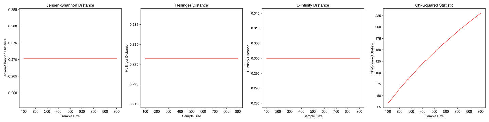

Behavior When a Category Slowly Disappears
............................................

This experiment shows how each method behaves as a category shrinks and eventually disappears.
We start with the reference distribution and slowly shrink category **b** while increasing the proportion of category **c**.

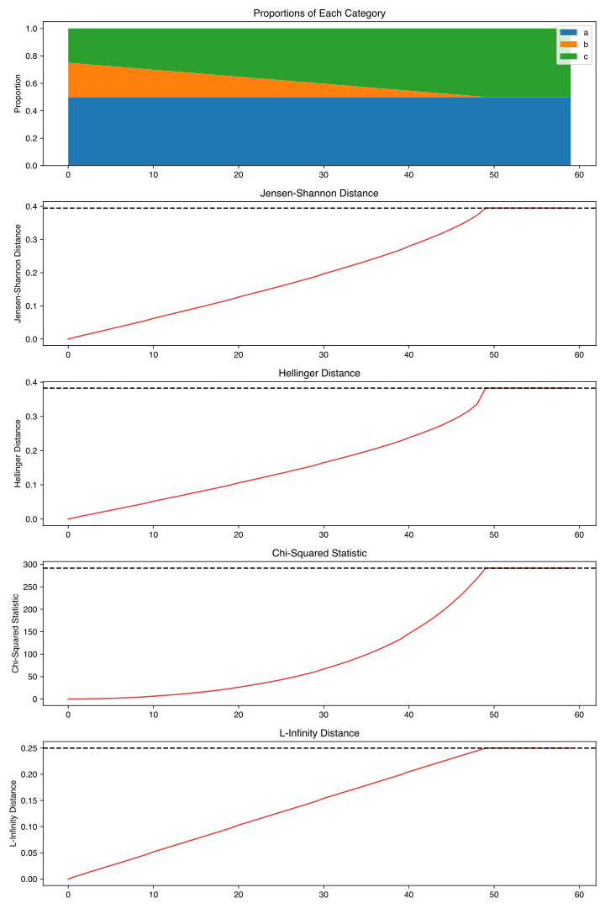

We see that L-Infinity has linear behavior in relation to the proportion of the categories changing.
In contrast, the Hellinger distance and Chi-squared statistic increase slowly at first but more quickly when
the **b** category is about to disappear. This makes them more sensitive to changes in low-frequency categories.

Behavior When Observations from a New Category Occur
......................................................

In this experiment, we show how each method reacts to the slow entry of a new category. To begin with, the
analysis distribution is distributed identically to the reference distribution.

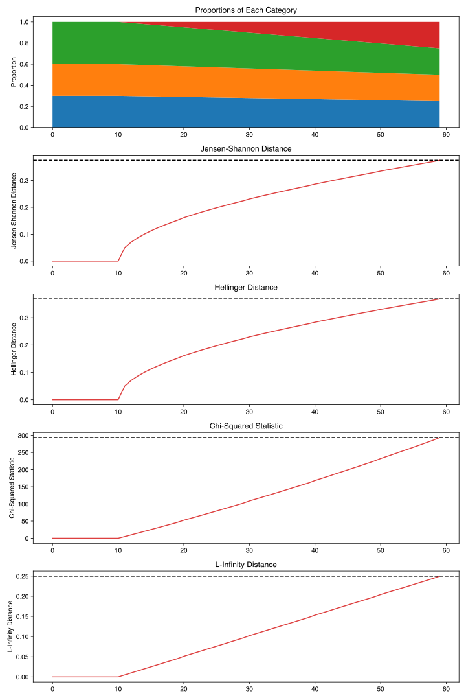

The interesting things to note in this experiment compared to the previous one are that:

 * Jensen-Shannon is less sensitive when a category disappears compared to when a new category appears,

 * Hellinger distance behaves the same when a catgory disappears compared to when a new category appears,

 * Chi-square grows linearly when the new category increases its relative frequency but it grows faster when a
   category disappears.

 * L-infinity is symmetric with respect to both situations.

Effect of Sample Size on Different Drift Measures
..................................................

In this experiment, we demonstrate the stability of each method while changing the size of the analysis sample. To demonstrate this,
we first drew a sample of 5000 points from  :math:`\text{Binom}(10,0.5)` as the reference data set. Then, the probability
mass function (PMF) of this distribution looks like this:

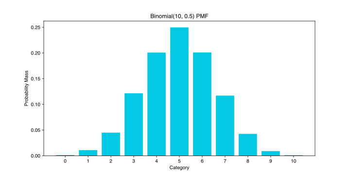

Then, to demonstrate the effect of sample size, we drew samples of sizes :math:`\{100, 200, 300,..., 3000\}` , again
from :math:`\text{Binom}(10,0.5)`, to serve as our analysis data sets. We know that there is no distribution shift
between the reference sample and any of the analysis samples because they were all drawn from the same distribution, namely :math:`\text{Binom}(10,0.5)`.
This way, we can see the sample size's impact on each drift measure. The results are shown below:

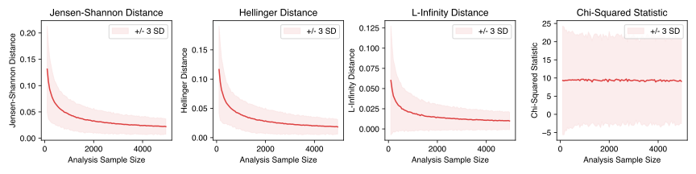

Shift as measured by JS distance, Hellinger distance, and L-infinity distance decreases as the analysis
sample increases in size and thus better represents the distribution. On the other hand, the chi-squared statistic on
average remains the same. This behavior may be considered beneficial in some cases.

Effect of the Number of Categories on Different Drift Measures
..............................................................

This experiment shows how the number of categories affects each method. The setup of
this experiment is as follows: First, we defined a set :math:`M = \{2,3,4,...,60\}`, and for each :math:`m` in :math:`M`, we
drew a sample from :math:`\text{Binom}(m, 0.5)` of 5000 points to serve as the reference data set. We then
drew a sample of 1000 points again from the same distribution :math:`\text{Binom}(m, 0.5)` to serve as the analysis
data set (so not actual
data distribution shift).
We then calculated
the difference between the reference data and analysis data as measured by JS distance, Hellinger
distance,
L-infinity distance and the Chi-squared statistic. The results are shown below:

.. image:: ../_static/univariate-comparison/binom_and_num_cats.svg
    :width: 1400pt

We see an increase in the JS distance, Hellinger distance, and the Chi-squared statistic as the number of categories
increases because the small differences in the frequencies in each category due to sampling effects are summed up. Thus, the more
terms in the sum, the higher the value. On the other hand, L-infinity distance does not increase because it only looks at the largest
change in frequency of all the categories. For intuition, a visualization of the Hellinger distance and the L-infinity distance is shown
below when the number of categories is 61 (i.e., :math:`\text{Binom(60, 0.5}`)).

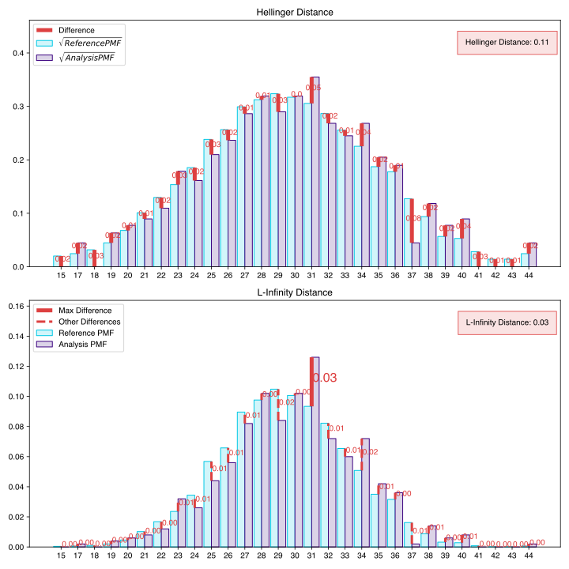

When dealing with
data sets with many categories, using the L-infinity distance may help to reduce false-positive alerts.

Comparison of Drift Methods on Data Sets with Many Categories
.............................................................

In cases with many categories, it can be difficult to detect a significant shift if it only occurs in a few categories. This is
because some methods
(like JS distance, Hellinger distance, and the Chi-squared statistic) sum a transformation of the difference between
the relative frequency of each category. Sampling effects can cause small differences in the frequency of each category, but when summed
together, these small differences can hide important changes that occur in only a few categories. L-infinity distance
only looks at the
the largest change in relative frequency among all the categories. It thus does not sum up all of the small, negligible differences caused by sampling error.

Here we show an experiment that highlights this behavior. This experiment has three important samples: the reference sample, an analysis
sample with no real drift (i.e., the sample is drawn from the same distribution), and an analysis set with severe drift in only one category. The
reference and analysis set without drift were drawn from the uniform distribution with 200 categories. The analysis set with severe drift was
constructed by drawing a sample from the uniform distribution with 200 categories, then adding more occurrences of the 100th category. The sample
size of each of the three sets was 7000 points. A visualization of the empirical probability mass function can be seen below. On the left, we see the reference data distribution
(the blue bars) and the analysis data distribution without drift (the purple bars).
On the right, we see the reference distribution (the blue bars) and the analysis distribution with severe drift in the 100th category (the red bars).

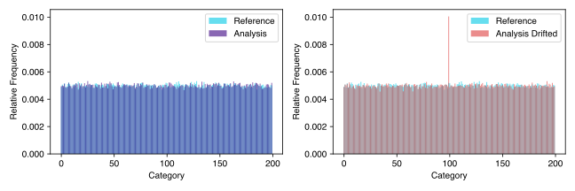

Each of the three distributions looks similar, aside from a major drift in category 100 in the analysis sample with severe drift. We can
compare the values that each method returns for the difference between the reference sample and the analysis sample without drift, and the reference
sample and the analysis sample with severe drift in one category, as seen below:

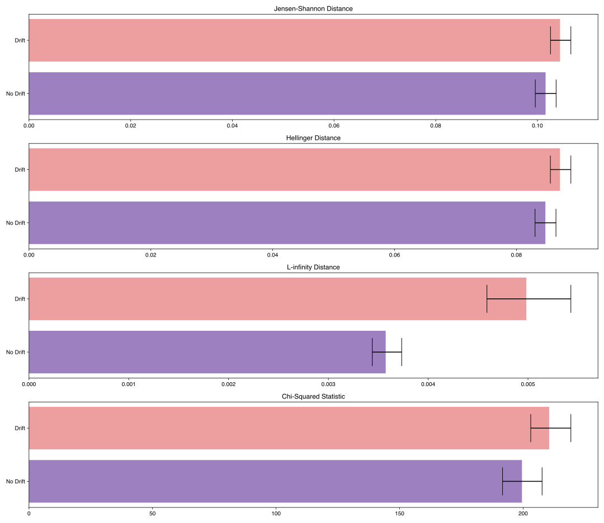

We see that the sampling effects (the small differences in the frequencies of each category) hide the significant shift
when using JS distance,
Hellinger distance, and the Chi-squared statistic. On the other hand, L-infinity shows
a significant difference between the two.

Results Summary (TLDR)
----------------------

Methods for Continuous Variables
................................

**We suggest Jensen-Shannon distance or Wasserstein distance for continuous features.**
While there is no one-size-fits-all method, both of these methods perform well in many cases, and generally, if drift occurs, these methods will catch it.

There are three main differences between these two measures. First, Jensen-Shannon distance will always be in the range :math:`[0, 1]`, whereas Wasserstein distance
has a range of :math:`[0, \infty)`. Second, Jensen-Shannon distance tends to be more sensitive to small drifts, meaning that it will likely raise more false alarms
than Wasserstein distance, but it might be more successful in catching meaningful low-magnitude drifts. And third, Wasserstein distance tends to be more
sensitive to outliers than Jensen-Shannon distance.

Methods For Categorical Variables
.................................
**For categorical features, we recommend Jensen-Shannon distance or L-Infinity distance if you have many categories.**
Both methods perform well in most cases, exhibit few downsides, and are bounded in the range :math:`[0,1]`. In cases
where there are many categories, and you care about changes to even one category, we suggest L-Infinity distance.
