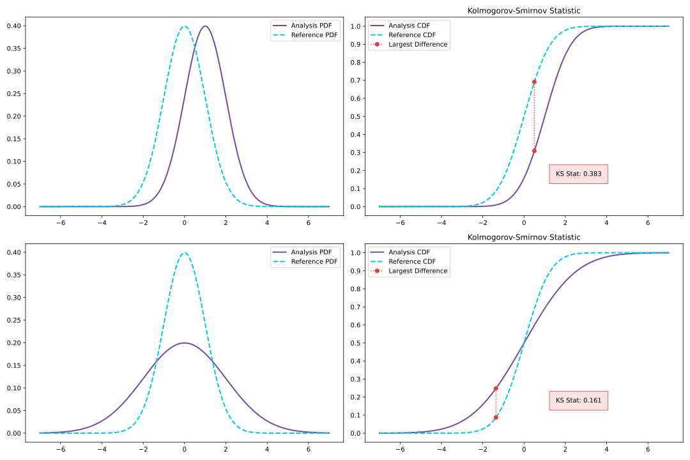
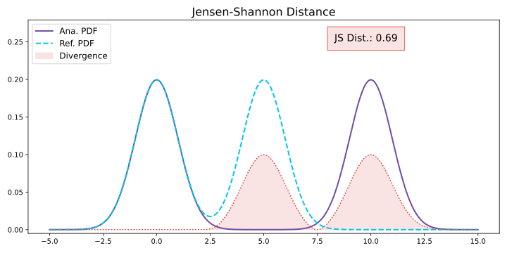
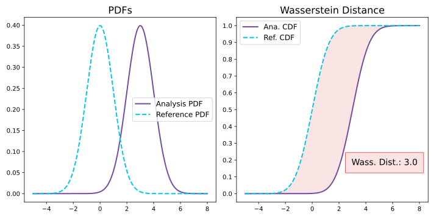
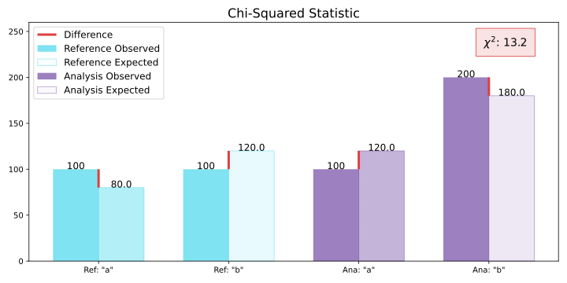
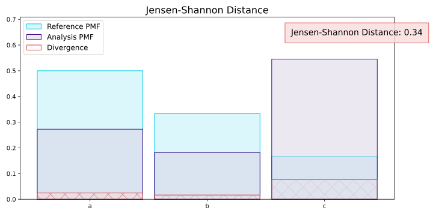
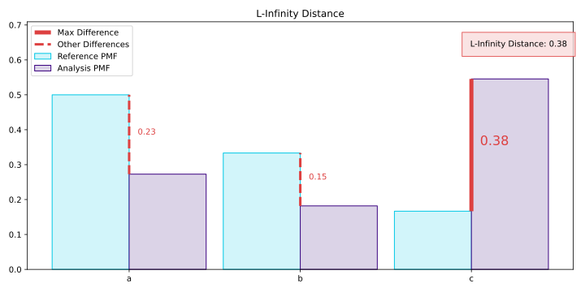

.. _how-it-works-univariate-drift-detection:

Presenting Univariate Drift Detection Methods
=============================================

Univariate Drift Detection looks at each feature individually and checks whether its
distribution has changed compared to reference data. There are many ways to compare two samples of data and measure
their *similarity*. NannyML provides several drift detection methods so that the users can choose the one that suits
their data best or the one they are familiar with. Additionally more than one method can be used together to
gain different perspectives on how the distribution of your data is changing.

This page explains which aspects of a distribution change each drift detection method is able to capture,
what are the important implementation details and in which situations a specific method can be a good choice.

We are grouping the drift detection methods presented according to whether they apply to categorical (discrete) or
continuous features. When a method is used for both it is mentioned in both places because of implementation differences
between the two types of features.

Lastly let's note that we are always performing two sample tests or comparisons. Probability density functions (PDF) and
cumulative density functions (CDF) are always estimated from the data samples that are being compared.

.. note::

    In the current implementation of the methods (both continuous and categorical), we drop all the missing values encountered.

.. _univariate-drift-detection-continuous-methods:

Methods for Continuous Features
--------------------------------

.. _univ_cont_method_ks:

Kolmogorov-Smirnov Test
.......................

The `Kolmogorov-Smirnov Test`_ is a two-sample, non-parametric statistical test. It is used to test for the equality of
one-dimensional continuous distributions. The test outputs the test statistic, called D-statistic, and an associated p-value.
The test statistic is the maximum distance of the cumulative distribution functions (CDF) of the two samples.

NannyML calculates drift performing two sample set comparisons. One sample is usually the reference data while the other comes from the data of the chunk we are calculating drift for.
It can calculate the KS test with two methods, depending on the user's ability to store the reference data. The first approach stores 
and uses the reference data as-is, while the second splits the continuous feature into quantile bins and uses the bin edges and frequencies for the calculation.
By default, NannyML employs the first method if the reference data has fewer than 10,000 rows, unless otherwise specified.

The D-statistic is robust to small changes in the data, easy to interpret and falls into  0-1 range.
This makes the Kolmogorov-Smirnov test a popular choice for many data distribution monitoring
practitioners. You can see on the image below how the value of D-statistic changes with the change of data
distribution to build some intuition on it's behavior.

.. _univariate-drift-detection-cont-jensen-shannon:

Jensen-Shannon Distance
........................

Jensen-Shannon Distance is a metric that tells us how different two probability distributions are.
It is based on `Kullback-Leibler divergence`_ but is created in such a way that it is symmetric and ranges between 0 and 1.

Between two distributions :math:`P,Q` of a continuous feature `Kullback-Leibler divergence`_  is defined as:

.. math::
    D_{KL} \left(P || Q \right) = \int_{-\infty}^{\infty}p(x)\ln \left( \frac{p(x)}{q(x)} \right) dx

where :math:`p(x)` and :math:`q(x)` are the probability density functions of the distributions :math:`P,Q` respectively.
And `Jensen-Shannon Divergence`_ is defined as:

.. math::
    D_{JS} \left(P || Q \right) = \frac{1}{2} \left[ D_{KL} \left(P \Bigg|\Bigg| \frac{1}{2}(P+Q) \right) + D_{KL} \left(Q \Bigg|\Bigg| \frac{1}{2}(P+Q) \right)\right]

and is a method of measuring the similarity between two probability distributions. Jensen-Shannon Distance is
the square root of Jensen-Shannon divergence and is a proper distance metric.

As mentioned, NannyML calculates drift performing two sample set comparisons. One sample is usually the whole reference data
while the other comes from the data of the chunk we are calculating drift for. In order to calculate Jensen-Shannon
Distance NannyML splits a continuous feature into bins using information from the reference sample.
The binning is done using `Doane's formula`_ from numpy.
If a continuous feature has a relatively low amount of unique values, meaning that
unique values are less then 10% of the reference dataset size up to a maximum of 50, each value becomes a bin.
If any data from the chunk sample are outside the range of the previous bins, then a new bin created for them.
The new bins relative frequency for the reference sample is set to 0.
The relative frequency for each bin is calculated for the reference and chunk samples. Those results are then
used to calculate the Jensen-Shannon Distance.

The figure below shows a visual representation of how the Jensen-Shannon Distance is calculated. The
area of the shaded region is the Jensen-Shannon Divergence which can be calculated using the formula above.
Taking the square root of this value gives us the Jensen-Shannon Distance.

.. _univariate-drift-detection-cont-wasserstein:

Wasserstein Distance
........................

The `Wasserstein Distance`_, also known as earth mover's distance and the Kantorovich-Rubinstein metric,
is a measure of the difference between two probability distributions. Wasserstein distance
can be thought of as the minimum amount of work needed to transform one distribution into the other. Informally, if
the PDF of each distribution is imagined as a pile of dirt, the Wasserstein distance is the amount of work it would
take to transform one pile of dirt into the other (which is why it is also called the earth mover's distance).

While finding the Wasserstein distance can be framed as an optimal transport problem, when each distribution is
one-dimensional, the CDFs of the two distributions can be used instead. When defined in this way, the Wasserstein
distance is the integral of the absolute value of the difference between the two CDFs, or more simply, the area between the CDFS. The figure below illustrates this.

Mathematically we can express this as follows: For the :math:`i^\text{th}` feature of a dataset
:math:`X=(X_1,...,X_i,...,X_n)`, let :math:`\hat{F}_{P}` and :math:`\hat{F}_{Q}` represent the
empirical CDFs of the two samples we are comparing. Further, let :math:`X_i^{P}` and :math:`X_i^{Q}`
represent those two samples. Then the
Wasserstein distance between the two distributions is given by:

.. math::
    W_1\left(X_i^{P},X_i^{Q}\right) = \int_\mathbb{R}\left|\hat{F}_{P}(x)-\hat{F}_{Q}(x)\right|dx

NannyML calculates drift performing two sample set comparisons. One sample is usually the reference data while the other comes from the data of the chunk we are calculating drift for.
It can calculate the Wasserstein Distance with two methods, depending on the user's ability to store the reference data. The first approach stores 
and uses the reference data as-is, while the second splits the continuous feature into equal-width based bins and uses the bin edges and frequencies for the calculation.
By default, NannyML employs the first method if the reference data has fewer than 10,000 rows, unless otherwise specified. 

.. _univariate-drift-detection-cont-hellinger:

Hellinger Distance
........................

The `Hellinger Distance`_, is a distance metric used to quantify the similarity between two probability distributions. It measures the overlap between the probabilities assigned
to the same event by both reference and analysis samples. It ranges from 0 to 1 where a value of 1 is only achieved when reference assigns zero probability to each event to which
the analysis sample assigns some positive probability and vice versa.
Between two distributions :math:`P,Q` of a continuous feature Hellinger is defined as:

.. math::
    H\left(P,Q\right) = \frac{1}{\sqrt{2}}\left[\int_{}\left(\sqrt{p(x)}-\sqrt{q(x)}\right)^2dx\right]^{1/2}

where :math:`p(x)` and :math:`q(x)` are the probability density functions of the distributions :math:`P,Q` respectively.

As mentioned, NannyML calculates drift performing two sample set comparisons. One sample is usually the whole reference data
while the other comes from the data of the chunk we are calculating drift for. In order to calculate Hellinger
Distance NannyML splits a continuous feature into bins using information from the reference sample.
The binning is done using `Doane's formula`_ from numpy.
If a continuous feature has relatively low amount of unique values, meaning that
unique values are less then 10% of the reference dataset size up to a maximum of 50, each value becomes a bin.
If the any data from the chunk sample are outside those ranges a new bin created for them.
The new bins' relative frequency for the reference sample is set to 0.
The relative frequency for each bin is calculated for the reference and chunk samples. Those results are then
used to calculate the Hellinger Distance.

This distance is very closely related to the Bhattacharya Coefficient. However we choose the former because it follows the triangle inequality and is
a proper distance metric. Moreover the division by the squared root of 2 ensures that the distance is always between 0 and
1, which is not the case with the Bhattacharya Coefficient. The relationship between the two can be depicted as follows:

.. math::
    H^2\left(P,Q\right) = 2(1-BC\left(P,Q\right))

where

.. math::
    BC\left(P,Q\right) =  \int \sqrt{p(x)q(x)}dx

.. _univariate-drift-detection-categorical-methods:

Methods for Categorical Variables
---------------------------------

.. _univ_cat_method_chi2:

Chi-squared Test
................

The `Chi-squared test`_ is a statistical hypothesis test of independence for categorical data.
The test outputs the test statistic, sometimes called chi2 statistic, and an associated p-value.

We can understand the Chi-squared test in the following way. We create a `contingency table`_ from the
categories present in the data and the two samples we are comparing. The expected frequencies,
denoted :math:`m_i`, are calculated from the marginal sums of the contingency table.
The observed frequencies, denoted :math:`x_i`, are calculated from the actual
frequency entries of the contingency table. The test statistic is then given by the formula:

.. math::
    \chi^2 = \sum_{i=1}^k \frac{(x_i - m_i)^2}{m_i}

where we sum over all entries in the contingency table.

This makes the chi-squared statistic sensitive to all changes in the distribution,
especially to the ones in low-frequency categories, as the expected frequency is in the denominator.
It is therefore not recommended for categorical features with many low-frequency categories or high cardinality
features, unless the sample size is really large.
Otherwise, in both cases false-positive alarms are expected.
Additionally, the statistic is non-negative and not limited which sometimes makes it difficult to interpret.
Despite that, the Chi-squared test is a common choice amongst practitioners as it provides p-value together with the
statistic that helps to better evaluate its result.

On the image below there is a visualization of the chi-squared statistic for a categorical variable with two
categories, a and b. You can see the expected values are calculated from both the reference and analysis data.
The red bars represent the difference between the observed and expected frequencies.
As mentioned above, in the chi-squared statistic formula,
the difference is squared and divided by the expected frequency and the resulting value is then summed over all categories
for both samples.

.. _univ_cat_method_js:

Jensen-Shannon Distance
........................

Jensen-Shannon Distance is a metric that tells us how different two probability distributions are.
It is based on `Kullback-Leibler divergence`_ but is created in such a way that it is symmetric and ranges between 0 and 1.

Between two distributions :math:`P,Q` of a categorical feature `Kullback-Leibler divergence`_  is defined as:

.. math::
    D_{KL} \left(P || Q \right) = \sum_{x \in X} P(x)\ln \left( \frac{P(x)}{Q(x)} \right)

where :math:`p(x)` and :math:`q(x)` are the probability mass functions of the distributions :math:`P,Q` respectively.
And `Jensen-Shannon Divergence`_ is defined as:

.. math::
    D_{JS} \left(P || Q \right) = \frac{1}{2} \left[ D_{KL} \left(P \Bigg|\Bigg| \frac{1}{2}(P+Q) \right) + D_{KL} \left(Q \Bigg|\Bigg| \frac{1}{2}(P+Q) \right)\right]

and is a method of measuring the similarity between two probability distributions.
**Jensen-Shannon Distance** is then defined as the squared root of Jensen-Shannon divergence and is a proper distance
metric.

As mentioned, NannyML calculates drift performing two sample set comparisons. One sample is usually the whole reference data
while the other comes from the data of the chunk we are calculating drift for. When calculating JS
Distance for categorical data NannyML uses the reference data to split the data into bins with each categorical
value corresponding to a bin in the reference sample.
If the any data from the chunk sample have different unique values a new bin created for them.
The new bins relative frequency for the reference sample is set to 0.
The relative frequency for each bin is calculated for the reference and chunk samples. Those results are then
used to calculate the Hellinger Distance.

The intuition behind Jensen-Shannon is that it measures an *average* of all changes in relative
frequencies of categories. Frequencies are compared by dividing one by another, therefore JS distance, just like
Chi-squared statistic, is sensitive to changes in less frequent classes. This means that an absolute change of
1 percentage point for less frequent class will have stronger
contribution to the final JS distance value than the same change in more frequent class. For this reason it
may not be the best choice for categorical variables with many low-frequency classes or high cardinality.

To help our intuition we can look at the image below:

We see how the relative frequencies of three categories have changed between reference and analysis data.
We also see that the JS Divergence contribution of each change and the resulting JS distance.

.. _univ_cat_method_hellinger:

Hellinger Distance
..................

The `Hellinger Distance`_, is a distance metric used to quantify the similarity between two probability distributions.
It measures the overlap between the probabilities assigned
to the same event by both reference and analysis samples. It ranges from 0 to 1 where a value of 1 is only achieved
when reference assigns zero probability to each event to which
the analysis sample assigns some positive probability and vice versa.

Between two distributions :math:`P,Q` of a categorical feature Hellinger Distance is defined as:

.. math::
 H\left(P,Q\right) = \frac{1}{\sqrt{2}}\left[\sum_{x \in X}\left(\sqrt{p(x)}-\sqrt{q(x)}\right)^2\right]^{1/2}

where :math:`p(x)` and :math:`q(x)` are the probability mass functions of the distributions :math:`P,Q` respectively.

As mentioned, NannyML calculates drift performing two sample set comparisons. One sample is usually the whole reference data
while the other comes from the data of the chunk we are calculating drift for. When calculating Hellinger
Distance for categorical data NannyML uses the reference data to split the data into bins with each categorical
value corresponding to a bin in the reference sample.
If the any data from the chunk sample have different unique values a new bin created for them.
The new bins relative frequency for the reference sample is set to 0.
The relative frequency for each bin is calculated for the reference and chunk samples. Those results are then
used to calculate the Hellinger Distance.

.. _univ_cat_method_l8:

L-Infinity Distance
...................

We are using L-Infinity to measure the similarity of categorical features. L-Infinity, for categorical features, is defined as
the maximum of the absolute difference between the relative frequencies of each category in the reference and analysis data.
You can find more about `L-Infinity at Wikipedia`_. It falls into the range of 0-1 and is easy to interpret as
is the greatest change in relative frequency among all categories. This behavior is different compared to Chi Squared test
where even small changes in low frequency labels can heavily influence the resulting test statistic.

To help our intuition we can look at the image below:

We see how the relative frequencies of three categories have changed between reference and analysis data.
We also see that the resulting L-Infinity distance is the relative frequency change in category c.

.. _`Chi-squared test`: https://en.wikipedia.org/wiki/Chi-squared_test
.. _`Kolmogorov-Smirnov Test`: https://en.wikipedia.org/wiki/Kolmogorov%E2%80%93Smirnov_test
.. _`Jensen-Shannon Divergence`: https://en.wikipedia.org/wiki/Jensen%E2%80%93Shannon_divergence
.. _`Hellinger Distance`: https://en.wikipedia.org/wiki/Hellinger_distance
.. _`L-Infinity at Wikipedia`: https://en.wikipedia.org/wiki/L-infinity
.. _`Kullback-Leibler divergence`: https://en.wikipedia.org/wiki/Kullback%E2%80%93Leibler_divergence
.. _`Doane's formula`: https://numpy.org/doc/stable/reference/generated/numpy.histogram_bin_edges.html
.. _`Wasserstein Distance`: https://en.wikipedia.org/wiki/Wasserstein_metric
.. _`contingency table`: https://en.wikipedia.org/wiki/Contingency_table
