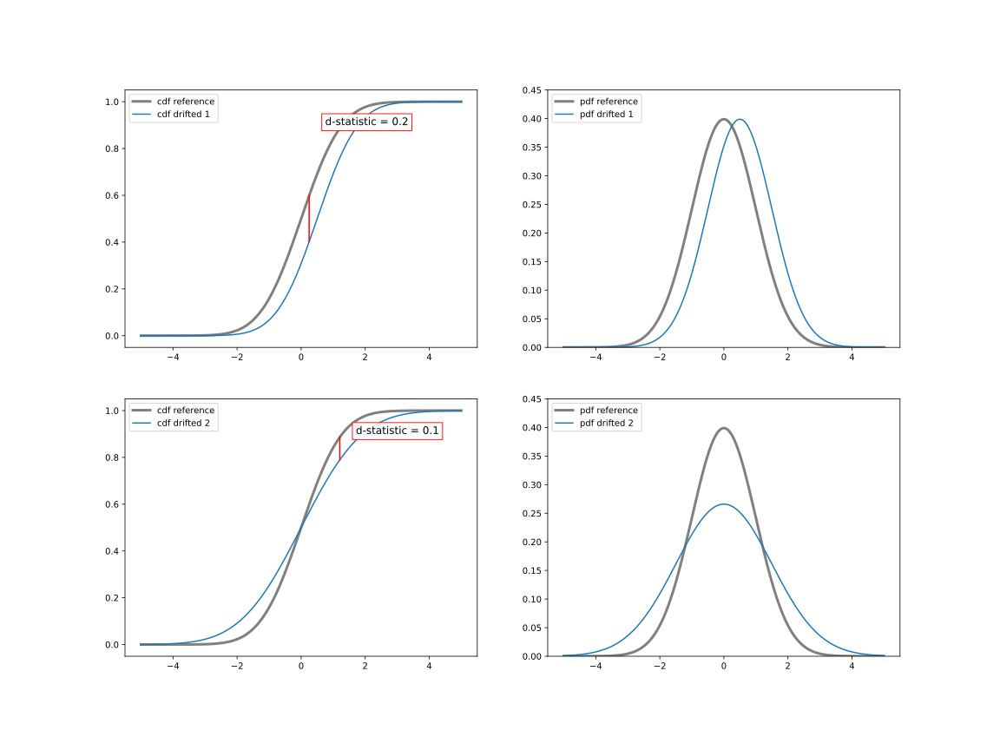

.. _how-it-works-univariate-drift-detection:

Univariate Drift Detection
==========================

Univariate Drift Detection looks at each feature individually and checks whether its
distribution has changed compared to reference data. There are many ways to compare two samples of data and measure
their *similarity*. NannyML provides several methods so that the users can choose the one that suits
their data best, the one they are familiar with (and trust) or just use a couple or even all of them to look at
distribution change from all the different perspectives. This page explains on which aspect of the distribution change
each method is focused, what are the important implementation details and in which situations a specific method
can be a good choice. Methods are grouped
by the ones applicable to categorical (discrete) and continuous variables. Even if a method can be used for both,
usually the implementation between categorical and continuous is different so it is mentioned in both places.

TBD describe why are we looking at statistic/distance first, still having pvalue though.

.. _univariate-drift-detection-continuous-methods:

Methods for Continuous Variables
--------------------------------

Kolmogorov-Smirnov Test
.......................

A two-sample, non-parametric statistical test that compares empirical (i.e. build from the data) Cumulative
Distribution Functions (CDF) [1]_. Test statistic (called D-statistic) is the maximum absolute difference between the
two CDFs.
D-statistic is robust, easy to interpret, falls into range 0-1 and is sensitive to changes in both - shape and
location of the empirical distributions. This makes KS test a number one choice for many data distribution monitoring
practitioners. See the image below to get intuition on how the value of D-statistic changes with the change of data
distribution.

.. _univariate-drift-detection-cont-jensen-shannon:

Jensen-Shannon Distance
........................
A square root of Jensen-Shannon Divergence [2]_ which measures similarity between two probability distributions. It
is a distance metric in range 0-1. Unlike KS D-static that looks at maximum difference
between two empirical CDFs, JS distance looks at the total difference between empirical Probability Density Functions
(PDF). This makes it
more sensitive to changes that may be ignored by KS. See plot below to get the intuition:

.. image:: ../_static/how-it-works-univariate-drift-detection-js-ks.svg
    :width: 1400pt

For the same reason it is more prone to
be affected by
random sampling (noise) effects. When the samples of data are small it may give false-positive alarms.

Since NannyML works on data rather than PDFs, the actual implementation splits continuous variable into
bins, calculates the relative frequency for each bin from reference and analyzed data and calculates JS Distance [2]_
. For continuous data
binning is done using Doane's formula [3]_. If continuous variable has relatively low amount of unique values (i.e.
unique values are less then 10% of the reference dataset size) each value becomes a bin. This rule holds
up to 50 unique values. If there are more - Doane's formula is used again.

.. _univariate-drift-detection-categorical-methods:

Methods for Categorical Variables
---------------------------------

Chi-squared Test
................
Statistical hypothesis test of independence for categorical data [4]_. Test statistic is a sum of terms calculated
for each category. The value of the term for a single category is equal to the
squared difference between expected (reference) frequency and observed (analysis) frequency divided by expected
(reference) frequency [4]_. In other words, it is relative change of frequency for a category (squared).This makes it
sensitive to all changes in the distribution, specifically to the ones in low-frequency categories, as the
expected frequency is in the denominator. It is therefore not recommended for categorical variables with many
low-frequency classes or high cardinality (large number
of distinct values) unless the sample size is really large. Otherwise, in both cases false-positive alarms are expected.
Additionally, the statistic is non-negative and not limited - this makes it sometimes
difficult to interpret. Still it is a common choice amongst practitioners as it provides pvalue together with the
statistic that helps to better evaluate its result.

Jensen-Shanon Distance
........................
A square root of Jensen-Shannon Divergence [2]_ which measures similarity between two probability distributions. It
is a distance metric in range 0-1 which makes it easier to interpret and get familiar with. For
categorical data, JS distance is calculated based on the relative frequencies of each category in reference and
analysis data. The intuition is that it measures an *average* of all changes in relative frequencies of categories.
Frequencies are compared by dividing one by another therefore (see [2]_) therefore JS distance, just like Chi-squared,
is sensitive to changes in less frequent classes (an absolute change of 1 percentage point for less frequent class will have stronger
attribution to the final JS distance than the same change in more frequent class). For this reason it
may not be the best choice for categorical variables with many low-frequency classes or high cardinality.

Infinity-Norm Distance
........................
Belonging to the family of vector norms, this norm measures the maximum of the absolute difference between the percentage
of each category in the reference and analysis data (see [5]_). The intuition behind this metric is very similar to that of 
Kolmogorov-Smirnov but for categoricals. It falls into the range of 0-1 and is easy to interpret however it faces the same challenges
as Chi-squared and Jenson-Shannon of being sensitive to changes in less frequent classes. 

**References**

.. [1] https://en.wikipedia.org/wiki/Kolmogorov%E2%80%93Smirnov_test
.. [2] https://en.wikipedia.org/wiki/Jensen%E2%80%93Shannon_divergence
.. [3] https://numpy.org/doc/stable/reference/generated/numpy.histogram_bin_edges.html
.. [4] https://en.wikipedia.org/wiki/Chi-squared_test

