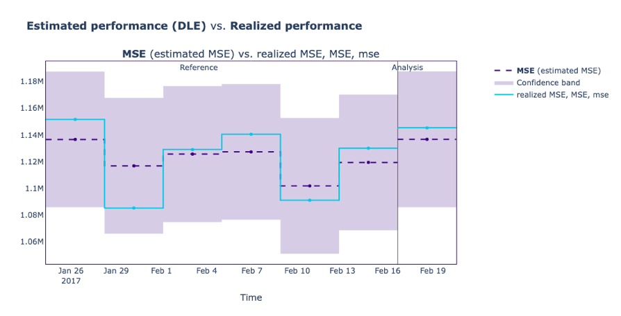
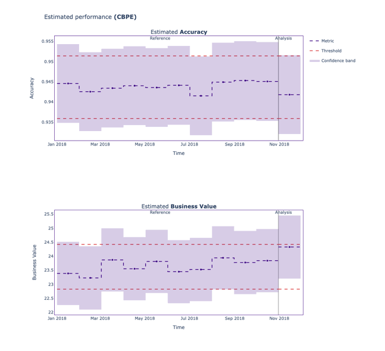
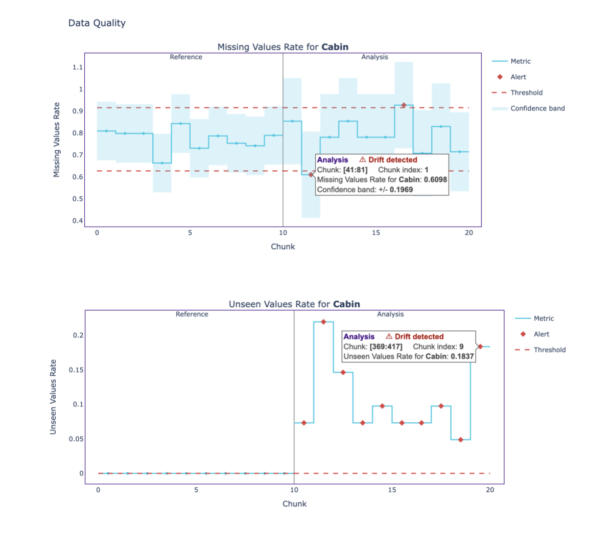
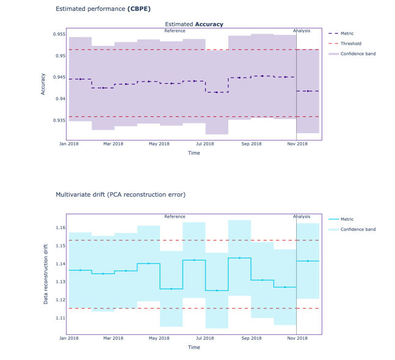
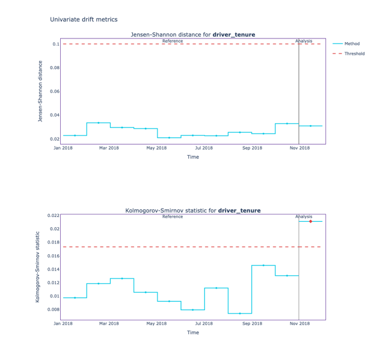
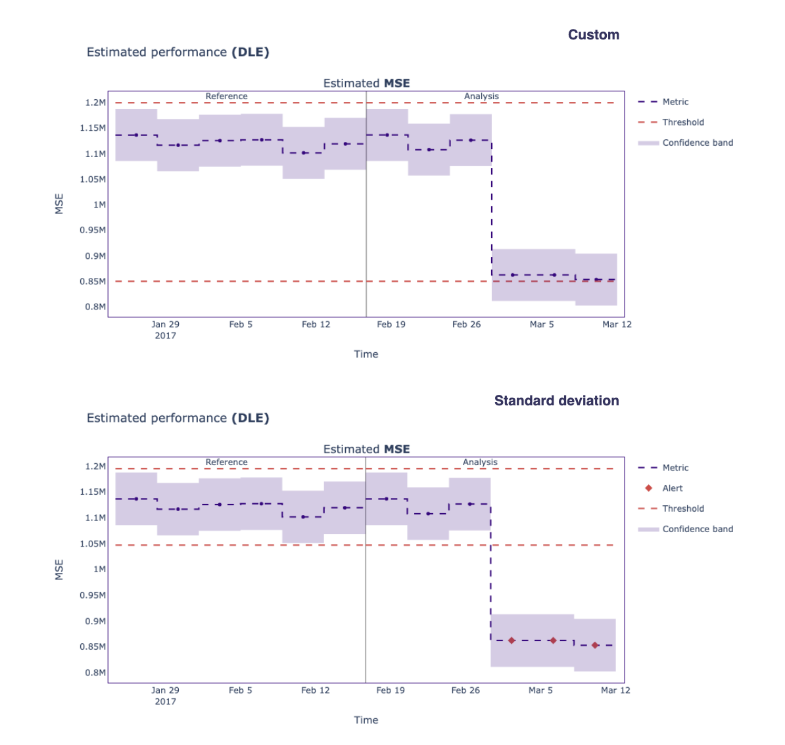

.. _landing_page:

============
Introduction
============

----------------
What is NannyML?
----------------

NannyML is an open-source python library for estimating post-deployment model performance (without access to targets), detecting data drift, and intelligently link data drift alerts back to changes in model performance.
Built for data scientists, NannyML has an easy-to-use interface, interactive visualizations, is completely model-agnostic and currently supports all tabular use cases, classification and regression.

------------
Key features
------------

➖ Performance Estimation and Calculation
-----------------------------------------

NannyML tracks to monitor the model’s performance even if the ground truth is delayed or absent.

Using **performance estimation** algorithms, users can track **any** metric like, i.e., accuracy, ROC AUC, or MSE and RMSE.

This enables real-time monitoring and quick reaction when the model is degrading.

➖ Business Value Estimation and Calculation
--------------------------------------------

NannyML uses **business value** metric estimation using the **CBPE** algorithm, which provides a way to tie the performance of a model to business-oriented outcomes.

This allows user to monitor and better understand the model's monetary value.

➖ Data Quality
---------------

NannyML supports testing users' data quality. It allows checking for **missing** and **unseen** values in categorical columns.

These changes are plotted over time to help users better understand the data.

➖ Multivariate Drift Detection
-------------------------------
To detect **multivariate feature drift**, NannyML uses `PCA-based data reconstruction <https://nannyml.readthedocs.io/en/main/how_it_works/data_reconstruction.html>`_ method which detects subtle changes in the data structure that cannot be detected with univariate drift detection methods.

These changes are monitored over time and data drift alerts are triggered when the reconstruction error exceeds a threshold.

➖ Univariate Drift Detection
-----------------------------
NannyML supports `six methods <https://nannyml.readthedocs.io/en/stable/how_it_works/univariate_drift_comparison.html>`_ to detect univariate feature drift in both **categorical** and **continuous** features.

Generated results by those methods are tracked over time, allowing users to correlate them with changes in the model's performance and take appropriate actions.

➖ Custom Thresholds
--------------------
When the model's performance exceeds the upper threshold or drops below the lower threshold, NannyML will flag that value as an **alert**.

To offer users maximum flexibility, NannyML incorporates two threshold options: a constant value threshold and a standard deviation-based threshold.

----------
Next steps
----------

| ⚡️ `Quickstart <https://nannyml.readthedocs.io/en/stable/quick.html>`_ - Get started with NannyML

| 📚 `Tutorials <https://nannyml.readthedocs.io/en/stable/tutorials.html#tutorials>`_ - Explore NannyML with practical code snippets

| 🤔 `How it works <https://nannyml.readthedocs.io/en/stable/how_it_works.html>`_ - Learn in details about the performance estimation and drift detection methods

| </> `Examples <https://nannyml.readthedocs.io/en/stable/examples.html>`_ - See how NannyML is used in real use-cases

| 🤖 Feel free to ask our docs chatbot any questions to gain a better understanding of the library's functionalities and features!

-----------------------------------
Get early access to NannyML Web App
-----------------------------------

We're building a comprehensive view of your monitoring systems, all from within the browser!

⏳️ Hop on the `waiting list <https://www.nannyml.com/nannyml-web-app-waitlist>`_ to request early access.
