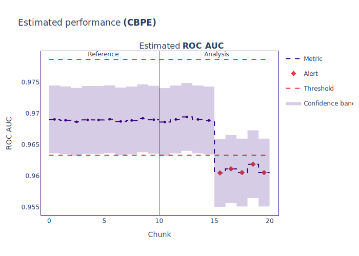
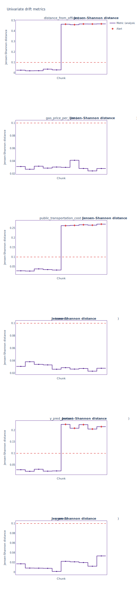
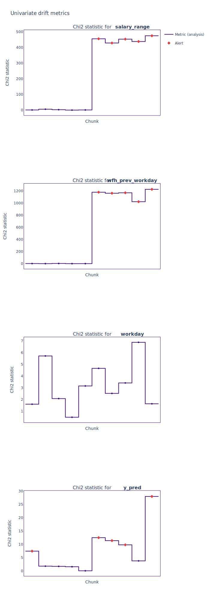
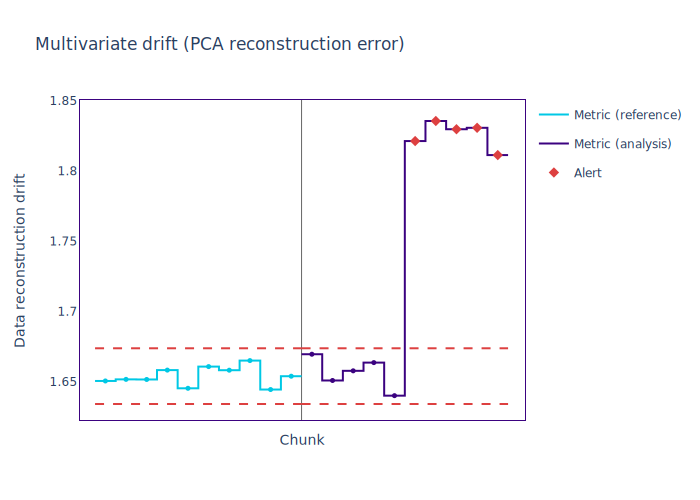

.. _quick-start:

=================
Quickstart
=================

----------------
What is NannyML?
----------------

NannyML detects silent model failure, estimates performance of ML models after deployment
before target data become available, and robustly detects data drift potentially responsible for the failure.
It can also monitor performance once target data is available.

------------------
Installing NannyML
------------------

NannyML depends on `LightGBM`_. This might require you to set install additional
OS-specific binaries. You can follow the `official LightGBM installation guide`_.

From the shell of your python environment type:

.. code-block:: bash

    $ pip install nannyml

or

.. code-block:: bash

    $ conda install -c conda-forge nannyml

or

.. code-block:: bash

    $ docker -v /local/config/dir/:/config/ run nannyml/nannyml nml run

--------------------------
Contents of the Quickstart
--------------------------

This Quickstart presents core functionalities of NannyML on an example binary classification model
that predicts  whether a customer will repay a loan to buy a car.

First, the whole code is shown so you can jump in and experiment right away if you want.

This is followed by a detailed walk-through to help you get familiar with the flow, and explain the details.
:ref:`The synthetic dataset<dataset-synthetic-binary-car-loan>` used contains inputs that are already merged with model
predictions and ready to be directly used by NannyML.

All :ref:`our tutorials<tutorials>` are a good place to get detailed guides on main
concepts and functionalities. If you want to know what is implemented under the hood -
visit :ref:`how it works<how_it_works>`. Finally, if you just look for examples
on other datasets or ML problems look through our :ref:`examples<examples>`.

.. note::
    The following example does not use any :term:`timestamps<Timestamp>`.
    These are optional but have an impact on the way data is chunked and results are plotted.
    You can read more about them in the :ref:`data requirements<data_requirements_columns_timestamp>`.

-------------
Just the code
-------------

.. nbimport::
    :path: ./example_notebooks/Quickstart.ipynb
    :cells: 1 4 5 7 9 11

.. _walk_through_the_quickstart:

-----------
Walkthrough
-----------

We start by loading the synthetic dataset included in the library. This synthetic dataset
contains inputs and predictions of a binary classification model that predicts
whether a customer will repay a loan to buy a car.

The probability of the customer repaying the loan is included in the ``y_pred_proba`` column, while the
prediction is in ``y_pred`` column.

The model inputs are
``car_value``, ``salary_range``,
``debt_to_income_ratio``, ``loan_length``,
``repaid_loan_on_prev_car``, ``size_of_downpayment`` and ``tenure``.

``timestamp`` is the :term:`Timestamp` column.

The data are split into a :ref:`reference period<data-drift-periods-reference>` and an
:ref:`analysis period<data-drift-periods-analysis>`. NannyML uses the reference period to
establish a baseline for expected model performance. The analysis period is where we estimate or
monitor performance, as well as detect data drift.

For more information about periods check :ref:`data-drift-periods`. A key thing to remember is that
the analysis period doesn't need to contain the :term:`Target` data.

Let's load and preview the data:

.. nbimport::
    :path: ./example_notebooks/Quickstart.ipynb
    :cells: 1

.. nbtable::
    :path: ./example_notebooks/Quickstart.ipynb
    :cell: 2

.. nbtable::
    :path: ./example_notebooks/Quickstart.ipynb
    :cell: 3

We need to make a choice about the way we will split our data into :term:`Data Chunks<Data Chunk>`.

.. nbimport::
    :path: ./example_notebooks/Quickstart.ipynb
    :cells: 4

Estimating Performance without Targets
======================================

NannyML can estimate the performance on a machine learning model in production
without access to its :term:`Target`. For more details on how to use performance estimation see
:ref:`our tutorial on performance estimation<performance-estimation>`,
while for more details on how the algorithm behind it works see
:ref:`Confidence-based Performance Estimation (CBPE)<performance-estimation-deep-dive>`.

.. nbimport::
    :path: ./example_notebooks/Quickstart.ipynb
    :cells: 5

The results indicate that the model's performance is likely to be negatively impacted
from the second half of the analysis period.

Detecting Data Drift
====================

NannyML allows for further investigation into potential performance issues with its data drift detection
functionality. See :ref:`data-drift` for more details.

.. nbimport::
    :path: ./example_notebooks/Quickstart.ipynb
    :cells: 7

When there are a lot of drifted features, NannyML can also rank them according to their correlation with a chosen
performance metric's results in order to help prioritize further investigations. For more information you can check the
:ref:`ranking tutorial<tutorial-ranking>`.

.. nbimport::
    :path: ./example_notebooks/Quickstart.ipynb
    :cells: 9

.. nbtable::
    :path: ./example_notebooks/Quickstart.ipynb
    :cell: 10

More complex data drift cases can get detected by Data Reconstruction with PCA. For more information
see :ref:`Data Reconstruction with PCA<data-reconstruction-pca>`.

.. nbimport::
    :path: ./example_notebooks/Quickstart.ipynb
    :cells: 11

--------
Insights
--------

With NannyML we were able to estimate performance in the absence of ground truth. The estimation has shown
potential drop in ROC AUC in the second half of the analysis period. Univariate and multivariate
data drift detection algorithms have identified data drift.

Putting everything together, we see that 4 features exhibit data drift from the second half of the analysis period. They are
``loan_length``, ``salary_range``, ``car_value``, ``repaid_loan_on_prev_car``.

This drift is responsible for the potential negative impact in performance that we have observed in this time period.

---------
What next
---------

This could be further investigated by analyzing changes of distributions of the input variables. Check
:ref:`tutorials<tutorials>` on :ref:`data drift<data-drift>` to find out how to plot distributions with NannyML.

You can now try using NannyML on your own data. Our :ref:`tutorials` are a good place to find out what to do for this.

.. _`LightGBM`: https://github.com/microsoft/LightGBM
.. _`official LightGBM installation guide`: https://lightgbm.readthedocs.io/en/latest/Installation-Guide.html
