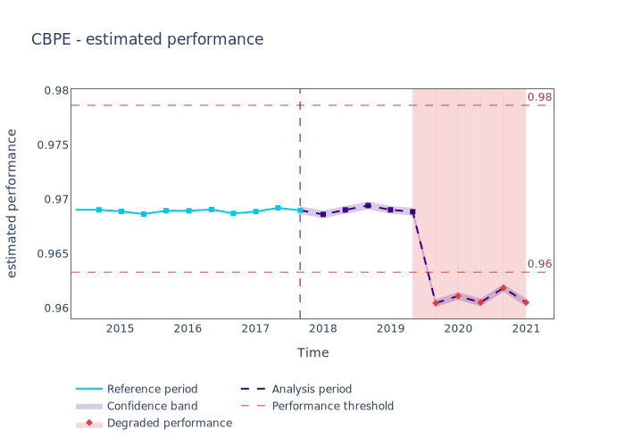

.. _quick-start:

=================
Quick Start Guide
=================

NannyML is a library that makes Model Monitoring more productive.
It estimates the performance of your models in absence of the target, detects data drift
and finds the data drift that's responsible for any drop in performance.

NannyML provides a sample synthetic dataset that can be used for testing purposes.

.. code-block:: python

    >>> import pandas as pd
    >>> import nannyml as nml
    >>> reference, analysis, analysis_target = nml.load_synthetic_sample()
    >>> reference.head()

+----+------------------------+----------------+-----------------------+------------------------------+--------------------+-----------+----------+--------------+--------------------+---------------------+----------------+-------------+
|    |   distance_from_office | salary_range   |   gas_price_per_litre |   public_transportation_cost | wfh_prev_workday   | workday   |   tenure |   identifier |   work_home_actual | timestamp           |   y_pred_proba | partition   |
+====+========================+================+=======================+==============================+====================+===========+==========+==============+====================+=====================+================+=============+
|  0 |               5.96225  | 40K - 60K €    |               2.11948 |                      8.56806 | False              | Friday    | 0.212653 |            0 |                  1 | 2014-05-09 22:27:20 |           0.99 | reference   |
+----+------------------------+----------------+-----------------------+------------------------------+--------------------+-----------+----------+--------------+--------------------+---------------------+----------------+-------------+
|  1 |               0.535872 | 40K - 60K €    |               2.3572  |                      5.42538 | True               | Tuesday   | 4.92755  |            1 |                  0 | 2014-05-09 22:59:32 |           0.07 | reference   |
+----+------------------------+----------------+-----------------------+------------------------------+--------------------+-----------+----------+--------------+--------------------+---------------------+----------------+-------------+
|  2 |               1.96952  | 40K - 60K €    |               2.36685 |                      8.24716 | False              | Monday    | 0.520817 |            2 |                  1 | 2014-05-09 23:48:25 |           1    | reference   |
+----+------------------------+----------------+-----------------------+------------------------------+--------------------+-----------+----------+--------------+--------------------+---------------------+----------------+-------------+
|  3 |               2.53041  | 20K - 20K €    |               2.31872 |                      7.94425 | False              | Tuesday   | 0.453649 |            3 |                  1 | 2014-05-10 01:12:09 |           0.98 | reference   |
+----+------------------------+----------------+-----------------------+------------------------------+--------------------+-----------+----------+--------------+--------------------+---------------------+----------------+-------------+
|  4 |               2.25364  | 60K+ €         |               2.22127 |                      8.88448 | True               | Thursday  | 5.69526  |            4 |                  1 | 2014-05-10 02:21:34 |           0.99 | reference   |
+----+------------------------+----------------+-----------------------+------------------------------+--------------------+-----------+----------+--------------+--------------------+---------------------+----------------+-------------+

The synthetic dataset provided contains a binary classification model that predicts whether
and employee will work from home the next workday or not. The probability of the employee
working from home is included in the ``y_pred_proba`` column. The model inputs are ``distance_from_office``,
``salary_range``, ``gas_price_per_litre``, ``public_transportation_cost``, ``wfh_prev_workday``, ``workday`` and
``tenure``. ``identifier`` is the :term:`Identifier` column and ``timestamp`` is the :term:`Timestamp` column.

The next step is to have NannyML deduce some information about the model from the dataset and make a choice about way we will split our data in :term:`Data Chunks<Data Chunk>`.

.. code-block:: python

    >>> metadata = nml.extract_metadata(data = reference, model_name='wfh_predictor')
    >>> metadata.target_column_name = 'work_home_actual'
    >>> data = pd.concat([reference, analysis], ignore_index=True)
    >>> # Let's use a chunk size of 5000 data points to create our drift statistics
    >>> chunk_size = 5000

The data are already split into a reference and an analysis partition. NannyML uses the reference partition to
establish a baseline for expected model performance and the analysis partition to check whether
the monitored model keeps performing as expected.
For more information about partitions look :ref:`data-drift-partitions`. The key thing to note is that we don't expect the analysis partition to contain
information about the :term:`Target`. This is why on the synthetic dataset it is provided in a separate object.

.. code-block:: python

    >>> analysis.head()

+-------+------------------------+----------------+-----------------------+------------------------------+--------------------+-----------+----------+--------------+---------------------+----------------+-------------+
|       |   distance_from_office | salary_range   |   gas_price_per_litre |   public_transportation_cost | wfh_prev_workday   | workday   |   tenure |   identifier | timestamp           |   y_pred_proba | partition   |
+=======+========================+================+=======================+==============================+====================+===========+==========+==============+=====================+================+=============+
| 49995 |                6.04391 | 0 - 20K €      |               1.98303 |                      5.89122 | True               | Thursday  |  6.41158 |        99995 | 2021-01-01 02:42:38 |           0.17 | analysis    |
+-------+------------------------+----------------+-----------------------+------------------------------+--------------------+-----------+----------+--------------+---------------------+----------------+-------------+
| 49996 |                5.67666 | 20K - 20K €    |               2.04855 |                      7.5841  | True               | Wednesday |  3.86351 |        99996 | 2021-01-01 04:04:01 |           0.55 | analysis    |
+-------+------------------------+----------------+-----------------------+------------------------------+--------------------+-----------+----------+--------------+---------------------+----------------+-------------+
| 49997 |                3.14311 | 0 - 20K €      |               2.2082  |                      6.57467 | True               | Tuesday   |  6.46297 |        99997 | 2021-01-01 04:12:57 |           0.22 | analysis    |
+-------+------------------------+----------------+-----------------------+------------------------------+--------------------+-----------+----------+--------------+---------------------+----------------+-------------+
| 49998 |                8.33514 | 40K - 60K €    |               2.39448 |                      5.25745 | True               | Monday    |  6.40706 |        99998 | 2021-01-01 04:17:41 |           0.02 | analysis    |
+-------+------------------------+----------------+-----------------------+------------------------------+--------------------+-----------+----------+--------------+---------------------+----------------+-------------+
| 49999 |                8.26605 | 0 - 20K €      |               1.41597 |                      8.10898 | False              | Friday    |  6.90411 |        99999 | 2021-01-01 04:29:32 |           0.02 | analysis    |
+-------+------------------------+----------------+-----------------------+------------------------------+--------------------+-----------+----------+--------------+---------------------+----------------+-------------+

This quick start guide will walk you through running NannyML, viewing the estimated performance of your model, and exploring the data drift detection.
This is assuming you are using data which is already formatted according to the :ref:`NannyML data formatting requirements<import-data>`.

Estimating Performance without Targets
======================================

NannyML can estimate the performance on a Machine Learning model in production
without access to it's :term:`Target`. To find out how, see :ref:`performance-estimation`.

.. code-block:: python

    >>> # fit estimator and estimate
    >>> estimator = nml.CBPE(model_metadata=metadata, chunk_size=chunk_size)
    >>> estimator.fit(reference)
    >>> estimated_performance = estimator.estimate(data=data)
    >>> # show results
    >>> figure = estimated_performance.plot(kind='performance')
    >>> figure.show()

The results indicate that the model's performance is likely to be negatively impacted at the second half
of 2019.

Detecting Data Drift
====================

NannyML allows for further investigation into potential peformance issues with it's data drift detection
functionality. See :ref:`data-drift-practice` for more details.

An example of using NannyML to compute and visualize data drift for the model inputs can be seen below:

.. code-block:: python

    >>> # Let's initialize the object that will perform the Univariate Drift calculations
    >>> univariate_calculator = nml.UnivariateStatisticalDriftCalculator(model_metadata=metadata, chunk_size=chunk_size)
    >>> univariate_calculator.fit(reference_data=reference)
    >>> univariate_results = univariate_calculator.calculate(data=data)
    >>> # let's plot drift results for all model inputs
    >>> for feature in metadata.features:
    ...     figure = univariate_results.plot(kind='feature_drift', metric='statistic', feature_label=feature.label)
    ...     figure.show()

.. image:: ./_static/drift-guide-distance_from_office.svg

.. image:: ./_static/drift-guide-gas_price_per_litre.svg

.. image:: ./_static/drift-guide-tenure.svg

.. image:: ./_static/drift-guide-wfh_prev_workday.svg

.. image:: ./_static/drift-guide-workday.svg

.. image:: ./_static/drift-guide-public_transportation_cost.svg

.. image:: ./_static/drift-guide-salary_range.svg

When there are a lot of drifted features, NannyML can also rank them by the number of alerts they have raised:

.. code-block:: python

    >>> ranker = nml.Ranker.by('alert_count')
    >>> ranked_features = ranker.rank(univariate_results, model_metadata=metadata, only_drifting = False)
    >>> ranked_features

+----+----------------------------+--------------------+--------+
|    | feature                    |   number_of_alerts |   rank |
+====+============================+====================+========+
|  0 | wfh_prev_workday           |                  5 |      1 |
+----+----------------------------+--------------------+--------+
|  1 | salary_range               |                  5 |      2 |
+----+----------------------------+--------------------+--------+
|  2 | distance_from_office       |                  5 |      3 |
+----+----------------------------+--------------------+--------+
|  3 | public_transportation_cost |                  5 |      4 |
+----+----------------------------+--------------------+--------+
|  4 | tenure                     |                  2 |      5 |
+----+----------------------------+--------------------+--------+
|  5 | workday                    |                  0 |      6 |
+----+----------------------------+--------------------+--------+
|  6 | gas_price_per_litre        |                  0 |      7 |
+----+----------------------------+--------------------+--------+

NannyML can also look for drift in the model outputs:

.. code-block:: python

    >>> figure = univariate_results.plot(kind='prediction_drift', metric='statistic')
    >>> figure.show()

.. image:: ./_static/drift-guide-predictions.svg

More complex data drift cases can get detected by Data Reconstruction with PCA. For more information
see :ref:`Data Reconstruction with PCA Deep Dive<data-reconstruction-pca>`.

.. code-block:: python

    >>> # Let's initialize the object that will perform Data Reconstruction with PCA
    >>> rcerror_calculator = nml.DataReconstructionDriftCalculator(model_metadata=metadata, chunk_size=chunk_size)
    >>> # NannyML compares drift versus the full reference dataset.
    >>> rcerror_calculator.fit(reference_data=reference)
    >>> # let's see Reconstruction error statistics for all available data
    >>> rcerror_results = rcerror_calculator.calculate(data=data)
    >>> figure = rcerror_results.plot(kind='drift')
    >>> figure.show()

.. image:: ./_static/drift-guide-multivariate.svg

Putting everything together, we see that 4 features exhibit data drift during late 2019. They are
``distance_from_office``, ``salary_range``, ``public_transportation_cost``, ``wfh_prev_workday``.
This drift is responsible for the potential negative impact in performance that we observed.
