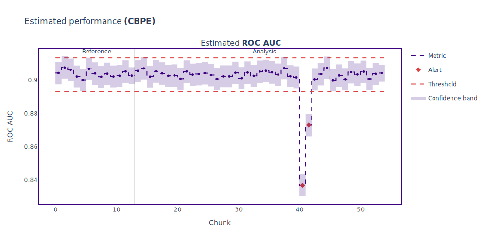
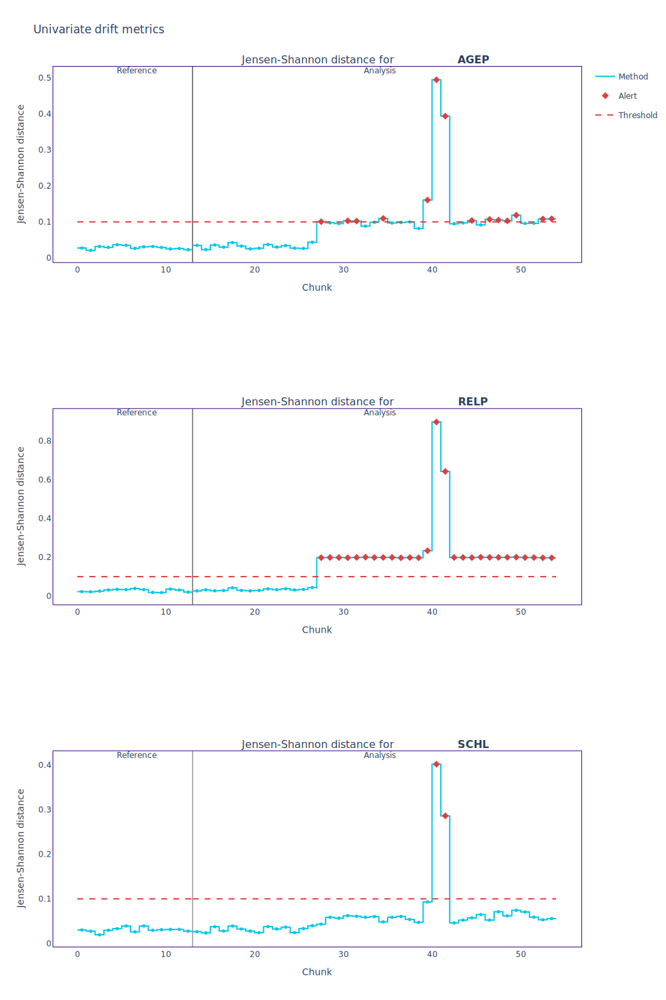
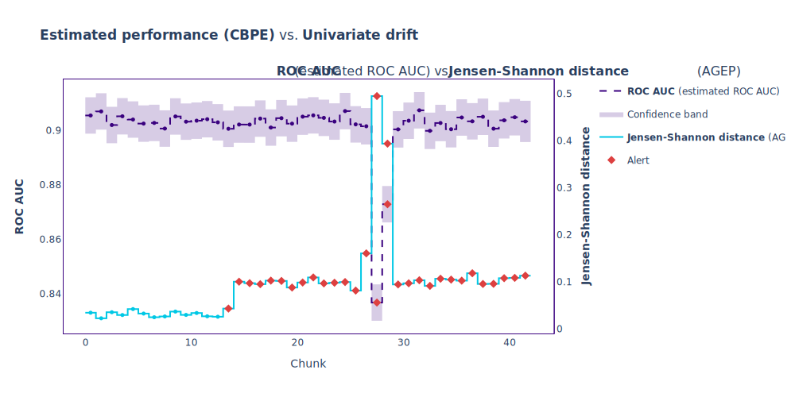
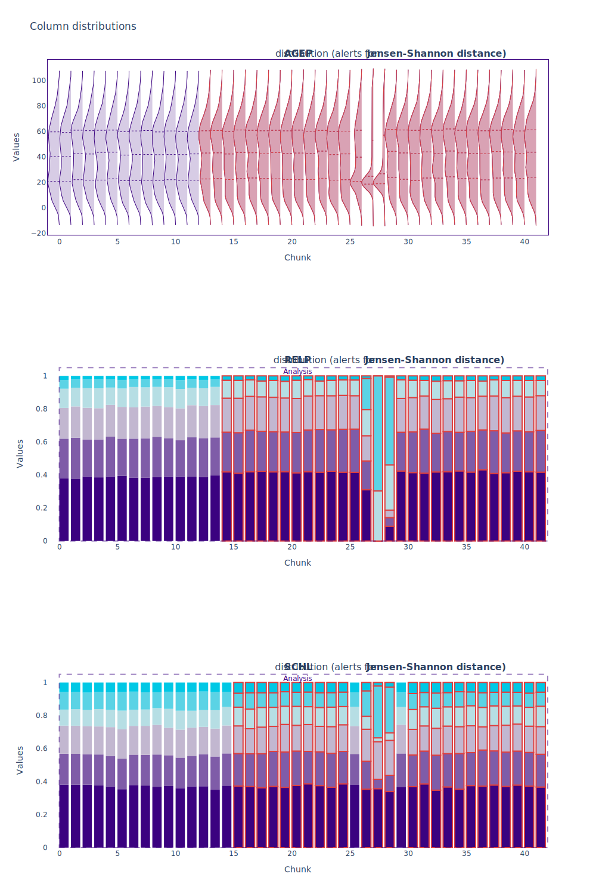
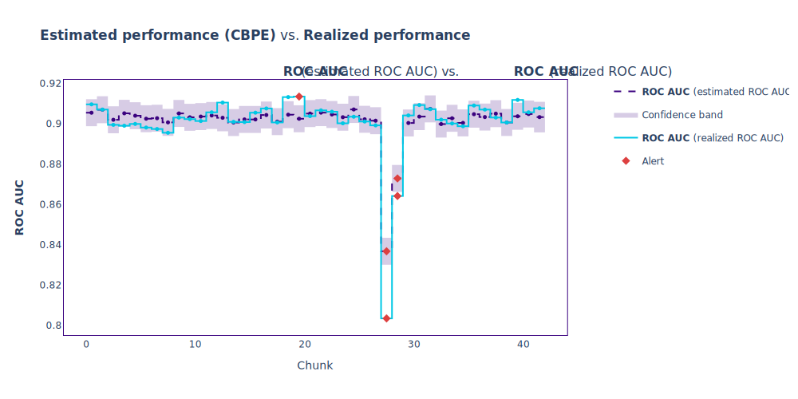

.. _quick-start:

==========
Quickstart
==========

----------------
What is NannyML?
----------------

.. include:: ./common/quickstart_what_is_nannyml.rst

.. _walk_through_the_quickstart:

This Quickstart presents some of the core functionalities of NannyML.

-------------------------------
Exemplary Workflow with NannyML
-------------------------------

Loading data
------------

We will use a real-world dataset containing inputs and predictions of a binary classification model that
predicts whether an individual is employed based on survey data. To learn more about this dataset
check out :ref:`US Census Employment dataset <dataset-real-world-ma-employment>`.

The data is split into two periods: :ref:`reference <data-drift-periods-reference>` and
:ref:`analysis<data-drift-periods-analysis>`. The reference data is used by
NannyML to establish a baseline for model performance and drift detection. The model's test set
can serve as the reference data. The analysis data is the data you want to analyze i.e. check whether the model
maintains its performance or if the feature distributions have shifted etc. This would usually be the latest production
data.

Let's load the libraries and the data:

.. nbimport::
    :path: ./example_notebooks/Quickstart.ipynb
    :cells: 1

.. nbimport::
    :path: ./example_notebooks/Quickstart.ipynb
    :cells: 3

.. nbtable::
    :path: ./example_notebooks/Quickstart.ipynb
    :cell: 4

.. nbtable::
    :path: ./example_notebooks/Quickstart.ipynb
    :cell: 5

The dataframes contain:

- model inputs like **AGEP**, **SCHL**, etc.
- **year** - the year the data was gathered. The ``df_reference`` data covers 2015 while ``df_analysis`` ranges
  from 2016 to 2018.
- **employed** - classification :term:`target<Target>`. Notice that the target is not available in ``df_analysis``.
- **prediction** - analyzed model predictions.
- **predicted_probability** - analyzed model predicted probability scores.

Estimating Performance without Targets
--------------------------------------

ML models are deployed to production once their business value and performance have been validated and tested. This
usually takes place in the model development phase.
The main goal of the ML model monitoring is to continuously verify whether the model maintains its anticipated
performance (which is not the case most of the time [1]_).

Monitoring performance is relatively straightforward when :term:`targets<Target>` are available, but this is often not
the case. The labels can be delayed, costly, or impossible to get. In such cases, estimating
performance is a good start for the monitoring workflow. NannyML can estimate the performance of an ML model without access to targets.

To reliably assess the performance of an ML model, we need to aggregate data. We call this *aggregation* chunking, and
the result of it is a :term:`chunk<Data Chunk>`. There are :ref:`many ways to define chunks in NannyML<chunking>`. In this
Quickstart, we will use size-based chunking and define the size of the chunk to be 5000 observations:

.. nbimport::
    :path: ./example_notebooks/Quickstart.ipynb
    :cells: 6

For :ref:`binary classification model performance estimation<binary-performance-estimation>` we will use the
:class:`~nannyml.performance_estimation
.confidence_based
.cbpe.CBPE` class (:ref:`Confidence-based Performance Estimation
<how-it-works-cbpe>`) to estimate the ``roc_auc`` metric. Let's initialize the estimator and provide the required
arguments:

.. nbimport::
    :path: ./example_notebooks/Quickstart.ipynb
    :cells: 7

Now we will fit it on ``df_reference`` and estimate on ``df_analysis``:

.. nbimport::
    :path: ./example_notebooks/Quickstart.ipynb
    :cells: 8

Let's visualize the results:

.. nbimport::
    :path: ./example_notebooks/Quickstart.ipynb
    :cells: 9

The estimated performance dropped significantly in the later part of the analysis.
Let's investigate this to determine whether we can rely on the estimation.

Investigating Data Distribution Shifts
--------------------------------------

Once we've identified a performance issue, we will troubleshoot it. We will quantify potential distribution shifts
for all the features using the :ref:`univariate drift
detection module<univariate_drift_detection>`.
We will instantiate the :class:`~nannyml.drift.univariate.calculator.UnivariateDriftCalculator`
class with the required arguments, fit it on ``df_reference``, and calculate on ``df_analysis``.

.. nbimport::
    :path: ./example_notebooks/Quickstart.ipynb
    :cells: 11

Now let's select only the features that drifted the most. To do this, we use one of the :ref:`ranking
methods<tutorial-ranking>`
- :meth:`~nannyml.drift.ranker.AlertCountRanker`:

.. nbimport::
    :path: ./example_notebooks/Quickstart.ipynb
    :cells: 12

.. nbtable::
    :path: ./example_notebooks/Quickstart.ipynb
    :cell: 13

The top 3 indicated features are:

 - **RELP** - the relationship of the person with the house owner.
 - **AGE** - age of the person.
 - **SCHL** - education level.

Let's plot univariate drift results for these features:

.. nbimport::
    :path: ./example_notebooks/Quickstart.ipynb
    :cells: 14

The plots show JS-distance calculated between the reference data and each chunk for every feature. For
**AGEP** and **RELP**
one can see a mild shift starting around one-third of the analysis period and a high peak that likely corresponds
to a performance drop. Around the same time, a similar peak can be noticed for **SCHL**. Let's check whether the shift
happens at the same time as the performance drop by
:ref:`showing both results in a single plot<compare_estimated_and_realized_performance>`:

.. nbimport::
    :path: ./example_notebooks/Quickstart.ipynb
    :cells: 16

The main drift peak indeed coincides with the strongest performance drop. It is interesting
to see that there is a noticeable shift magnitude increase right before the estimated drop happens. That looks
like an early sign of incoming issues. Now let's have a closer look at changes in the distributions by visualizing them
in the analysis period:

.. nbimport::
    :path: ./example_notebooks/Quickstart.ipynb
    :cells: 18

Let's summarize the shifts:

 - The distribution of person age (**AGEP**) has strongly shifted towards younger people (around 18 years old).
 - The relative frequencies of the categories in **RELP** have changed significantly. Since the plots are
   interactive (when run in a notebook), they allow checking the corresponding values in the bar
   plots. The category that has increased its relative frequency from around 5% in the reference period to almost 70% in
   the chunk with the strongest drift is encoded :ref:`with value
   17<dataset-real-world-ma-employment-feature-description-RELP>`, which refers to *Noninstitutionalized group quarters
   population*. This corresponds to people who live in group quarters other than institutions. Examples are: college
   dormitories, rooming houses, religious group houses, communes, or halfway houses.
 - The distribution of **SCHL** changed, with one of the categories doubling its relative frequency. This category is
   encoded
   :ref:`with value 19<dataset-real-world-ma-employment-feature-description-SCHL>`, which corresponds to people with
   *1 or more years of college credit, no degree*.

So the main responders in the period with data shift are young people who finished at least one year of college but
did not graduate and don't live at their parents' houses. It means that, most likely, there was a significant survey
action conducted at dormitories of colleges/universities. These findings indicate that a significant part of
the shift has a nature of covariate shift [2]_, which :ref:`CBPE handles well<CBPE-assumptions-limitations>`.

Comparing Estimated with Realized Performance when Targets Arrive
-----------------------------------------------------------------

Once the labels are in place, we can :ref:`calculate the realized performance<performance-calculation>`
and compare it with the estimation to verify its accuracy. We will use the
:class:`~nannyml.performance_calculation.calculator.PerformanceCalculator`
and follow the familiar pattern: initialize, fit, and calculate. Then we will plot the comparison:

.. nbimport::
    :path: ./example_notebooks/Quickstart.ipynb
    :cells: 20, 21

.. nbtable::
    :path: ./example_notebooks/Quickstart.ipynb
    :cell: 22

.. nbimport::
    :path: ./example_notebooks/Quickstart.ipynb
    :cells: 23

We see that the realized performance has indeed sharply dropped in the
two indicated chunks. The performance was relatively stable in the preceding
period even though **AGEP** was already slightly shifted at that time. This confirms the need to monitor
performance/estimated performance, as not every shift impacts performance.

------------
What's next?
------------

This Quickstart presents some of the core functionalities of NannyML on an example of real-world binary classification
data. The walk-through is concise to help you get familiar with the fundamental concepts and structure of the
library. NannyML provides other useful functionalities (like :ref:`multivariate drift
detection<multivariate_drift_detection>`) that
can help you monitor your models in production comprehensively. All of our :ref:`tutorials<tutorials>` are an excellent
place
to start exploring them.

If you want to know what is implemented under the hood - visit :ref:`how it works<how_it_works>`. Finally, if you just look for examples
on other datasets or ML problems, look through our :ref:`examples<examples>`.

**References**

.. [1] https://www.nature.com/articles/s41598-022-15245-z
.. [2] https://www.nannyml.com/blog/types-of-data-shift
