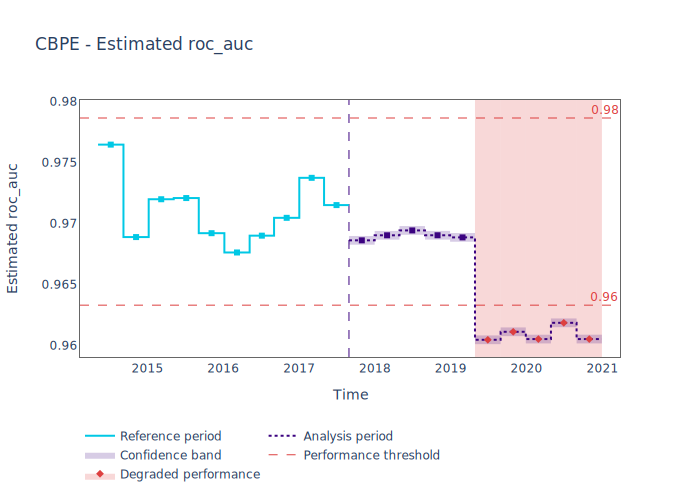

.. _quick-start:

=================
Quickstart
=================

----------------
What is NannyML?
----------------

NannyML detects silent model failure, estimates performance of ML models after deployment
before target data become available, and robustly detects data drift potentially responsible for the failure.
It can also monitor performance once target data is available.

------------------
Installing NannyML
------------------

From the shell of your python environment type:

.. code-block:: bash

    $ pip install nannyml

--------------------------
Contents of the quickstart
--------------------------

This quickstart presents core functionalities of NannyML on an example binary classification model
that predicts whether an employee will work from home the next day or not. First, the whole code is shown 
so you can jump in and experiment right away if you want.

This is followed by a detailed walk-through to help you get familiar with the flow, and explain the details.
:ref:`The synthetic dataset<dataset-synthetic-binary>` used contains inputs that are already merged with model
predictions and ready to be directly used by NannyML.

All :ref:`our tutorials<tutorials>` are a good place to get detailed guides on main
concepts and functionalities. If you want to know what is implemented under the hood - 
visit :ref:`how it works<how_it_works>`. Finally, if you just look for examples
on other datasets or ML problems look through our :ref:`examples<examples>`.

-------------
Just the code
-------------

.. code-block:: python

    >>> import pandas as pd
    >>> import nannyml as nml
    >>> from IPython.display import display

    >>> # Load synthetic data
    >>> reference, analysis, analysis_target = nml.load_synthetic_binary_classification_dataset()
    >>> display(analysis.head())
    >>> display(reference.head())

    >>> # Choose a chunker or set a chunk size
    >>> chunk_size = 5000

    >>> # initialize, specify required data columns, fit estimator and estimate
    >>> estimator = nml.CBPE(
    >>>    y_pred_proba='y_pred_proba',
    >>>    y_pred='y_pred',
    >>>    y_true='y_true',
    >>>    timestamp_column_name='timestamp',
    >>>    metrics=['roc_auc']
    >>>    chunk_size=chunk_size,
    >>> )
    >>> estimator = estimator.fit(reference)
    >>> estimated_performance = estimator.estimate(analysis)

    >>> # Show results
    >>> figure = estimated_performance.plot(kind='performance', metric='roc_auc', plot_reference=True)
    >>> figure.show()

    >>> # Define feature columns
    >>> feature_column_names = [
    >>>     col for col in reference_df.columns if col not in ['timestamp', 'y_pred_proba', 'period', 'y_pred', 'repaid']]

    >>> # Let's initialize the object that will perform the Univariate Drift calculations
    >>> univariate_calculator = nml.UnivariateStatisticalDriftCalculator(feature_column_names=feature_column_names, timestamp_column_name='timestamp', chunk_size=chunk_size)
    >>> univariate_calculator = univariate_calculator.fit(reference)
    >>> univariate_results = univariate_calculator.calculate(analysis)
    >>> # Plot drift results for all model inputs
    >>> for feature in univariate_calculator.feature_column_names:
    ...     figure = univariate_results.plot(kind='feature_drift', metric='statistic', plot_reference=True)
    ...     figure.show()

    >>> # Rank features based on number of alerts
    >>> ranker = nml.Ranker.by('alert_count')
    >>> ranked_features = ranker.rank(univariate_results, only_drifting = False)
    >>> display(ranked_features)

    >>> figure = univariate_results.plot(kind='prediction_drift', metric='statistic', plot_reference=True)
    >>> figure.show()

    >>> # Let's initialize the object that will perform Data Reconstruction with PCA
    >>> rcerror_calculator = nml.DataReconstructionDriftCalculator(feature_column_names=feature_column_names, timestamp_column_name='timestamp', chunk_size=chunk_size).fit(reference_data=reference)
    >>> # let's see Reconstruction error statistics for all available data
    >>> rcerror_results = rcerror_calculator.calculate(analysis)
    >>> figure = rcerror_results.plot(kind='drift', plot_reference=True)
    >>> figure.show()

.. _walk_through_the_quickstart:

---------------------------
Walkthrough
---------------------------

We start by loading the synthetic dataset included in the library. This synthetic dataset 
contains inputs and predictions of a binary classification model that predicts whether an employee will 
work from home the next workday or not.

The probability of the employee working from home is included in the ``y_pred_proba`` column, while the 
prediction is in ``y_pred`` column. The model inputs are ``distance_from_office``, ``salary_range``, 
``gas_price_per_litre``, ``public_transportation_cost``, ``wfh_prev_workday``, ``workday`` and ``tenure``. 
``identifier`` is the :term:`Identifier` column and ``timestamp`` is the :term:`Timestamp` column.

The data are split into a ``reference period`` and an ``analysis period``. NannyML uses the reference period to
establish a baseline for expected model performance. The analysis period is where we estimate or
monitor performance, as well as detect data drift.

For more information about periods check :ref:`data-drift-periods`. A key thing to remember is that
the analysis period doesn't need to contain the :term:`Target` data.

.. code-block:: python

    >>> import pandas as pd
    >>> import nannyml as nml
    >>> from IPython.display import display

    >>> # Load synthetic data
    >>> reference, analysis, analysis_target = nml.load_synthetic_binary_classification_dataset()
    >>> display(analysis.head())
    >>> display(reference.head())

+----+------------------------+----------------+-----------------------+------------------------------+--------------------+-----------+----------+--------------+--------------------+---------------------+----------------+-------------+----------+
|    |   distance_from_office | salary_range   |   gas_price_per_litre |   public_transportation_cost | wfh_prev_workday   | workday   |   tenure |   identifier |   work_home_actual | timestamp           |   y_pred_proba | partition   |   y_pred |
+====+========================+================+=======================+==============================+====================+===========+==========+==============+====================+=====================+================+=============+==========+
|  0 |               5.96225  | 40K - 60K €    |               2.11948 |                      8.56806 | False              | Friday    | 0.212653 |            0 |                  1 | 2014-05-09 22:27:20 |           0.99 | reference   |        1 |
+----+------------------------+----------------+-----------------------+------------------------------+--------------------+-----------+----------+--------------+--------------------+---------------------+----------------+-------------+----------+
|  1 |               0.535872 | 40K - 60K €    |               2.3572  |                      5.42538 | True               | Tuesday   | 4.92755  |            1 |                  0 | 2014-05-09 22:59:32 |           0.07 | reference   |        0 |
+----+------------------------+----------------+-----------------------+------------------------------+--------------------+-----------+----------+--------------+--------------------+---------------------+----------------+-------------+----------+
|  2 |               1.96952  | 40K - 60K €    |               2.36685 |                      8.24716 | False              | Monday    | 0.520817 |            2 |                  1 | 2014-05-09 23:48:25 |           1    | reference   |        1 |
+----+------------------------+----------------+-----------------------+------------------------------+--------------------+-----------+----------+--------------+--------------------+---------------------+----------------+-------------+----------+
|  3 |               2.53041  | 20K - 20K €    |               2.31872 |                      7.94425 | False              | Tuesday   | 0.453649 |            3 |                  1 | 2014-05-10 01:12:09 |           0.98 | reference   |        1 |
+----+------------------------+----------------+-----------------------+------------------------------+--------------------+-----------+----------+--------------+--------------------+---------------------+----------------+-------------+----------+
|  4 |               2.25364  | 60K+ €         |               2.22127 |                      8.88448 | True               | Thursday  | 5.69526  |            4 |                  1 | 2014-05-10 02:21:34 |           0.99 | reference   |        1 |
+----+------------------------+----------------+-----------------------+------------------------------+--------------------+-----------+----------+--------------+--------------------+---------------------+----------------+-------------+----------+

+----+------------------------+----------------+-----------------------+------------------------------+--------------------+-----------+----------+--------------+---------------------+----------------+-------------+----------+
|    |   distance_from_office | salary_range   |   gas_price_per_litre |   public_transportation_cost | wfh_prev_workday   | workday   |   tenure |   identifier | timestamp           |   y_pred_proba | partition   |   y_pred |
+====+========================+================+=======================+==============================+====================+===========+==========+==============+=====================+================+=============+==========+
|  0 |               0.527691 | 0 - 20K €      |               1.8     |                      8.96072 | False              | Tuesday   | 4.22463  |        50000 | 2017-08-31 04:20:00 |           0.99 | analysis    |        1 |
+----+------------------------+----------------+-----------------------+------------------------------+--------------------+-----------+----------+--------------+---------------------+----------------+-------------+----------+
|  1 |               8.48513  | 20K - 20K €    |               2.22207 |                      8.76879 | False              | Friday    | 4.9631   |        50001 | 2017-08-31 05:16:16 |           0.98 | analysis    |        1 |
+----+------------------------+----------------+-----------------------+------------------------------+--------------------+-----------+----------+--------------+---------------------+----------------+-------------+----------+
|  2 |               2.07388  | 40K - 60K €    |               2.31008 |                      8.64998 | True               | Friday    | 4.58895  |        50002 | 2017-08-31 05:56:44 |           0.98 | analysis    |        1 |
+----+------------------------+----------------+-----------------------+------------------------------+--------------------+-----------+----------+--------------+---------------------+----------------+-------------+----------+
|  3 |               0.118456 | 20K - 20K €    |               2.17144 |                      8.85542 | False              | Tuesday   | 4.71101  |        50003 | 2017-08-31 06:10:17 |           0.97 | analysis    |        1 |
+----+------------------------+----------------+-----------------------+------------------------------+--------------------+-----------+----------+--------------+---------------------+----------------+-------------+----------+
|  4 |               4.7867   | 0 - 20K €      |               2.36854 |                      8.39497 | False              | Monday    | 0.906738 |        50004 | 2017-08-31 06:29:38 |           0.92 | analysis    |        1 |
+----+------------------------+----------------+-----------------------+------------------------------+--------------------+-----------+----------+--------------+---------------------+----------------+-------------+----------+
    

Estimating Performance without Targets
======================================

NannyML can estimate the performance on a machine learning model in production
without access to its :term:`Target`. For more details on how to use performance estimation see 
:ref:`our tutorial on performance estimation<performance-estimation>`,
while for more details on how the algorithm behind it works see 
:ref:`Confidence-based Performance Estimation (CBPE)<performance-estimation-deep-dive>`.

.. code-block:: python

    >>> # initialize, specify required data columns, fit estimator and estimate
    >>> estimator = nml.CBPE(
    >>>    y_pred_proba='y_pred_proba',
    >>>    y_pred='y_pred',
    >>>    y_true='y_true',
    >>>    timestamp_column_name='timestamp',
    >>>    metrics=['roc_auc']
    >>>    chunk_size=chunk_size,
    >>> )
    >>> estimator = estimator.fit(reference)
    >>> estimated_performance = estimator.estimate(analysis)

    >>> # Show results
    >>> figure = estimated_performance.plot(kind='performance', metric='roc_auc', plot_reference=True)
    >>> figure.show()

The results indicate that the model's performance is likely to be negatively impacted from the second half of 2019
onwards.

Detecting Data Drift
====================

NannyML allows for further investigation into potential performance issues with its data drift detection
functionality. See :ref:`data-drift` for more details.

.. code-block:: python

    >>> # Define feature columns
    >>> feature_column_names = [
    >>>     col for col in reference_df.columns if col not in ['timestamp', 'y_pred_proba', 'period', 'y_pred', 'repaid']]
    >>> # Let's initialize the object that will perform the Univariate Drift calculations
    >>> univariate_calculator = nml.UnivariateStatisticalDriftCalculator(feature_column_names=feature_column_names, timestamp_column_name='timestamp', chunk_size=chunk_size)
    >>> univariate_calculator = univariate_calculator.fit(reference)
    >>> univariate_results = univariate_calculator.calculate(analysis)
    >>> # Plot drift results for all model inputs
    >>> for feature in univariate_calculator.feature_column_names:
    ...     figure = univariate_results.plot(kind='feature_drift', metric='statistic', plot_reference=True)
    ...     figure.show()

.. image:: ./_static/drift-guide-distance_from_office.svg

.. image:: ./_static/drift-guide-gas_price_per_litre.svg

.. image:: ./_static/drift-guide-tenure.svg

.. image:: ./_static/drift-guide-wfh_prev_workday.svg

.. image:: ./_static/drift-guide-workday.svg

.. image:: ./_static/drift-guide-public_transportation_cost.svg

.. image:: ./_static/drift-guide-salary_range.svg

When there are a lot of drifted features, NannyML can also rank them by the number of alerts they have raised:

.. code-block:: python

    >>> ranker = nml.Ranker.by('alert_count')
    >>> ranked_features = ranker.rank(univariate_results, only_drifting = False)
    >>> display(ranked_features)
    
+----+----------------------------+--------------------+--------+
|    | feature                    |   number_of_alerts |   rank |
+====+============================+====================+========+
|  0 | wfh_prev_workday           |                  5 |      1 |
+----+----------------------------+--------------------+--------+
|  1 | salary_range               |                  5 |      2 |
+----+----------------------------+--------------------+--------+
|  2 | distance_from_office       |                  5 |      3 |
+----+----------------------------+--------------------+--------+
|  3 | public_transportation_cost |                  5 |      4 |
+----+----------------------------+--------------------+--------+
|  4 | tenure                     |                  2 |      5 |
+----+----------------------------+--------------------+--------+
|  5 | workday                    |                  0 |      6 |
+----+----------------------------+--------------------+--------+
|  6 | gas_price_per_litre        |                  0 |      7 |
+----+----------------------------+--------------------+--------+

Drift in the model outputs can be also visualized:

.. code-block:: python

    >>> figure = univariate_results.plot(kind='prediction_drift', metric='statistic', plot_reference=True)
    >>> figure.show()

.. image:: ./_static/drift-guide-predictions.svg

More complex data drift cases can get detected by Data Reconstruction with PCA. For more information
see :ref:`Data Reconstruction with PCA<data-reconstruction-pca>`.

.. code-block:: python

    >>> # Let's initialize the object that will perform Data Reconstruction with PCA
    >>> rcerror_calculator = nml.DataReconstructionDriftCalculator(feature_column_names=feature_column_names, timestamp_column_name='timestamp', chunk_size=chunk_size).fit(reference_data=reference)
    >>> # let's see Reconstruction error statistics for all available data
    >>> rcerror_results = rcerror_calculator.calculate(analysis)
    >>> figure = rcerror_results.plot(kind='drift', plot_reference=True)
    >>> figure.show()

.. image:: ./_static/drift-guide-multivariate.svg

-----------------------
Insights
-----------------------

With NannyML we were able to estimate performance in the absence of ground truth. The estimation has shown
potential drop in ROC AUC in the second half of the analysis period. Univariate and multivariate
data drift detection algorithms have identified data drift.

Putting everything together, we see that 4 features exhibit data drift from late 2019 onwards. They are
``distance_from_office``, ``salary_range``, ``public_transportation_cost``, ``wfh_prev_workday``.
This drift is responsible for the potential negative impact in performance that we observed in this time period.

-----------------------
What next
-----------------------

This could be further investigated by analyzing changes of distributions of the input variables. Check
:ref:`tutorials<tutorials>` on :ref:`data drift<data-drift>` to find out how to plot distributions with NannyML.

You can now try using NannyML on your own data. Our :ref:`tutorials` are a good placs to find out what to do for this.