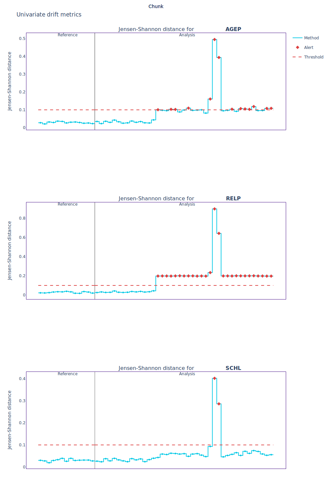
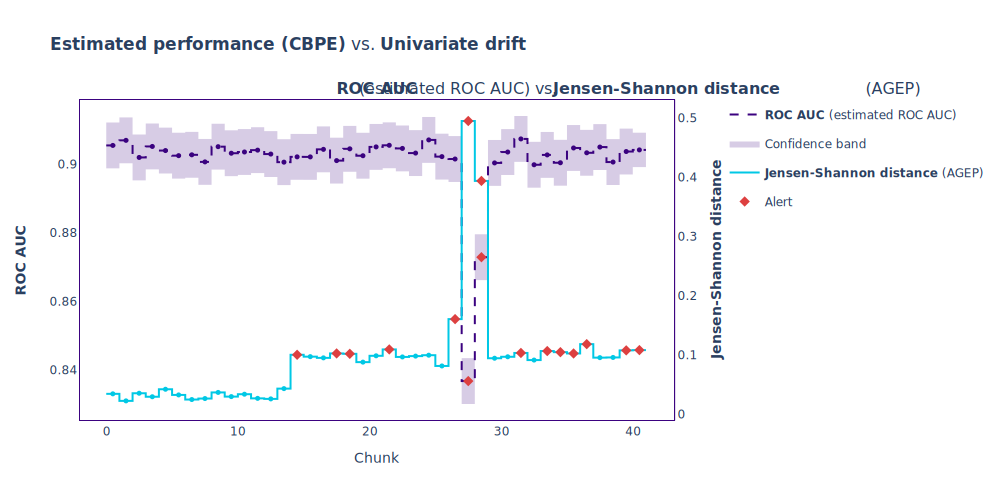
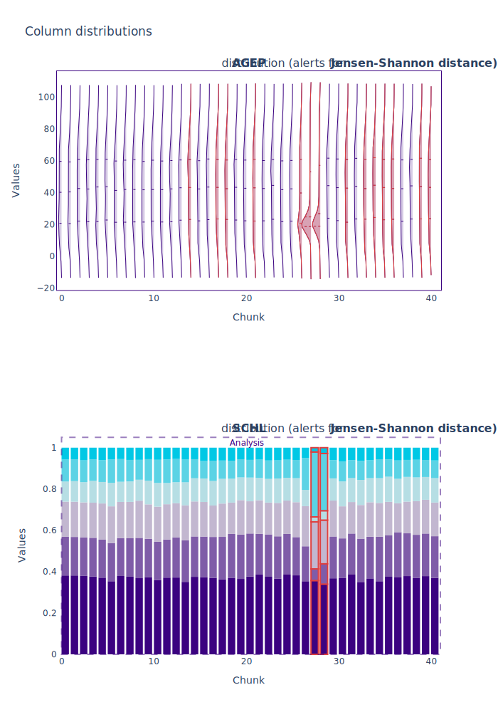
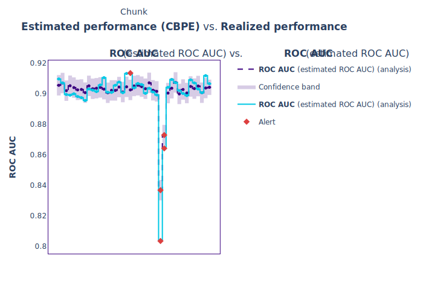

.. _quick-start:

==========
Quickstart
==========

----------------
What is NannyML?
----------------

.. include:: ./common/quickstart_what_is_nannyml.rst

.. _walk_through_the_quickstart:

This Quickstart presents some of the core functionalities of NannyML on real-world dataset with binary classification
model.

-------------------------------
Exemplary Workflow with NannyML
-------------------------------

Loading data
------------

We will use real-world dataset that contains inputs and predictions of a binary classification model that
predicts whether an individual is employed. Details about the dataset can be found
:ref:`here <dataset-real-world-ma-employment>`.

The data are split into two periods: :ref:`reference <data-drift-periods-reference>` and
:ref:`analysis<data-drift-periods-analysis>`. The reference data is used by
NannyML to establish a baseline for model performance and variable distributions. Your model's test dataset
can serve as the reference data. The analysis data is the data you want to analyze i.e. check whether the model
maintains its performance or if feature distributions have shifted etc. This would usually be your latest production data.

Let's load libraries and the data:

.. nbimport::
    :path: ./example_notebooks/Quickstart.ipynb
    :cells: 1

.. nbimport::
    :path: ./example_notebooks/Quickstart.ipynb
    :cells: 3

.. nbtable::
    :path: ./example_notebooks/Quickstart.ipynb
    :cell: 4

.. nbtable::
    :path: ./example_notebooks/Quickstart.ipynb
    :cell: 5

Dataframes contain:

- model inputs like ``AGEP`` (person age), ``SCHL`` (education level) etc.
- ``year`` - the year data was gathered, the ``df_reference`` data covers 2015 while ``df_analysis`` ranges 2016-2018.
- ``y_true`` - classification :term:`target<Target>`, **notice that target is not available in** ``df_analysis``.
- ``y_pred_proba`` - analyzed model predicted probability scores.
- ``y_pred`` - analyzed model predictions.

Estimating Performance without Targets
--------------------------------------

ML models are deployed to production once their business value and performance have been validated. This usually takes
place in model development phase.
The main goal of ML model monitoring is to continuously verify whether the model maintains its anticipated
performance (which is not the case most of the time [1]_).

Monitoring performance is relatively straightforward when :term:`targets<Target>` are available but this is often not
the case. Labels can be delayed, costly or impossible to get. In such cases, estimating
performance is a good start of the monitoring workflow. NannyML can estimate the performance of an ML model without access to targets.

To reliably assess the performance of an ML model, we need a sufficiently big sample of data. We call this sample a
:term:`chunk<Data Chunk>`. There are :ref:`many ways to define chunks in NannyML<chunking>`, in quickstart we will
use size-based chunking and define the size of the chunk to be 5000 observations:

.. nbimport::
    :path: ./example_notebooks/Quickstart.ipynb
    :cells: 6

For :ref:`binary classification model performance estimation<binary-performance-estimation>` we will use
:class:`~nannyml.performance_estimation
.confidence_based
.cbpe.CBPE` class (:ref:`Confidence-based Performance Estimation
<how-it-works-cbpe>`) to estimate ``roc_auc`` metric. Let's initialize the estimator and provide the required
parameters:

.. nbimport::
    :path: ./example_notebooks/Quickstart.ipynb
    :cells: 7

Now we will fit it on ``df_reference`` and estimate on ``df_analysis``:

.. nbimport::
    :path: ./example_notebooks/Quickstart.ipynb
    :cells: 8

Let's visualize the results:

.. nbimport::
    :path: ./example_notebooks/Quickstart.ipynb
    :cells: 9

.. image:: ./_static/quick-start-perf-est.svg

The estimated performance dropped significantly in the later part of the analysis.
Let's investigate this to determine whether we can rely on the estimation.

Investigating Data Distribution Shifts
--------------------------------------

Once we've identified a performance issue, we will troubleshoot it. Let's focus on the first two features `AGEP` and
`SCHL`. We will quantify potential distribution shifts for these two variables using the :ref:`univariate drift
detection module<_univariate_drift_detection>`.
We will instantiate the :class:`~nannyml.drift.univariate.calculator.UnivariateDriftCalculator`
class with required parameters, fit on ``df_reference`` and calculate on
``df_analysis``.

.. nbimport::
    :path: ./example_notebooks/Quickstart.ipynb
    :cells: 11, 12

Plots show JS-distance calculated between the chunk of interest and the reference data for each feature. For `AGEP`
one can notice mild shift starting in around one-third of the analysis period and a high peak that likely corresponds
to performance drop. Around the same time a similar peak can be notice for `SCHL`. Let's check whether the shift
happens at the same time as the performance drop by :ref:`showing both results in single plot<compare_estimated_and_realized_performance>`:

.. nbimport::
    :path: ./example_notebooks/Quickstart.ipynb
    :cells: 14

Plot confirms our supposition: the main drift peak coincides with the strongest performance drop. It is interesting
to see that there is a noticeable shift magnitude increase right before the estimated drop happens. That could looks
like an early sign of incoming issues. Now let's see what
actually happened with the distributions by visualizing their change in the analysis period:

.. nbimport::
    :path: ./example_notebooks/Quickstart.ipynb
    :cells: 16

Distribution changes in the chunks of interest are significant. The age has strongly shifted towards
younger people (around 18 years old). In the education level feature one of the categories has doubled its relative
frequency. Since plots are interactive when run in the notebook they allow to check corresponding values in the bar
plots. The category which frequency has increased is encoded :ref:`with value 19<dataset-real-world-ma-employment>`, which
corresponds to people with *1 or more years of college credit, no degree*. It is likely that during the investigated period, there was a
significant survey conducted at colleges and universities.

Comparing Estimation with Realized Performance when Targets Arrive
------------------------------------------------------------------

The above findings enhance trust in the estimation. Once the labels are in place, we can :ref:`calculate performance<performance-calculation>`
and
compare with the estimation to verify its accuracy. We will use :class:`~nannyml.performance_calculation.calculator
.PerformanceCalculator`
and follow the familiar pattern: initialize, fit and calculate. Then we will plot the comparison:

.. nbimport::
    :path: ./example_notebooks/Quickstart.ipynb
    :cells: 21

We see that the realized performance has indeed sharply dropped in the
two indicated chunks. The performance was relatively stable in the preceding
period even though ``AGEP`` was already slightly shifted at that time. This confirms the need to monitor
performance/estimated performance as not every shift impacts performance.

------------
What's next?
------------

This Quickstart presents some of the core functionalities of NannyML on an example of real-world binary classification
data. The walk through is concise to help you getting familiar with fundamental concepts and structure of the
library. NannyML provides other useful functionalities (like well-received :ref:`multivariate drift
detection<multivariate_drift_detection>`) that
can help you monitor your production models comprehensively. All :ref:`our tutorials<tutorials>` are a good place to start exploring them.

If you want to know what is implemented under the hood - visit :ref:`how it works<how_it_works>`. Finally, if you just look for examples
on other datasets or ML problems look through our :ref:`examples<examples>`.

**References**

.. [1] https://www.nature.com/articles/s41598-022-15245-z
