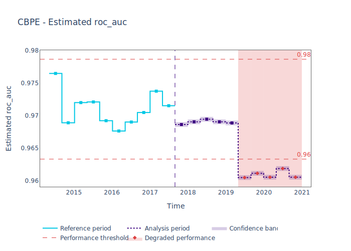
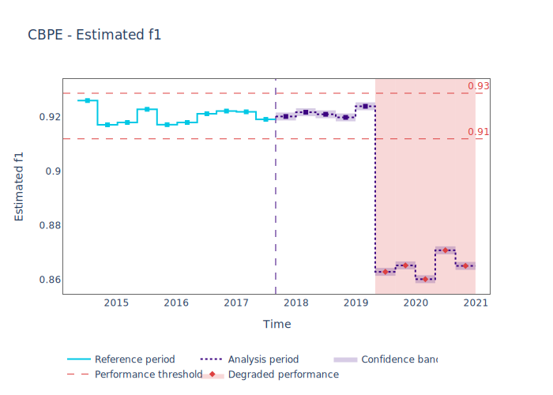
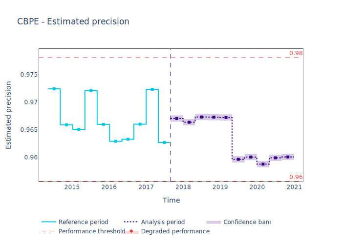
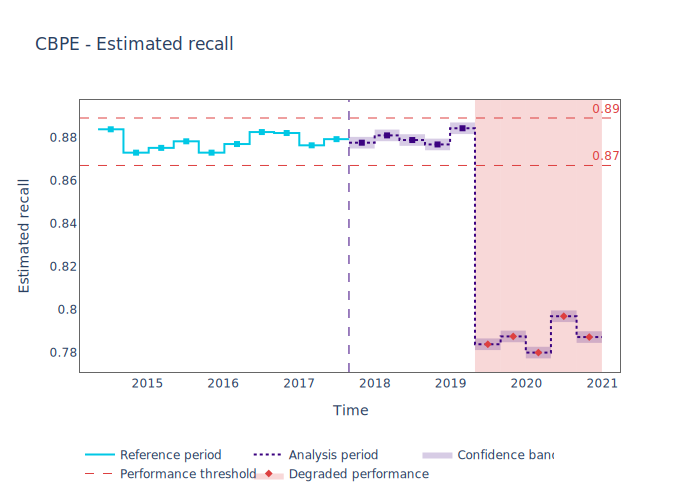

.. _performance-estimation:

======================
Performance Estimation
======================

Why Perform Performance Estimation
----------------------------------

NammyML allows for estimating the performance of a classification model before ground truth
becomes available. This can be very helpful in situations where there is a significant delay
in when ground truth becomes available but any changes in the model's performance would have
a significant impact on business results.

Just The Code
-------------

If you just want the code to experiment yourself, here you go:

.. code-block:: python

    >>> import pandas as pd
    >>> import nannyml as nml
    >>> from IPython.display import display
    >>> reference, analysis, analysis_gt = nml.datasets.load_synthetic_sample()
    >>> display(reference.head(3))

    >>> display(analysis.head(3))

    >>> metadata = nml.extract_metadata(reference, exclude_columns=['identifier'])
    >>> metadata.target_column_name = 'work_home_actual'

    >>> cbpe = nml.CBPE(model_metadata=metadata, chunk_size=5000, metrics=['roc_auc', 'f1', 'precision', 'recall']).fit(reference_data=reference)
    >>> est_perf = cbpe.estimate(pd.concat([reference, analysis], ignore_index=True))
    >>> est_perf.data.head(3)

    >>> for metric in cbpe.metrics:
            est_perf.plot(kind='performance', metric=metric).show()

Walkthrough on Performance Estimation
-------------------------------------

The :class:`~nannyml.performance_estimation.confidence_based.cbpe.CBPE` class
implements the performance estimation functionality for binary classification models. For more
information on how the algorithm works read the
:ref:`Confidence Based Performance Estimation<performance-estimation-deep-dive>` page.

The guide is based on a synthetic dataset where the monitored model predicts whether an employee will work from home.
Let's first load the data and have a quick look:

.. code-block:: python

    >>> import pandas as pd
    >>> import nannyml as nml
    >>> from IPython.display import display
    >>> reference, analysis, analysis_gt = nml.datasets.load_synthetic_sample()
    >>> display(reference.head(3))

+----+------------------------+----------------+-----------------------+------------------------------+--------------------+-----------+----------+--------------+--------------------+---------------------+----------------+-------------+----------+
|    |   distance_from_office | salary_range   |   gas_price_per_litre |   public_transportation_cost | wfh_prev_workday   | workday   |   tenure |   identifier |   work_home_actual | timestamp           |   y_pred_proba | partition   |   y_pred |
+====+========================+================+=======================+==============================+====================+===========+==========+==============+====================+=====================+================+=============+==========+
|  0 |               5.96225  | 40K - 60K €    |               2.11948 |                      8.56806 | False              | Friday    | 0.212653 |            0 |                  1 | 2014-05-09 22:27:20 |           0.99 | reference   |        1 |
+----+------------------------+----------------+-----------------------+------------------------------+--------------------+-----------+----------+--------------+--------------------+---------------------+----------------+-------------+----------+
|  1 |               0.535872 | 40K - 60K €    |               2.3572  |                      5.42538 | True               | Tuesday   | 4.92755  |            1 |                  0 | 2014-05-09 22:59:32 |           0.07 | reference   |        0 |
+----+------------------------+----------------+-----------------------+------------------------------+--------------------+-----------+----------+--------------+--------------------+---------------------+----------------+-------------+----------+
|  2 |               1.96952  | 40K - 60K €    |               2.36685 |                      8.24716 | False              | Monday    | 0.520817 |            2 |                  1 | 2014-05-09 23:48:25 |           1    | reference   |        1 |
+----+------------------------+----------------+-----------------------+------------------------------+--------------------+-----------+----------+--------------+--------------------+---------------------+----------------+-------------+----------+

.. code-block:: python

    >>> display(analysis.head(3))

+----+------------------------+----------------+-----------------------+------------------------------+--------------------+-----------+----------+--------------+---------------------+----------------+-------------+----------+
|    |   distance_from_office | salary_range   |   gas_price_per_litre |   public_transportation_cost | wfh_prev_workday   | workday   |   tenure |   identifier | timestamp           |   y_pred_proba | partition   |   y_pred |
+====+========================+================+=======================+==============================+====================+===========+==========+==============+=====================+================+=============+==========+
|  0 |               0.527691 | 0 - 20K €      |               1.8     |                      8.96072 | False              | Tuesday   |  4.22463 |        50000 | 2017-08-31 04:20:00 |           0.99 | analysis    |        1 |
+----+------------------------+----------------+-----------------------+------------------------------+--------------------+-----------+----------+--------------+---------------------+----------------+-------------+----------+
|  1 |               8.48513  | 20K - 20K €    |               2.22207 |                      8.76879 | False              | Friday    |  4.9631  |        50001 | 2017-08-31 05:16:16 |           0.98 | analysis    |        1 |
+----+------------------------+----------------+-----------------------+------------------------------+--------------------+-----------+----------+--------------+---------------------+----------------+-------------+----------+
|  2 |               2.07388  | 40K - 60K €    |               2.31008 |                      8.64998 | True               | Friday    |  4.58895 |        50002 | 2017-08-31 05:56:44 |           0.98 | analysis    |        1 |
+----+------------------------+----------------+-----------------------+------------------------------+--------------------+-----------+----------+--------------+---------------------+----------------+-------------+----------+

The ``reference`` and ``analysis`` dataframes correspond to ``reference`` and ``analysis`` partitions of
the monitored data. To understand what they are read :ref:`data partitions<data-drift-partitions>`. The
``analysis_gt`` dataframe contains the ground truth results of the analysis period and we will not be using
it during Performance Estimation.

One of the first steps in using NannyML is providing metadata information about the model we are monitoring.
Some information is infered automatically and we provide the rest.

.. code-block:: python

    >>> metadata = nml.extract_metadata(reference, model_name='wfh_predictor', exclude_columns=['identifier'])
    >>> metadata.target_column_name = 'work_home_actual'

Full information on how the model's data should be prepared can be found in the guide on
:ref:`importing data<import-data>`.

Creating and using the estimator
~~~~~~~~~~~~~~~~~~~~~~~~~~~~~~~~

In the next step Confidence-based Performance Estimation (CBPE) estimator is created and fitted on ``reference`` data.
Both the chunking method and the metrics to estimate need to be specified now.
Read more about chunking in relevant :ref:`guide<chunk-data>`.

.. code-block:: python

    >>> cbpe = nml.CBPE(
    ...     model_metadata=metadata,
    ...     chunk_size=5000,
    ...     metrics=['roc_auc', 'f1', 'precision', 'recall', 'specificity', 'accuracy']
    ... ).fit(reference_data=reference)

The fitted ``cbpe`` can be used to estimate performance on other data, for which performance cannot be calculated.
Typically, this would be used on the latest production data where ground truth is missing, which usually is
the ``analysis`` partition.

However, it can be also used on combined ``reference`` and ``analysis`` data, e.g. when comparing
estimations of ``reference`` and ``analysis`` data or comparing the estimated performance versus the realized
performance on ``reference`` data.

.. code-block:: python

    >>> est_perf = cbpe.estimate(pd.concat([reference, analysis], ignore_index=True))

To find out how CBPE estimates performance, read the relevant :ref:`deep dive<performance-estimation-deep-dive>`.

View the results
~~~~~~~~~~~~~~~~

To get the data frame with results:

.. code-block:: python

    >>> est_perf.data.head(3)

+----+---------------+---------------+-------------+---------------------+---------------------+-------------+----------------------+--------------------+---------------------+---------------------------+---------------------------+-----------------+-----------------+---------------+----------------+----------------------+----------------------+------------+------------------------+----------------------+-----------------------+-----------------------------+-----------------------------+-------------------+---------------------+-------------------+--------------------+--------------------------+--------------------------+----------------+------------------+
|    | key           |   start_index |   end_index | start_date          | end_date            | partition   |   confidence_roc_auc |   realized_roc_auc |   estimated_roc_auc |   upper_threshold_roc_auc |   lower_threshold_roc_auc | alert_roc_auc   |   confidence_f1 |   realized_f1 |   estimated_f1 |   upper_threshold_f1 |   lower_threshold_f1 | alert_f1   |   confidence_precision |   realized_precision |   estimated_precision |   upper_threshold_precision |   lower_threshold_precision | alert_precision   |   confidence_recall |   realized_recall |   estimated_recall |   upper_threshold_recall |   lower_threshold_recall | alert_recall   |   actual_roc_auc |
+====+===============+===============+=============+=====================+=====================+=============+======================+====================+=====================+===========================+===========================+=================+=================+===============+================+======================+======================+============+========================+======================+=======================+=============================+=============================+===================+=====================+===================+====================+==========================+==========================+================+==================+
|  0 | [0:4999]      |             0 |        4999 | 2014-05-09 22:27:20 | 2014-09-09 08:18:27 | reference   |           0.00035752 |           0.976477 |            0.969051 |                  0.963317 |                   0.97866 | False           |      0.00145944 |      0.926044 |       0.921705 |             0.911932 |             0.928751 | False      |            0.000579414 |             0.972408 |              0.966623 |                    0.955649 |                    0.978068 | False             |          0.00270608 |          0.8839   |           0.880777 |                  0.86706 |                 0.889152 | False          |         0.976253 |
+----+---------------+---------------+-------------+---------------------+---------------------+-------------+----------------------+--------------------+---------------------+---------------------------+---------------------------+-----------------+-----------------+---------------+----------------+----------------------+----------------------+------------+------------------------+----------------------+-----------------------+-----------------------------+-----------------------------+-------------------+---------------------+-------------------+--------------------+--------------------------+--------------------------+----------------+------------------+
|  1 | [5000:9999]   |          5000 |        9999 | 2014-09-09 09:13:35 | 2015-01-09 00:02:51 | reference   |           0.00035752 |           0.968899 |            0.968909 |                  0.963317 |                   0.97866 | False           |      0.00145944 |      0.917111 |       0.917418 |             0.911932 |             0.928751 | False      |            0.000579414 |             0.965889 |              0.966807 |                    0.955649 |                    0.978068 | False             |          0.00270608 |          0.873022 |           0.87283  |                  0.86706 |                 0.889152 | False          |         0.969045 |
+----+---------------+---------------+-------------+---------------------+---------------------+-------------+----------------------+--------------------+---------------------+---------------------------+---------------------------+-----------------+-----------------+---------------+----------------+----------------------+----------------------+------------+------------------------+----------------------+-----------------------+-----------------------------+-----------------------------+-------------------+---------------------+-------------------+--------------------+--------------------------+--------------------------+----------------+------------------+
|  2 | [10000:14999] |         10000 |       14999 | 2015-01-09 00:04:43 | 2015-05-09 15:54:26 | reference   |           0.00035752 |           0.972    |            0.968657 |                  0.963317 |                   0.97866 | False           |      0.00145944 |      0.917965 |       0.919083 |             0.911932 |             0.928751 | False      |            0.000579414 |             0.965066 |              0.96696  |                    0.955649 |                    0.978068 | False             |          0.00270608 |          0.875248 |           0.875723 |                  0.86706 |                 0.889152 | False          |         0.971742 |
+----+---------------+---------------+-------------+---------------------+---------------------+-------------+----------------------+--------------------+---------------------+---------------------------+---------------------------+-----------------+-----------------+---------------+----------------+----------------------+----------------------+------------+------------------------+----------------------+-----------------------+-----------------------------+-----------------------------+-------------------+---------------------+-------------------+--------------------+--------------------------+--------------------------+----------------+------------------+

.. _performance-estimation-thresholds:

Apart from chunking and chunk and partition-related data, the results data have the following columns for each metric
that was estimated:

 - ``estimated_<metric>`` - the estimate of ROC AUC for a specific chunk,
 - ``confidence_<metric>`` - the width of the confidence band. It is equal to 1 standard deviation of performance estimates on
   `reference` data (hence calculated during ``fit`` phase).
 - ``upper_threshold_<metric>`` and ``lower_threshold_<metric>`` - crossing these thresholds will raise an alert on significant
   performance change. The thresholds are calculated based on the actual performance of the monitored model on chunks in
   the ``reference`` partition. The thresholds are 3 standard deviations away from the mean performance calculated on
   chunks.
   They are calculated during ``fit`` phase.
 - ``realized_<metric>`` - when ``target`` values are available for a chunk, the realized performance metric will also
   be calculated and included within the results.
 - ``alert_<metric>`` - flag indicating potentially significant performance change. ``True`` if estimated performance crosses
   upper or lower threshold.

The results can be also plotted:

.. code-block:: python

    >>> for metric in cbpe.metrics:
            est_perf.plot(kind='performance', metric=metric).show()

.. image:: ../../_static/perf-est-guide-specificity.svg

.. image:: ../../_static/perf-est-guide-accuracy.svg

Insights and Follow Ups
-----------------------

After reviewing the performance estimation results we have to decide if further investigation is needed.
The :ref:`Data Drift<data-drift>` functionality can help here.

If needed further investigation can be performed as to why our population characteristics have
changed the way they did. This is an ad-hoc investigating that is not covered by NannyML.

When the ground truth results become available they can be compared with the estimated results as
demonstrated :ref:`here<compare_estimated_and_realized_performance>`. You can learn more
about the Confidence Based Performance Estimation and it's limitation in the
:ref:`How it Works page<performance-estimation-deep-dive>`
