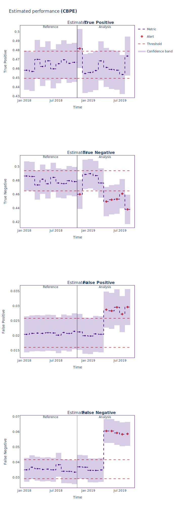

.. _confusion-matrix-estimation:

========================================================================================
Estimating Confusion Matrix Elements for Binary Classification
========================================================================================
This tutorial explains how to use NannyML to estimate the confusion matrix for binary classification
models in the absence of target data. To find out how :class:`~nannyml.performance_estimation.confidence_based.cbpe.CBPE` estimates performance, read the :ref:`explanation of Confidence-based
Performance Estimation<performance-estimation-deep-dive>`.

.. note::
    The following example uses :term:`timestamps<Timestamp>`.
    These are optional but have an impact on the way data is chunked and results are plotted.
    You can read more about them in the :ref:`data requirements<data_requirements_columns_timestamp>`.

.. _confusion-matrix-estimation-binary-just-the-code:

Just The Code
----------------

.. nbimport::
    :path: ./example_notebooks/Tutorial - Estimating Confusion Matrix - Binary Classification.ipynb
    :cells: 1 3 4 5 7

Walkthrough
--------------

For simplicity this guide is based on a synthetic dataset included in the library, where the monitored model
predicts whether a customer will repay a loan to buy a car.
Check out :ref:`Car Loan Dataset<dataset-synthetic-binary-car-loan>` to learn more about this dataset.

In order to monitor a model, NannyML needs to learn about it from a reference dataset. Then it can monitor the data that is subject to actual analysis, provided as the analysis dataset.
You can read more about this in our section on :ref:`data periods<data-drift-periods>`.

We start by loading the dataset we'll be using:

.. nbimport::
    :path: ./example_notebooks/Tutorial - Estimating Confusion Matrix - Binary Classification.ipynb
    :cells: 1

.. nbtable::
    :path: ./example_notebooks/Tutorial - Estimating Confusion Matrix - Binary Classification.ipynb
    :cell: 2

Next we create the Confidence-based Performance Estimation
(:class:`~nannyml.performance_estimation.confidence_based.cbpe.CBPE`)
estimator and specify that we would like the 'confusion_matrix'
metric using the ``metrics`` parameter. We also specify how we would
like the confusion matrix results to be normalized using the
``normalize_confusion_matrix`` parameter. The normalization options
are:

    * ``None`` : returns counts for each cell
    * ``"true"`` : normalize over the true class of observations.
    * ``"pred"`` : normalize over the predicted class of observations
    * ``"all"`` : normalize over all observations

.. note::
    Since we are estimating the confusion matrix, we do not
    have access to the true counts of the true classes of observations.
    For this reason, we normalize the values using the estimated values
    for each cell. So, for example, if "true" is given as the
    normalization option, the estimates in each row will sum to 1.
    And if the "pred" option is given, the estimates in each column
    will sum to 1.

Additionally, we specify an optional :term:`chunking<Data Chunk>` specification.
For more information about chunking check out the :ref:`chunking tutorial<chunking>`
and it's :ref:`advanced guide<chunk-data>`.

.. nbimport::
    :path: ./example_notebooks/Tutorial - Estimating Confusion Matrix - Binary Classification.ipynb
    :cells: 3

.. note::
  The list of metrics specifies which performance metrics of the monitored model will be estimated.
  This tutorial is specific to the ``confusion_matrix`` metric, but you can find more information about
  other standard metrics such as ``roc_auc``, ``f1``, ``precision``, ``recall``, ``specificity``,
  and ``accuracy`` in the
  :ref:`estimation of standard performance metrics tutorial<standard-metric-estimation>`. Additionally,
  you can find more information about the ``business_value`` metric in the
  :ref:`business value estimation tutorial<business-value-estimation>`.

The :class:`~nannyml.performance_estimation.confidence_based.cbpe.CBPE`
estimator is then fitted using the
:meth:`~nannyml.performance_estimation.confidence_based.cbpe.CBPE.fit` method on the ``reference`` data.

.. nbimport::
    :path: ./example_notebooks/Tutorial - Estimating Confusion Matrix - Binary Classification.ipynb
    :cells: 4

The fitted ``estimator`` can be used to estimate performance on other data, for which performance cannot be calculated.
Typically, this would be used on the latest production data where target is missing. In our example this is
the ``analysis_df`` data.

NannyML can then output a dataframe that contains all the results. Let's have a look at the results for analysis period
only.

.. nbimport::
    :path: ./example_notebooks/Tutorial - Estimating Confusion Matrix - Binary Classification.ipynb
    :cells: 5

.. nbtable::
    :path: ./example_notebooks/Tutorial - Estimating Confusion Matrix - Binary Classification.ipynb
    :cell: 6

Apart from chunk-related data, the results data have the following columns for each metric
that was estimated:

 - ``value`` - the estimate of a metric for a specific chunk.
 - ``sampling_error`` - the estimate of the :term:`Sampling Error`.
 - ``realized`` - when ``target`` values are available for a chunk, the realized performance metric will also
   be calculated and included within the results.
 - ``upper_confidence_boundary`` and ``lower_confidence_boundary`` - These values show the :term:`Confidence Band` of the relevant metric
   and are equal to estimated value +/- 3 times the estimated :term:`Sampling Error`.
 - ``upper_threshold`` and ``lower_threshold`` - crossing these thresholds will raise an alert on significant
   performance change. The thresholds are calculated based on the actual performance of the monitored model on chunks in
   the ``reference`` partition. The thresholds are 3 standard deviations away from the mean performance calculated on
   chunks.
   They are calculated during ``fit`` phase.
 - ``alert`` - flag indicating potentially significant performance change. ``True`` if estimated performance crosses
   upper or lower threshold.

These results can be also plotted. Our plot contains several key elements.

* The purple dashed step plot shows the estimated performance in each chunk of the analysis period. Thick squared point
  markers indicate the middle of these chunks.

* The low-saturated purple area around the estimated performance indicates the :ref:`sampling error<estimation_of_standard_error>`.

* The red horizontal dashed lines show upper and lower thresholds for alerting purposes.

* If the estimated performance crosses the upper or lower threshold an alert is raised which is indicated by a red,
  diamond-shaped point marker in the middle of the chunk.

Description of tabular results above explains how the
:term:`confidence bands<Confidence Band>` and thresholds are calculated. Additional information is shown in the hover (these are
interactive plots, though only static views are included here).

.. nbimport::
    :path: ./example_notebooks/Tutorial - Estimating Confusion Matrix - Binary Classification.ipynb
    :cells: 7

* The right-hand side of the plot shows the estimated performance for the analysis period.

* The solid grey vertical line splits the reference and analysis periods.

* On the left-hand side of the line, the actual model performance (not estimation!) is plotted with a solid light blue
  line. This facilitates comparison of the estimation against the reference period, and sets expectations on the
  variability of the performance.

Insights
--------

After reviewing the performance estimation results, we should be able to see any indications of performance change that
NannyML has detected based upon the model's inputs and outputs alone.

What's next
-----------

The :ref:`Data Drift<data-drift>` functionality can help us to understand whether data drift is causing the performance problem.
When the target values become    available they can be :ref:`compared with the estimated
results<compare_estimated_and_realized_performance>`.

You can learn more about the Confidence Based Performance Estimation and its limitations in the
:ref:`How it Works page<performance-estimation-deep-dive>`.
