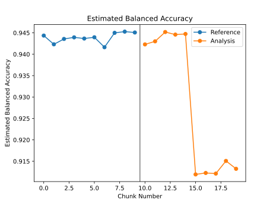

.. _custom-metric-estimation:

========================================================================================
Creating and Estimating a Custom Binary Classification Metric
========================================================================================
This tutorial explains how to use NannyML to estimate a custom metric based on :term:`confusion matrix<Confusion Matrix>` for binary classification
models in the absence of target data. In particular, we will be creating a **balanced accuracy** metric.
To find out how CBPE estimates the confusion matrix components, read the :ref:`explanation of Confidence-based
Performance Estimation<performance-estimation-deep-dive>`.

.. _custom-metric-estimation-binary-just-the-code:

Just the Code
-------------

.. nbimport::
    :path: ./example_notebooks/Tutorial - Creating and Estimating a Custom Metric - Binary Classification.ipynb
    :cells: 1 3 4 5 7 8 9 10

Walkthrough
--------------

While NannyML offers out-of-the-box support for the estimation of a number of metrics (see which in our :ref:`binary-performance-estimation` page),
it is also possible to create custom metrics. In this tutorial we will be creating a **balanced accuracy** metric, using
the :term:`confusion matrix<Confusion Matrix>` as a building block.

For simplicity this guide is based on a synthetic dataset included in the library, where the monitored model
predicts whether a customer will repay a loan to buy a car.
You can read more about this synthetic dataset :ref:`here<dataset-synthetic-binary-car-loan>`.

In order to monitor a model, NannyML needs to learn about it from a reference dataset. Then it can monitor the data that is subject to actual analysis, provided as the analysis dataset.
You can read more about this in our section on :ref:`data periods<data-drift-periods>`.

We start by importing the libraries we'll need and loading the dataset we'll be using:

.. nbimport::
    :path: ./example_notebooks/Tutorial - Creating and Estimating a Custom Metric - Binary Classification.ipynb
    :cells: 1

.. nbtable::
    :path: ./example_notebooks/Tutorial - Creating and Estimating a Custom Metric - Binary Classification.ipynb
    :cell: 2

Next we create the Confidence-based Performance Estimation
(:class:`~nannyml.performance_estimation.confidence_based.cbpe.CBPE`)
estimator to estimate the confusion matrix elements that we will
need for our custom metric. In order to estimate the **confusion_matrix**
elements we will specify the `metrics` parameter as `['confusion_matrix']`.
We will also specify the `normalize_confusion_matrix` parameter as `"all"`
to get the *rate* instead of the count for each cell.

.. nbimport::
    :path: ./example_notebooks/Tutorial - Creating and Estimating a Custom Metric - Binary Classification.ipynb
    :cells: 3

The :class:`~nannyml.performance_estimation.confidence_based.cbpe.CBPE`
estimator is then fitted using the
:meth:`~nannyml.performance_estimation.confidence_based.cbpe.CBPE.fit` method on the ``reference`` data.

.. nbimport::
    :path: ./example_notebooks/Tutorial - Creating and Estimating a Custom Metric - Binary Classification.ipynb
    :cells: 4

The fitted ``estimator`` can be used to estimate performance on other data, for which performance cannot be calculated.
Typically, this would be used on the latest production data where target is missing. In our example this is
the ``analysis_df`` data.

NannyML can then output a dataframe that contains all the results.

.. nbimport::
    :path: ./example_notebooks/Tutorial - Creating and Estimating a Custom Metric - Binary Classification.ipynb
    :cells: 5

.. nbtable::
    :path: ./example_notebooks/Tutorial - Creating and Estimating a Custom Metric - Binary Classification.ipynb
    :cell: 6

From these results we will want the **value** for each component of the confusion matrix
for each chunk of data. To do so, we simply index into the results dataframe as is done
below:

.. nbimport::
    :path: ./example_notebooks/Tutorial - Creating and Estimating a Custom Metric - Binary Classification.ipynb
    :cells: 7

Now that we have these values, we can use them to calculate the **sensitivity**
and **specificity** for each chunk of data. We can then use these values to calculate
the **balanced accuracy** for each chunk of data.

As a reminder, the balanced accuracy is defined as:

.. math::
    \text{balanced accuracy} = \frac{1}{2} \left( \text{sensitivity} + \text{specificity} \right)

and the sensitivity and specificity are defined as:

.. math::
    \text{sensitivity} = \frac{TP}{TP + FN}

.. math::
    \text{specificity} = \frac{TN}{TN + FP}

where :math:`TP` is the number of true positives (or true positive rate), :math:`TN` is the number of true negatives (or true negative rate),
:math:`FP` is the number of false positives (or false positive rate), and :math:`FN` is the number of false negatives (or false negative rate).

.. nbimport::
    :path: ./example_notebooks/Tutorial - Creating and Estimating a Custom Metric - Binary Classification.ipynb
    :cells: 8

To distinguish between the balanced accuracy for the reference data and the analysis data,
we can get the number of chunks in the reference data and analysis data and then use this to
index the ``balanced_accuracy`` array.

.. nbimport::
    :path: ./example_notebooks/Tutorial - Creating and Estimating a Custom Metric - Binary Classification.ipynb
    :cells: 9

Since **balanced accuracy** is not supported out of the box with NannyML, we will create a custom plot to visualize the performance
estimation results.

.. nbimport::
    :path: ./example_notebooks/Tutorial - Creating and Estimating a Custom Metric - Binary Classification.ipynb
    :cells: 10

Insights
--------

After reviewing the performance estimation results, we should be able to see any indications of performance change that
NannyML has detected based upon the model's inputs and outputs alone.

What's next
-----------

The :ref:`Data Drift<data-drift>` functionality can help us to understand whether data drift is causing the performance problem.
When the target values become    available they can be :ref:`compared with the estimated
results<compare_estimated_and_realized_performance>`.

You can learn more about the Confidence Based Performance Estimation and its limitations in the
:ref:`How it Works page<performance-estimation-deep-dive>`.

And if targets are available or become available, you can learn more about *calculating* confusion
matrix elements in the :ref:`confusion-matrix-calculation` tutorial.
