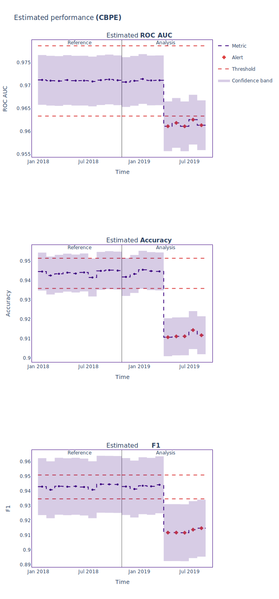

.. _standard-metric-estimation:

========================================================================================
Estimating Standard Performance Metrics for Binary Classification
========================================================================================

This tutorial explains how to use NannyML to estimate the performance of binary classification
models in the absence of target data. To find out how :class:`~nannyml.performance_estimation.confidence_based.cbpe.CBPE` estimates performance, read the :ref:`explanation of Confidence-based
Performance Estimation<performance-estimation-deep-dive>`.

.. note::
    The following example uses :term:`timestamps<Timestamp>`.
    These are optional but have an impact on the way data is chunked and results are plotted.
    You can read more about them in the :ref:`data requirements<data_requirements_columns_timestamp>`.

.. _performance-estimation-binary-just-the-code:

Just The Code
----------------

.. nbimport::
    :path: ./example_notebooks/Tutorial - Estimating Standard Performance Metrics - Binary Classification.ipynb
    :cells: 1 3 4 5 7

.. admonition:: **Advanced configuration**
    :class: hint

    - To learn how :class:`~nannyml.chunk.Chunk` works and to set up custom chunkings check out the :ref:`chunking tutorial <chunking>`
    - To learn how :class:`~nannyml.thresholds.ConstantThreshold` works and to set up custom threshold check out the :ref:`thresholds tutorial <thresholds>`

Walkthrough
--------------

For simplicity this guide is based on a synthetic dataset included in the library, where the monitored model
predicts whether a customer will repay a loan to buy a car.
Check out :ref:`Car Loan Dataset<dataset-synthetic-binary-car-loan>` to learn more about this dataset.

In order to monitor a model, NannyML needs to learn about it from a reference dataset. Then it can monitor the data that is subject to actual analysis, provided as the analysis dataset.
You can read more about this in our section on :ref:`data periods<data-drift-periods>`.

We start by loading the dataset we'll be using:

.. nbimport::
    :path: ./example_notebooks/Tutorial - Estimating Standard Performance Metrics - Binary Classification.ipynb
    :cells: 1

.. nbtable::
    :path: ./example_notebooks/Tutorial - Estimating Standard Performance Metrics - Binary Classification.ipynb
    :cell: 2

Next we create the Confidence-based Performance Estimation
(:class:`~nannyml.performance_estimation.confidence_based.cbpe.CBPE`)
estimator. In this example, we will estimate the following metrics: **roc_auc**, **accuracy**, and **f1**.

We specify the following parameters in the initialization of the estimator:

  - **y_pred_proba:** the name of the column in the reference data that
    contains the predicted probabilities.
  - **y_pred:** the name of the column in the reference data that
    contains the predicted classes.
  - **y_true:** the name of the column in the reference data that
    contains the true classes.
  - **timestamp_column_name (Optional):** the name of the column in the reference data that
    contains timestamps.
  - **metrics:** a list of metrics to estimate. For more information about the
    metrics that can be estimated for binary classification, check out
    the :ref:`Binary Performance Estimation page<binary-performance-estimation>`.
  - **chunk_size (Optional):** the number of observations in each chunk of data
    used to estimate performance. For more information about
    :term:`chunking<Data Chunk>` configurations check out the :ref:`chunking tutorial<chunking>`.
  - **problem_type:** the type of problem being monitored. In this example we
    will monitor a binary classification problem.
  - **thresholds (Optional):** the thresholds used to calculate the alert flag. For more information about
    thresholds, check out the :ref:`thresholds tutorial<thresholds>`.

.. nbimport::
    :path: ./example_notebooks/Tutorial - Estimating Standard Performance Metrics - Binary Classification.ipynb
    :cells: 3

The :class:`~nannyml.performance_estimation.confidence_based.cbpe.CBPE`
estimator is then fitted using the
:meth:`~nannyml.performance_estimation.confidence_based.cbpe.CBPE.fit` method on the reference data.

.. nbimport::
    :path: ./example_notebooks/Tutorial - Estimating Standard Performance Metrics - Binary Classification.ipynb
    :cells: 4

The fitted ``estimator`` can be used to estimate performance on other data, for which performance cannot be calculated.
Typically, this would be used on the latest production data where target is missing. In our example this is
the ``analysis_df`` data.

NannyML can then output a dataframe that contains all the results. Let's have a look at the results for analysis period
only.

.. nbimport::
    :path: ./example_notebooks/Tutorial - Estimating Standard Performance Metrics - Binary Classification.ipynb
    :cells: 5

.. nbtable::
    :path: ./example_notebooks/Tutorial - Estimating Standard Performance Metrics - Binary Classification.ipynb
    :cell: 6

.. _performance-estimation-thresholds:

Apart from chunk-related data, the results data have the following columns for each metric
that was estimated:

 - **value** - the estimate of a metric for a specific chunk.
 - **sampling_error** - the estimate of the :term:`Sampling Error`.
 - **realized** - when **target** values are available for a chunk, the realized performance metric will also
   be calculated and included within the results.
 - **upper_confidence_boundary** and **lower_confidence_boundary** - These values show the :term:`confidence band<Confidence Band>` of the relevant metric
   and are equal to estimated value +/- 3 times the estimated :term:`sampling error<Sampling Error>`.
 - **upper_threshold** and **lower_threshold** - crossing these thresholds will raise an alert on significant
   performance change. The thresholds are calculated based on the actual performance of the monitored model on chunks in
   the reference partition. The thresholds are 3 standard deviations away from the mean performance calculated on
   chunks.
   The thresholds are calculated during ``fit`` phase. You can also set up custom thresholds using constant or standard deviations thresholds,
   to learn more about it check out our :ref:`tutorial on thresholds<thresholds>`.
 - **alert** - flag indicating potentially significant performance change. ``True`` if estimated performance crosses
   upper or lower threshold.

These results can be also plotted. Our plot contains several key elements.

* *The purple step plot* shows the estimated performance in each chunk of the analysis period. Thick squared point
  markers indicate the middle of these chunks.

* *The low-saturated purple area* around the estimated performance in the analysis period corresponds to the :term:`confidence band<Confidence Band>` which is
  calculated as the estimated performance +/- 3 times the estimated :term:`Sampling Error`.

* *The gray vertical line* splits the reference and analysis periods.

* *The red horizontal dashed lines* show upper and lower thresholds for alerting purposes.

* *The red diamond-shaped point markers* in the middle of a chunk indicate that an alert has been raised. Alerts are caused by the estimated performance crossing the upper or lower threshold.

.. nbimport::
    :path: ./example_notebooks/Tutorial - Estimating Standard Performance Metrics - Binary Classification.ipynb
    :cells: 7

Additional information such as the chunk index range and chunk date range (if timestamps were provided) is shown in the hover for each chunk (these are
interactive plots, though only static views are included here).

Insights
--------

After reviewing the performance estimation results, we should be able to see any indications of performance change that
NannyML has detected based upon the model's inputs and outputs alone.

What's next
-----------

The :ref:`Data Drift<data-drift>` functionality can help us to understand whether data drift is causing the performance problem.
When the target values become    available they can be :ref:`compared with the estimated
results<compare_estimated_and_realized_performance>`.

You can learn more about the Confidence Based Performance Estimation and its limitations in the
:ref:`How it Works page<performance-estimation-deep-dive>`.
