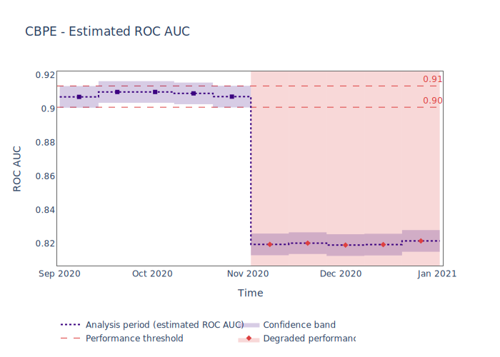
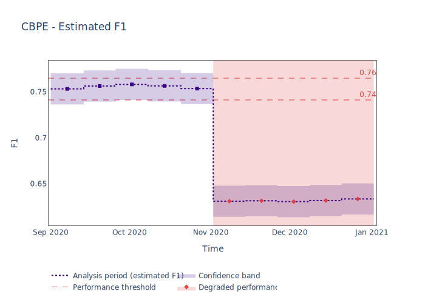
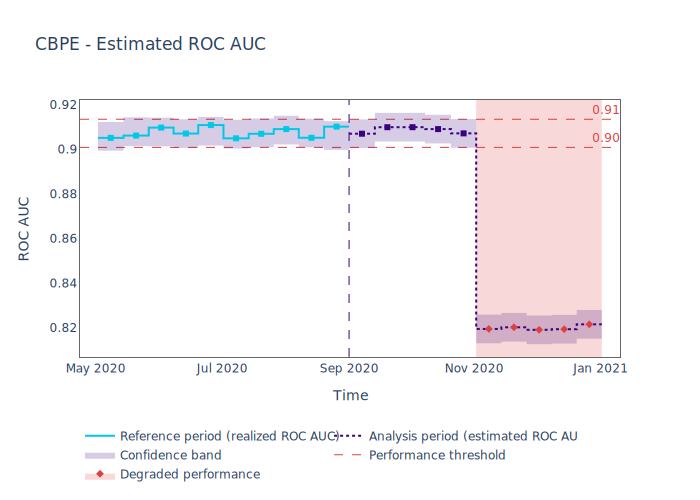
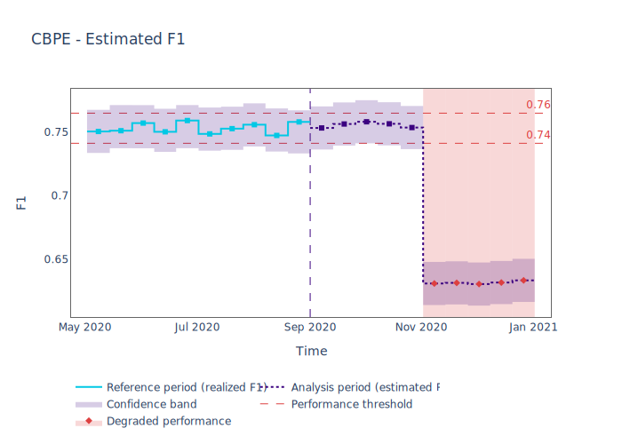

.. _multiclass-performance-estimation:

========================================================================================
Estimating Performance for Multiclass Classification
========================================================================================

This tutorial explains how to use NannyML to estimate the performance of multiclass classification
models in the absence of target data. To find out how CBPE estimates performance, read the :ref:`explanation of Confidence-based
Performance Estimation<performance-estimation-deep-dive>`.

.. note::
    The following example uses :term:`timestamps<Timestamp>`.
    These are optional but have an impact on the way data is chunked and results are plotted.
    You can read more about them in the :ref:`data requirements<data_requirements_columns_timestamp>`.

Just The Code
-------------

.. nbimport::
    :path: ./example_notebooks/Tutorial - Estimating Performance - Multiclass Classification.ipynb
    :cells: 1 3 4 6 8

Walkthrough
------------------------

For simplicity the guide is based on a synthetic dataset where the monitored model predicts
which type of credit card product new customers should be assigned to. You can learn more about this dataset
:ref:`here<dataset-synthetic-multiclass>`.

In order to monitor a model, NannyML needs to learn about it from a reference dataset. Then it can monitor the data that is subject to actual analysis, provided as the analysis dataset.
You can read more about this in our section on :ref:`data periods<data-drift-periods>`.

.. nbimport::
    :path: ./example_notebooks/Tutorial - Estimating Performance - Multiclass Classification.ipynb
    :cells: 1

.. nbtable::
    :path: ./example_notebooks/Tutorial - Estimating Performance - Multiclass Classification.ipynb
    :cell: 2

Next we create the Confidence-based Performance Estimation
(:class:`~nannyml.performance_estimation.confidence_based.cbpe.CBPE`)
estimator with a list of metrics, and an optional
:ref:`chunking<chunking>` specification. For more information about :term:`chunking<Data Chunk>` you can check the :ref:`setting up page<chunking>` and :ref:`advanced guide<chunk-data>`.

The list of metrics specifies which performance metrics of the monitored model will be estimated.
The following metrics are currently supported:

- ``roc_auc`` - one-vs-the-rest, macro-averaged
- ``f1`` - macro-aveaged
- ``precision`` - macro-averaged
- ``recall`` - macro-averaged
- ``specificity`` - macro-averaged
- ``accuracy``

.. nbimport::
    :path: ./example_notebooks/Tutorial - Estimating Performance - Multiclass Classification.ipynb
    :cells: 3

The :class:`~nannyml.performance_estimation.confidence_based.cbpe.CBPE`
estimator is then fitted using the
:meth:`~nannyml.performance_estimation.confidence_based.cbpe.CBPE.fit` method on the ``reference`` data.

The fitted ``estimator`` can be used to estimate performance on other data, for which performance cannot be calculated.
Typically, this would be used on the latest production data where target is missing. In our example this is
the ``analysis_df`` data.

NannyML can then output a dataframe that contains all the results. Let's have a look at the results for analysis period
only.

.. nbimport::
    :path: ./example_notebooks/Tutorial - Estimating Performance - Multiclass Classification.ipynb
    :cells: 4

.. nbtable::
    :path: ./example_notebooks/Tutorial - Estimating Performance - Multiclass Classification.ipynb
    :cell: 5

Apart from chunk-related data, the results data have the following columns for each metric
that was estimated:

 - ``realized_<metric>`` - when ``target`` values are available for a chunk, the realized performance metric will also
   be calculated and included within the results.
 - ``estimated_<metric>`` - the estimate of a metric for a specific chunk,
 - ``upper_confidence_<metric>`` and ``lower_confidence_<metric>`` - These values show the :term:`Confidence Band` of the relevant metric
   and are equal to estimated value +/- 3 times the estimated :term:`Sampling Error`.
 - ``upper_threshold_<metric>`` and ``lower_threshold_<metric>`` - crossing these thresholds will raise an alert on significant
   performance change. The thresholds are calculated based on the actual performance of the monitored model on chunks in
   the ``reference`` partition. The thresholds are 3 standard deviations away from the mean performance calculated on
   chunks.
   They are calculated during ``fit`` phase.
 - ``alert_<metric>`` - flag indicating potentially significant performance change. ``True`` if estimated performance crosses
   upper or lower threshold.

These results can be also plotted. Our plot contains several key elements.

* The purple dashed step plot shows the estimated performance in each chunk of the analysis period. Thick squared point
  markers indicate the middle of these chunks.

* The low-saturated purple area around the estimated performance indicates the :ref:`sampling error<estimation_of_standard_error>`.

* The red horizontal dashed lines show upper and lower thresholds for alerting purposes.

* If the estimated performance crosses the upper or lower threshold an alert is raised which is indicated with a red,
  low-saturated background in the whole width of the relevant chunk. This is additionally
  indicated by a red, diamond-shaped point marker in the middle of the chunk.

Description of tabular results above explains how the
:term:`confidence bands<Confidence Band>` and thresholds are calculated. Additional information is shown in the hover (these are
interactive plots, though only static views are included here).

.. nbimport::
    :path: ./example_notebooks/Tutorial - Estimating Performance - Multiclass Classification.ipynb
    :cells: 6

To get a better context let's additionally plot estimation of performance on analysis data together with calculated
performance on reference period (where the target was available).

* The right-hand side of the plot shows the estimated performance for the
  analysis period as before.

* The purple dashed vertical line splits the reference and analysis periods.

* On the left-hand side of the line, the actual model performance (not estimation!) is plotted with a solid light blue
  line. This facilitates interpretation of the estimation, as it helps to set expectations on the variability of
  the realised performance.

.. nbimport::
    :path: ./example_notebooks/Tutorial - Estimating Performance - Multiclass Classification.ipynb
    :cells: 8

Insights
--------

After reviewing the performance estimation results, we should be able to see any indications of performance change that
NannyML has detected based upon the model's inputs and outputs alone.

What's next
-----------

The :ref:`Data Drift<data-drift>` functionality can help us to understand whether data drift is causing the performance problem.
When the target results become available they can be :ref:`compared with the estimated results<compare_estimated_and_realized_performance>`.

You can learn more about the Confidence Based Performance Estimation and its limitations in the
:ref:`How it Works page<performance-estimation-deep-dive>`.
