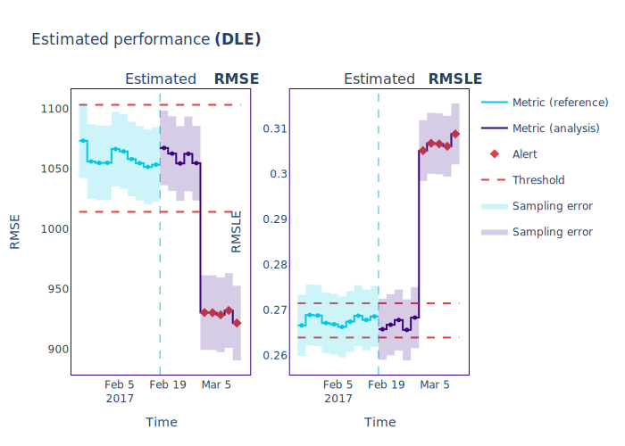
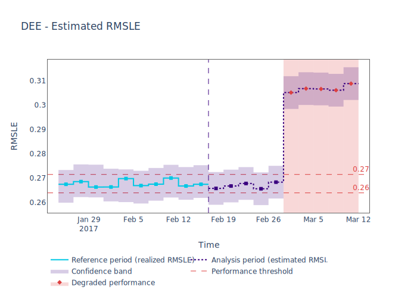

.. _regression-performance-estimation:

=====================================
Estimating Performance for Regression
=====================================

This tutorial explains how to use NannyML to estimate the performance of regression
models in the absence of target data. To find out how DLE estimates performance,
read the :ref:`explanation of how Direct Loss Estimation works<how-it-works-dle>`.

.. _performance-estimation-regression-just-the-code:

Just The Code
-------------

.. nbimport::
    :path: ./example_notebooks/Tutorial - Estimating Performance - Regression.ipynb
    :cells: 1 3 4 6 8

Walkthrough
-----------

For simplicity this guide is based on a synthetic dataset included in the library, where the monitored model predicts
whether the market price of a used car. You can read more about this synthetic dataset :ref:`here<dataset-synthetic-regression>`.

In order to monitor a model, NannyML needs to learn about it from a reference dataset.
Then it can monitor the data that is subject to actual analysis, provided as the analysis dataset.
You can read more about this in our section on :ref:`data periods<data-drift-periods>`.

We start by loading the dataset we 'll be using:

.. nbimport::
    :path: ./example_notebooks/Tutorial - Estimating Performance - Regression.ipynb
    :cells: 1

.. nbtable::
    :path: ./example_notebooks/Tutorial - Estimating Performance - Regression.ipynb
    :cell: 2

The next step is to instantiate the Direct Error Estimation
(:class:`~nannyml.performance_estimation.direct_loss_estimation.dle.DLE`)
estimator. For the instantiation we need to provide:

* The list of column names for the features our model uses.
* The column name for the model output.
* The column name for the model targets.
* The list of regression performance metrics we are interested in estimating. Currently the supported metrics are:

  * ``mae`` - mean absolute error
  * ``mape`` - mean absolute percentage error
  * ``mse`` - mean squared error
  * ``rmse`` - root mean squared error
  * ``msle`` - mean squared logarithmic error
  * ``rmsle`` - root mean squared logarithmic error

* Optionally we can provide a :ref:`chunking<chunking>` specification, otherwise the NannyML default will be used.
  For more information about :term:`chunking<Data Chunk>` you can check the :ref:`setting up page<chunking>` and :ref:`advanced guide<chunk-data>`.
* Optionally we can provide selected hyperparamters for the model that will make the error estimation. If not, the
  `LGBMRegressor defaults`_ will be used.
* Optionally we can tell the estimator to use FLAML to perform hyperparamter tuning. By default no hyperparamter tuning is performed.
* Optionally we can provide `configuration options`_ to perform hyperparamter tuning instead of using the ones set by NannyML.

More information can be found on the API documentation for the :class:`~nannyml.performance_estimation.direct_loss_estimation.dle.DLE` estimator.
During this tutorial the NannyML default settings are used regarding hyperparameter tuning.

.. nbimport::
    :path: ./example_notebooks/Tutorial - Estimating Performance - Regression.ipynb
    :cells: 3

The new :class:`~nannyml.performance_estimation.direct_loss_estimation.dle.DLE` is fitted using the
:meth:`~nannyml.performance_estimation.direct_loss_estimation.dle.DLE.fit` method on the ``reference`` data.

The fitted ``estimator`` can then be used to calculate
estimated performance metrics on all data which has target values available with the
:meth:`~nannyml.performance_estimation.direct_loss_estimation.dle.DLE.estimate` method.
NannyML can output a dataframe that contains all the results of the analysis data.

.. nbimport::
    :path: ./example_notebooks/Tutorial - Estimating Performance - Regression.ipynb
    :cells: 4

.. nbtable::
    :path: ./example_notebooks/Tutorial - Estimating Performance - Regression.ipynb
    :cell: 5

There results from the reference data are also available.

.. nbimport::
    :path: ./example_notebooks/Tutorial - Estimating Performance - Regression.ipynb
    :cells: 6

.. nbtable::
    :path: ./example_notebooks/Tutorial - Estimating Performance - Regression.ipynb
    :cell: 7

.. _performance-estimation-regression-thresholds:

Apart from chunk-related data, the results data have the following columns for each metric
that was estimated:

 - ``realized_<metric>`` - when ``target`` values are available for a chunk, the realized performance metric will also
   be calculated and included within the results.
 - ``estimated_<metric>`` - the estimate of a metric for a specific chunk,
 - ``upper_confidence_<metric>`` and ``lower_confidence_<metric>`` - these correspond to the sampling error and are equal to +/-
   3 times the calculated :term:`standard error<Standard Error>`.
 - ``<metric>_lower_threshold>`` and ``<metric>_upper_threshold>`` - Lower and upper thresholds for performance metric.
   Crossing them will raise an alert that there is a significant metric change. The thresholds are calculated based
   on the realized performance of chunks in the ``reference`` period.
   The thresholds are 3 standard deviations away from the mean performance calculated on ``reference`` chunks.
   They are calculated during ``fit`` phase.
 - ``alert_<metric>`` - flag indicating potentially significant performance change. ``True`` if estimated performance crosses
   upper or lower threshold.

These results can be also plotted. Our plot contains several key elements.

* The purple dashed step plot shows the estimated performance in each chunk of the analysis period. Thick squared point
  markers indicate the middle of these chunks.

* The low-saturated purple area around the estimated performance indicates the :ref:`sampling
  error<estimation_of_standard_error>`.

* The red horizontal dashed lines show upper and lower thresholds for alerting purposes.

* If the estimated performance crosses the upper or lower threshold an alert is raised which is indicated with a red,
  low-saturated background in the whole width of the relevant chunk. This is additionally
  indicated by a red, diamond-shaped point marker in the middle of the chunk.

Additional information is shown in the hover (these are interactive plots, though only static views are included here).
The plots can be created with the following code:

.. nbimport::
    :path: ./example_notebooks/Tutorial - Estimating Performance - Regression.ipynb
    :cells: 8

Insights
--------

From looking at the RMSE and RMSLE performance results we can observe an interesting effect. We know that RMSE penalizes
mispredictions symmetrically while RMSLE penalizes underprediction more than overprediction. Hence performance estimator tells us
that while our model will become a little bit more accurate according to RMSE, the increase in RMSLE suggests us that our model will
be underpredicting more than it was before!

What's next
-----------

The :ref:`Data Drift<data-drift>` functionality can help us to understand whether data drift is causing the performance problem.
When the target values become available they can be :ref:`compared with the estimated
results<compare_estimated_and_realized_performance>`.

You can learn more about Direct Error Estimation and its limitations in the
:ref:`How it Works page<performance-estimation-deep-dive>`.

.. _LGBMRegressor defaults: https://lightgbm.readthedocs.io/en/latest/pythonapi/lightgbm.LGBMRegressor.html
.. _configuration options: https://microsoft.github.io/FLAML/docs/reference/automl#automl-objects
