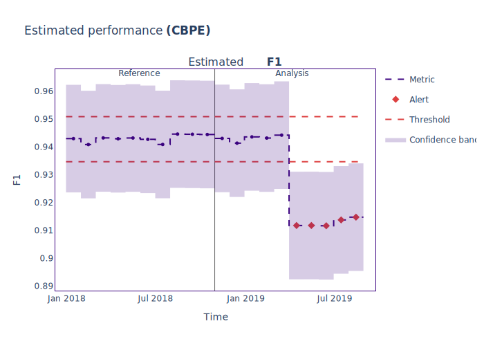
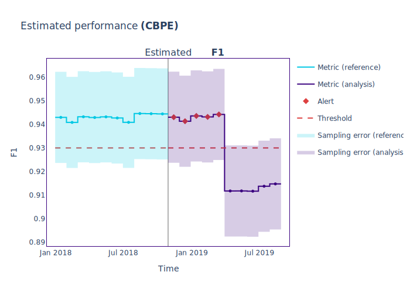

.. _thresholds:

==========
Thresholds
==========

NannyML calculators and estimators allow a user to configure alerting thresholds for more fine-grained control
over the alerts generated by NannyML.

This tutorial will walk you through threshold basics and how to use them to customize the behavior of NannyML.

Just the code
=============

.. nbimport::
    :path: ./example_notebooks/Tutorial - Thresholds.ipynb
    :cells: 1 4 6 7 9 11 12 14

Walkthrough
===========

We will use an F1-score estimation as an example use case. But first, let's dive into some of the basics.

NannyML compares the metric values it calculates to lower and upper threshold values. If the metric values fall
outside the range determined by these, NannyML will flag these values as alerts.

To determine the lower and upper threshold values for a certain metric, NannyML will take the
:ref:`reference data <data-drift-periods>`, split it into chunks and calculate the metric value for each of those chunks.
NannyML then applies a calculation that transforms this array of chunked reference metric values into single lower and upper threshold values.

NannyML provides simple classes to customize this calculation.

Constant thresholds
-------------------

The :class:`~nannyml.thresholds.ConstantThreshold` class is a very basic threshold. It is given a lower and upper value
when initialized, which will be returned as the lower and upper threshold values, independent of what reference data
is passed to it.

The :class:`~nannyml.thresholds.ConstantThreshold` can be configured using the parameters ``lower`` and ``upper``.
They represent the constant lower and upper values used as thresholds when evaluating alerts.
One or both parameters can be set to ``None``, disabling the upper or lower threshold.

This snippet shows how to create an instance of the :class:`~nannyml.thresholds.ConstantThreshold`:

.. nbimport::
    :path: ./example_notebooks/Tutorial - Thresholds.ipynb
    :cells: 2
    :show_output:

.. _thresholds_std:

Standard deviation thresholds
-----------------------------

The :class:`~nannyml.thresholds.StandardDeviationThreshold` class will use the mean of the data given as
a baseline. It will then add the standard deviation of the given data, scaled by a multiplier, to that baseline to
calculate the upper threshold value. Subtracting the standard deviation, scaled by a multiplier, from the baseline
calculates the lower threshold value.

The :class:`~nannyml.thresholds.StandardDeviationThreshold` can be configured using the following parameters.
The ``std_lower_multiplier`` and ``std_upper_multiplier`` parameters allow you to set a custom value for the multiplier
applied to the standard deviation of the given data, respectively determining the lower threshold value and the
upper threshold value. Both can be set to ``None``, which disables the respective threshold.

The ``offset_from`` parameter takes any function aggregating an array of numbers into a single number. This function
will be applied to the given data, and the resulting value serves as a baseline to add or subtract the calculated offset.

This snippet shows how to create an instance of the :class:`~nannyml.thresholds.StandardDeviationThreshold`:

.. nbimport::
    :path: ./example_notebooks/Tutorial - Thresholds.ipynb
    :cells: 3
    :show_output:

Setting custom thresholds for calculators and estimators
---------------------------------------------------------

All calculators and estimators in NannyML support custom thresholds. You can specify a custom threshold for each
drift detection method and performance metric.

.. warning::

    The :ref:`Chi-squared<univ_cat_method_chi2>`, :math:`\chi^2`, drift detection method for categorical data does not support custom thresholds yet.
    It is currently using p-values for thresholding and replacing them by or incorporating them in the custom
    thresholding system requires further research.

    For now, it will continue to function as it did before.

    When specifying a custom threshold for Chi-squared in the
    :class:`~nannyml.drift.univariate.calculator.UnivariateDriftCalculator`,
    NannyML will log a warning message to clarify that the custom threshold will be ignored.

We will illustrate this through performance estimation using **CBPE**.
But, first we load our datasets.

.. nbimport::
    :path: ./example_notebooks/Tutorial - Thresholds.ipynb
    :cells: 4

.. nbtable::
    :path: ./example_notebooks/Tutorial - Thresholds.ipynb
    :cell: 5

Next, we will set up the CBPE ``estimator``. Note that we are not providing any threshold specifications for now.
Let's check out the default value for the ``f1`` metric:

.. nbimport::
    :path: ./example_notebooks/Tutorial - Thresholds.ipynb
    :cells: 6
    :show_output:

After running the estimation, we can see some alerts popping up. This means a couple of threshold values have been breached.

.. nbimport::
    :path: ./example_notebooks/Tutorial - Thresholds.ipynb
    :cells: 7

.. nbtable::
    :path: ./example_notebooks/Tutorial - Thresholds.ipynb
    :cell: 8

The plots clearly illustrate this:

.. nbimport::
    :path: ./example_notebooks/Tutorial - Thresholds.ipynb
    :cells: 9

Now let's set a threshold that inverses this result by fixing the upper threshold and dropping the lower.

.. nbimport::
    :path: ./example_notebooks/Tutorial - Thresholds.ipynb
    :cells: 11
    :show_output:

Let's use this new custom threshold for our performance estimation now.
Note that we are passing our custom thresholds as a dictionary,
mapping the metric name to a :class:`~nannyml.thresholds.Threshold` instance.
We only have to provide our single override value; the other metrics will use the default values.

.. nbimport::
    :path: ./example_notebooks/Tutorial - Thresholds.ipynb
    :cells: 12

.. nbtable::
    :path: ./example_notebooks/Tutorial - Thresholds.ipynb
    :cell: 13

If we check the plots, we can see that the alerts have now inverted.

.. nbimport::
    :path: ./example_notebooks/Tutorial - Thresholds.ipynb
    :cells: 14

.. _default_thresholds:

Default thresholds
-------------------

Performance metrics and drift detection methods, and the missing values data quality metric
have the following default threshold:

.. code-block:: python

    nml.thresholds.StandardDeviationThreshold(std_lower_multiplier=3, std_upper_multiplier=3, offset_from=np.mean)

Some drift detection methods and the unseen values data quality metric are exceptions to this rule.
They have default thresholds more attuned to their specific role and properties:

.. list-table::
   :widths: 25, 25, 50
   :header-rows: 1

   * - Module
     - Functionality
     - Default threshold
   * - Univariate Drift
     - `jensen_shannon`
     - ``ConstantThreshold(upper=0.1)``
   * - Univariate Drift
     - `hellinger`
     - ``ConstantThreshold(upper=0.1)``
   * - Univariate Drift
     - `l_infinity`
     - ``ConstantThreshold(upper=0.1)``
   * - Data Quality
     - Unseen Values Calculator
     - ``ConstantThreshold(lower=None, upper=0)``

What's next?
=============

You can read more about the threshold's inner workings in the :ref:`how it works article<how_thresholds>` or review the
`API reference documentation <../nannyml/nannyml.thresholds.html>`__.
